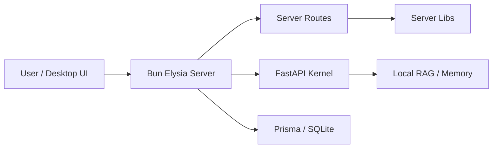

# Architecture Map

Compact implementation map for startup context.

## Layers

| Layer | Directory | Purpose |
| --- | --- | --- |
| Experience | `packages/server/`, `public/`, `dashboard/` | Bun / Elysia API, static UI, and visual surfaces. |
| Shared contract | `packages/shared/` | Browser-safe TypeScript types, UI bridge helpers, and API clients. |
| Cognitive kernel | `python/`, `kernel/` | FastAPI, local AI tools, RAG, and kernel experiments. |
| Native shell | `src-tauri/` | Tauri desktop packaging and native integration. |
| Security/native agent | `packages/shield-agent/` | Rust sentinel and validation code. |
| Data model | `prisma/` | Prisma schema and migrations. |
| Operations | `scripts/`, `tools/`, `deploy/` | Setup, maintenance, operator utilities, and deployment assets. |
| Knowledge | `docs/`, `.Codex/` | Durable documentation and tiny startup context. |

## Request Flow

## Where To Edit

- New API route: `packages/server/src/routes/`, then register in `packages/server/src/index.ts`.
- New server behavior: `packages/server/src/lib/`.
- New shared SDK/type: `packages/shared/src/`.
- New Python kernel behavior: `python/` with tests under `python/tests/`.
- New desktop-native behavior: `src-tauri/`.
- New manual Windows/local utility: `tools/`.
- New repo automation: `scripts/`.
- New durable explanation: `docs/`.

## Safety Defaults

- Keep local privacy assumptions intact.
- Keep runtime state, secrets, logs, uploads, caches, and editor metadata out of Git.
- Treat OS/game helper scripts as manual operator tools.
