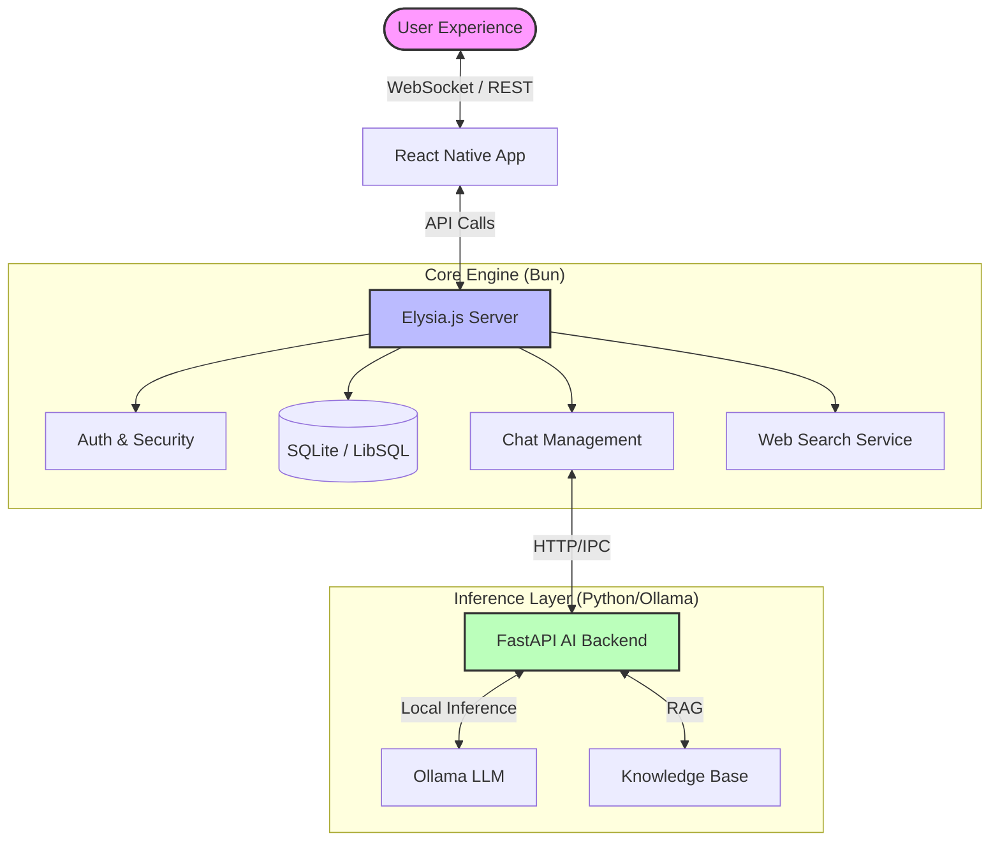
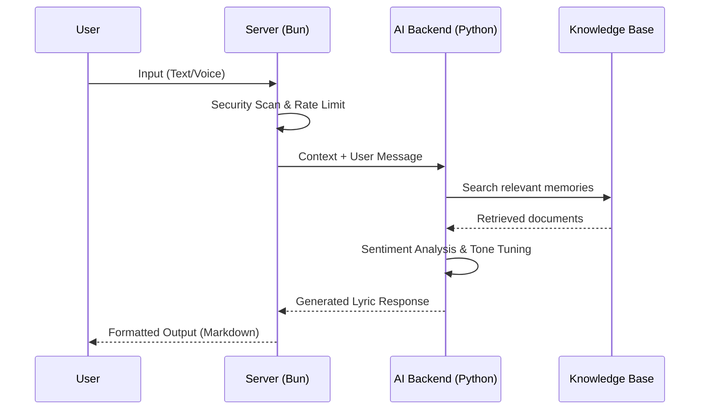

# Architecture Documentation

This document describes the high-level architecture of **Elysia AI**, focusing on the emotional inference and data flow.

## 📸 System Overview

Elysia AI is designed as a multi-modal AI system that integrates Bun (Elysia.js) for high-performance API handling and Python for specialized RAG and sentiment analysis.

## 💓 Sentiment & Context Flow

The soul of Elysia AI lies in how it processes human emotion through lyrical context.

## 🛠 Technology Stack

- **Runtime**: [Bun](https://bun.sh/) (Server), [Node.js](https://nodejs.org/) (Mobile)
- **Framework**: [Elysia.js](https://elysiajs.com/), [FastAPI](https://fastapi.tiangolo.com/), [Expo](https://expo.dev/)
- **Database**: [Prisma](https://www.prisma.io/) with LibSQL
- **AI/LLM**: [Ollama](https://ollama.ai/), [OpenAI API](https://openai.com/) (Optional)
- **Governance**: Biome (Lint/Format), GitHub Actions (CI/CD)
