# Architecture: RAG (Long-Term Memory)

ElysiaAIは「永遠に消えない記憶」を持つOSです。
短期記憶（直近の会話履歴）はSQLiteベースの `MemoryVault` で処理されますが、数万件に及ぶ過去の対話や知識を呼び覚ますため、**Retrieval-Augmented Generation (RAG)** アーキテクチャを導入します。プライバシーとローカル実行の理念に従い、ChromaDB または Qdrant のようなローカルベクトルDBを採用します。

## System Workflow

```mermaid
sequenceDiagram
    participant User as 開拓者 (User)
    participant Boot as 🌟boot.py (CLI)
    participant Persona as 🌸persona.py (Engine)
    participant Memory as 💾MemoryVault (SQLite)
    participant VectorDB as 🧠VectorDB (Chroma)
    participant LLM as Gemini API

    User->>Boot: 入力 (例: "あの時の約束、覚えてる？")
    Boot->>Memory: 保存 (User Input)
    
    rect rgb(30, 30, 60)
    Note over Boot,VectorDB: Semantic Search (RAG)
    Boot->>LLM: 入力をベクトル化 (Embedding)
    LLM-->>Boot: Vector [0.1, 0.4, ...]
    Boot->>VectorDB: 類似記憶の検索 (Top-K)
    VectorDB-->>Boot: 関連する過去の会話チャンク
    end
    
    Boot->>Persona: 取得した記憶+直近履歴をPromptに統合
    Persona-->>Boot: RAG Prompt生成
    
    Boot->>LLM: Prompt送信 (Gemini 1.5)
    LLM-->>Boot: 生成テキスト
    
    Boot->>Memory: 保存 (ElysiaAI Response)
    Boot->>VectorDB: 会話をベクトル化して非同期保存
    Boot-->>User: 応答を表示
```

## Data Persistence

- 短期的な会話は `data/memory/historical.db` (SQLite) に即座に保存されます。
- バックグラウンドワーカー（または非同期タスク）がバッチとしてSQLiteのテキストをEmbeddingに変換し、ローカルの `data/vector/` 領域へ保持します。

## Security & Privacy

すべての生体データおよび会話ログはローカル環境（Dockerコンテナ内部）から外部ネットワーク（API送信時を除く）へ流出しない設計です。
