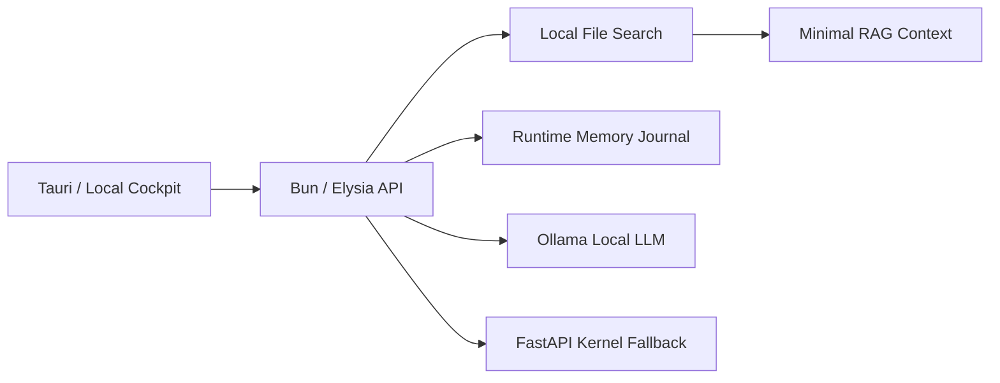

# ElysiaAI MVP Readiness

## 要約

ElysiaAI MVPの範囲は、"毎日使えるローカルAI OSの最初の一本"に固定する。

チャット、Ollama、ローカルRAG、ファイル検索、メモリー、Tauri UI、CI、Security Gateを一つの導線として通す。Home Compute Meshや高度なAgent群は、MVPの外に置く。

## MVPスコープ

### 入れるもの

- Tauriで開けるローカルAIコックピット
- Bun / Elysia API
- Ollamaへの直接ローカルチャット
- ローカルファイル検索
- 検索結果を使った最小RAG
- 会話のランタイムメモリー
- Memoryの表示、削除、セッションクリア
- MVP readiness API
- Security Agentの最小監査API
- GitHub ActionsのCI
- Gitleaks / CodeQL / Security Auditの継続

### 入れないもの

- Home Compute Meshの本実装
- 自律Agentの本格運用
- モバイルアプリ
- クラウド同期
- 本番向けマルチユーザー管理
- Agent Marketplace

## 実査結果

### すでにある土台

- Bun / Elysia serverは `packages/server` に存在する
- FastAPI kernelは `python/fastapi_server.py` に存在し、`/chat` と `/rag` を持つ
- Tauri shellは `src-tauri` に存在する
- CI workflowは `.github/workflows` に存在する
- Gitleaks設定は `.gitleaks.toml` に存在する
- `docs/MVP.md` にMVP定義の原型がある

### 未実装 / 不完全 / 未接続だった部分

- ルートUIがポートフォリオ寄りで、MVPコックピットになっていなかった
- UIが外部CDNを使っており、完全ローカルの条件と噛み合っていなかった
- Tauriの `beforeDevCommand` がBunサーバーのみを起動していた
- UIの開発ログインがCSRFヘッダーを扱っておらず、Cookie認証と噛み合いにくかった
- Bun / Elysia側にOllama直結のMVPチャット経路がなかった
- ファイルアップロードAPIはあったが、MVP用のファイル検索APIがなかった
- RAGの最小導線がUIから見えなかった
- メモリー保存は複数箇所に構想があったが、MVP用の見える導線がなかった
- `.github/PULL_REQUEST_TEMPLATE.md` と `.github/pull_request_template.md` がWindowsで衝突している
- Security Agentは構想段階で、UIからSecrets / Actions / 依存関係 / ログ異常を見られなかった

## 今回固定したMVP導線



## 追加したMVP API

| API | 役割 |
| --- | --- |
| `GET /api/mvp/readiness` | MVP readinessを返す |
| `POST /api/mvp/search` | ローカルファイル検索 |
| `POST /api/mvp/rag` | 検索結果からRAG文脈を返す |
| `GET /api/mvp/memory` | セッションのメモリーを返す |
| `POST /api/mvp/memory` | メモリーを追加する |
| `DELETE /api/mvp/memory/:id` | セッション内のメモリーを1件削除する |
| `DELETE /api/mvp/memory` | セッション内のメモリーをクリアする |
| `GET /api/mvp/security-agent` | Secrets / Actions / 依存関係 / ログ異常の最小監査を返す |
| `POST /api/elysia-core/chat` | Ollama直結を優先し、FastAPIへフォールバックする |

## 完成条件チェック

- [x] MVPスコープを固定した
- [x] リポジトリの構成を実査した
- [x] MVP readinessチェックリストを作成した
- [x] Tauri UIをローカルコックピットへ寄せた
- [x] Bun / ElysiaからOllamaへ直接接続する導線を追加した
- [x] 最小RAGとファイル検索をBun / Elysiaへ追加した
- [x] ランタイムメモリーの保存と表示を追加した
- [x] ランタイムメモリーの1件削除とセッションクリアを追加した
- [x] 日本語クエリ向けにRAG / ファイル検索の語彙補完を追加した
- [x] Security Agent試作を追加した
- [x] Tauri開発起動を `bun run dev:lite` に寄せた
- [x] Tauri CSPをローカル接続中心へ寄せた
- [x] Browser smokeでUI / readiness / file searchを確認した
- [x] Ollama互換ローカルスタブでUI -> Bun / Elysia -> RAG -> Ollama chat -> Memoryを縦通し確認した
- [x] PRテンプレートの大文字 / 小文字衝突を解消した
- [x] Python Ruff CIの対象範囲をKernel / MVP関連へ明示的に絞った
- [x] Python Ruff対象範囲をformat済みにした
- [x] Python pytest対象範囲をローカルで確認した
- [x] Windowsで `bun run dev:lite` 相当のlite stack起動を確認した
- [x] 実Ollamaで `llama3.2` をpullし、Ollama API応答を確認した
- [x] 実OllamaでBun / Elysia -> RAG -> Ollama chatの縦通しを確認した
- [x] Gitleaks worktree scanでSecrets検出ゼロを確認した
- [x] WindowsにVisual Studio Build Tools C++ / Windows SDKを導入した
- [x] Windowsで `bun tauri dev` のRust build完了と `app.exe` 起動到達を確認した
- [x] GitHub Actionsの最新実行結果を確認した
- [x] Ollama未起動時のUI文言をやさしい復帰案内へ調整した
- [x] Security AgentでGitHub Actions実行履歴を取得できるようにした
- [x] 最新差分をpushし、GitHub Actions成功を確認した
- [x] Dependabot alert #7をdismissせず、上流依存リスクとしてIssue #104で追跡した
- [ ] macOSで `bun tauri dev` を起動確認する

## ローカル検証結果

2026-06-14時点の実査結果。

### 通過

- `bun run typecheck`
- `bun run lint`
- `bun run test`
- `bun run test --coverage` 218 passed / 60 skipped
- `bun test packages/server/src/lib/mvp-local-ai.test.ts`
- `bun test packages/server/src/lib/mvp-local-ai.test.ts packages/server/src/lib/security-agent.test.ts`
- `bun test packages/server/src/lib/security-agent.test.ts packages/server/src/lib/mvp-local-ai.test.ts src/config.test.ts` 14 passed
- `bun run check:git-hygiene`
- `bun run check:runner-policy`
- `bun run check:deps`
- `bun run check:encoding`
- `bun audit`
- `bun run security:glassworm -- --ci`
- `bun run security:audit`
- `GET /ping` smoke
- Browser smoke: readiness表示、dev-login、file search、local-ollama mode、RAG Sources、Memory表示
- `python -m ruff check python/fastapi_server.py kernel usr tests/test_kernel.py tests/python scripts/security/audit_dependencies.py scripts/tests/check-encoding.py`
- `python -m ruff format --check python/fastapi_server.py kernel usr tests/test_kernel.py tests/python scripts/security/audit_dependencies.py scripts/tests/check-encoding.py`
- `python -m pytest tests/python tests/test_kernel.py --junitxml=pytest-report.xml` 18 passed
- `winget install --id Ollama.Ollama --silent --accept-package-agreements --accept-source-agreements`
- `ollama pull llama3.2`
- `ollama list`: `llama3.2:latest`, 2.0 GB, digest `a80c4f17acd5`
- `POST http://127.0.0.1:11434/api/chat`: `ELYSIA_OLLAMA_OK`
- `POST /api/elysia-core/chat` against real Ollama: `x-elysia-core-mode: local-ollama`
- `bun tauri info`: WebView2 / Rust / Cargo detected
- `winget install --id Microsoft.VisualStudio.2022.BuildTools --override "... Microsoft.VisualStudio.Workload.VCTools ... Windows11SDK.26100"`: installed
- `bun tauri info`: Visual Studio Build Tools 2022 / MSVC detected
- `bun tauri dev` on Windows: FastAPI ready, Elysia ready, Rust build finished, `target\debug\app.exe` launched
- Security Agent unit tests: Secrets masking, PR template case collision check, dependency audit summary
- Security Agent live report with GitHub token: `source: github-api`, latest run fetched
- Browser smoke: Security Agent表示、Japanese file search、real Ollama `mode: local-ollama`、Memory表示、1件削除、API clear
- Security Agent local report: Secrets `ok` / GitHub Actions `ok` / Dependencies `ok` / Logs `attention`
- `gitleaks detect --source . --no-git --verbose`: no leaks found
- 広域Secrets regex scan: no matches
- `cargo check --manifest-path packages/shield-agent/Cargo.toml`: passed with one existing unused `mut` warning

### 残るCI論点

- GitHub Actionsの最新 `master` 実行は `ElysiaAI CI (Guardian)` / `ICE Runner Policy` ともにsuccess
- Pythonの `ruff check .` は、MVP外の既存スクリプト群まで含むため167件で引き続き失敗する
- Pythonの `ruff format --check .` は、MVP外の既存スクリプト群69件で引き続き失敗する
- Pythonの無指定 `pytest` は、MVP外の既存Discord / Marathon系スクリプトを収集してimport errorになる
- CIのPython Ruff対象は、Kernel / MVP関連の守るべき範囲へ明示的に限定した
- Biomeはlint成功。ただしschema 2.4.15とCLI 2.5.0の情報メッセージが残る
- Dependabot alert #7は `glib 0.20.0` へ直接更新できず、Tauri/Wryの上流依存リスクとしてIssue #104で追跡する
- macOS Tauri実機確認は未実施

## ローカル確認コマンド

```powershell
bun install --backend=copyfile --ignore-scripts
bun run typecheck
bun run test
bun run lint
bun run check:git-hygiene
bun run check:runner-policy
bun run security:audit
```

Ollamaを使う場合は、別ターミナルで起動してから確認する。

```powershell
ollama serve
ollama pull llama3.2
bun run dev:lite
bun tauri dev
```

## Security Gate

### 継続するゲート

- Gitleaks Secret Detection
- CodeQL
- ICE Runner Policy
- Bun audit
- Python dependency audit
- Rust cargo check
- GlassWorm scan
- Git hygiene guard

### 今回の判断

- SecretsやWebhook URLは追加していない
- 既存のDiscord Webhook直書きは `DESTINY2_WEBHOOK_URL` 環境変数へ移した
- 既存のRedis接続URL直書きは `REDIS_URL` 環境変数へ移した
- ドキュメント上のOpenAI API key例は、実キーに見える形式を避けた
- MVPメモリーは `data/runtime/mvp-memory.jsonl` に保存する
- `data/*` は既存の `.gitignore` で原則除外される
- RAGの参照内容は信頼済み命令ではなく、参考情報として扱う
- Ollama接続先はlocalhostまたはプライベートLANに限定する
- Security Agent APIはSecrets値を返さず、検出行をマスクして表示する
- 現在のSecurity Agentはローカルログに失敗系キーワードを検出するため `attention` を返すが、Secrets検出はゼロ

## 次に残る仕事

- macOSで `bun tauri dev` を実機確認する
- Dependabot alert #7の上流更新をIssue #104で追跡する
- 3分デモ動画を収録する
- 3〜5人のテスターへBeta 0.1候補を投入する
