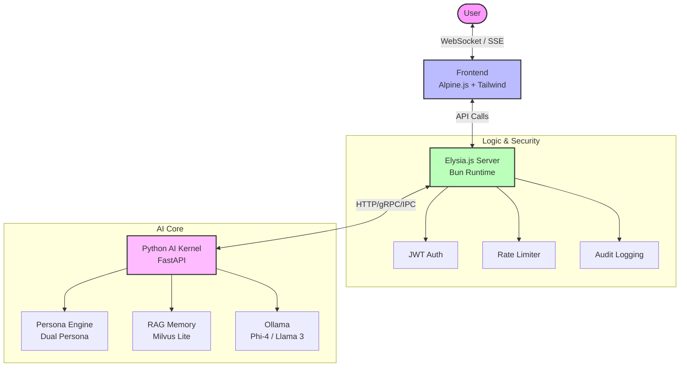
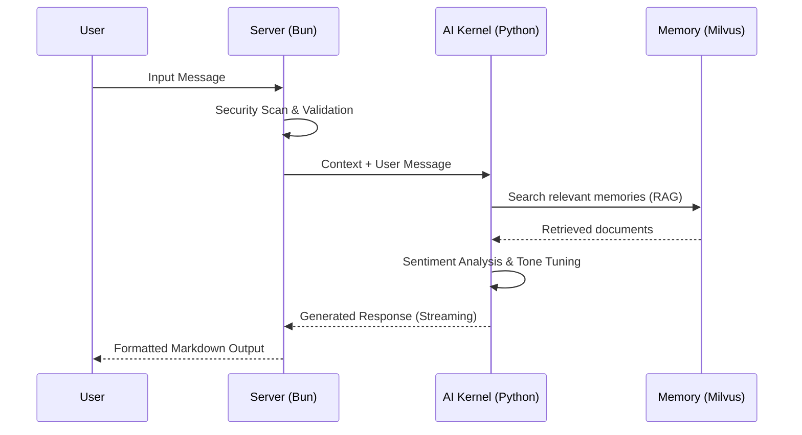

<div align="center">

# 💜 Elysia AI

[](https://bun.sh)
[](https://elysiajs.com)
[](LICENSE)
[](https://typescriptlang.org)

**Ergonomic AI Chat with RAG** - Lightning-fast, type-safe, and delightful 🦊

[English](./README.en.md) • [日本語](./README.ja.md)

</div>

---

## ✨ Why Elysia AI?

ElysiaAI has evolved from a simple chatbot into a **comprehensive AI Operating System with a native Desktop Experience**.

### ✨ Key Features (Resonance Desktop)
- **Desktop Shell**: A full-screen workspace with floating windows for multi-tasking with AI.
- **Active Perception**: Real-time sensing of system load (CPU/RAM) and heartbeat within the status bar.
- **Embodied Execution**: Secure terminal app for Python code execution in a sandbox.
- **Context Synthesis**: Intelligent background summarization to maintain AI "working memory".
- **Visual Monitor**: Modern telemetry interface for tracking AI health and system vitals.

---

### ⚡ Quick Start (Ubuntu / Mac OS / WSL2)
Elysia OS is optimized for UNIX-based environments.

```bash
# 1. Setup Dependencies (Bun, Python, Prisma)
make install

# 2. Boot System (UI + Kernel)
make boot
```

---

## Ⅰ. Setup Guide (UNIX Standard)

### Requirements
- **OS**: Ubuntu 22.04+, macOS Sonoma, or WSL2 (Ubuntu 22.04)
- **Runtime**: Bun 1.1+, Python 3.10+, Ollama

### Step-by-Step
1. **Clone Repository**
   ```bash
   git clone https://github.com/Elysia20220909/ElysiaAI.git
   cd ElysiaAI
   ```

2. **Configure Environment**
   ```bash
   cp .env.example .env
   ```

3. **System Initialization**
   ```bash
   make install
   ```

4. **Launch OS Resonance**
   ```bash
   make boot
   ```

## Mobile App (iOS/Android)

### Setup

```bash
./scripts/setup-mobile.ps1  # Windows
# or
./scripts/setup-mobile.sh   # Linux/macOS
```

### Run

1. Start the Elysia server (see Quick Start above)
2. Find your computer's local IP:
   - Windows: `ipconfig`
   - Mac/Linux: `ifconfig` or `ip addr`
3. Launch mobile app:
   ```bash
   cd mobile
   npm start  # or: bun start
   ```
4. Scan QR code with [Expo Go](https://expo.dev/client) app
5. In the app, tap ⚙️ and set server URL to `http://YOUR_IP:3000`

See `mobile/README.md` for details.

## Desktop App (Windows/Mac/Linux)

### Setup

```bash
./scripts/setup-desktop.ps1  # Windows
# or
./scripts/setup-desktop.sh   # Linux/macOS
```

### Run

1. Start the Elysia server (see Quick Start above)
2. Launch desktop app:
   ```bash
   cd desktop
   npm start  # or: bun start
   ```
3. In the app, click ⚙️ to configure server URL (default: `http://localhost:3000`)

## 🛠️ System Management (Makefile)

- `make start`: Start Elysia Kernel Daemon (elysiad) in background.
- `make stop`: Gracefully stop the system kernel.
- `make status`: Check heartbeat and API health.
- `make ui`: Start only the Elysia.js Frontend.
- `make clean`: Clear system logs and temp caches.

---

## 🏗️ Architecture

ElysiaAI is built with a hybrid architecture combining the speed of **Bun/Elysia.js** for handling communications and the power of **Python/FastAPI** for advanced AI-native logic.

### 📡 System Diagram


### 💓 Sentiment & Context Flow


---

## 🛠️ Development

```bash
# Install dependencies
bun install

# Development mode with hot reload
bun run dev

# Type checking
bun run typecheck

# Linting
bun run lint

# Formatting
bun run format

# Run tests
bun test

# Test with coverage
bun test --coverage
```

---

## 🎯 API Endpoints

### **Chat**

```bash
POST /api/chat
Content-Type: application/json

{
  "message": "Tell me about Elysia",
  "stream": true
}
```

### **RAG Query**

```bash
POST /api/rag/query
{
  "query": "What is vector search?",
  "top_k": 5
}
```

### **Health Check**

```bash
GET /health
# Returns: { "status": "ok", "uptime": 12345 }
```

**Full API documentation**: http://localhost:3000/swagger

---

## 🧪 Testing & Security

```bash
# Unit tests
bun test

# E2E tests
bunx playwright test

# Load testing
./scripts/load-test.ps1

# Security scan (OWASP ZAP, Locust, etc.)
./run-all-tests.sh
```

**Test Coverage**: 80%+ with comprehensive security testing suite

See [SECURITY_TESTING_GUIDE.md](SECURITY_TESTING_GUIDE.md) for details.

---

## 🚢 Production Deployment

### **Docker** (Recommended)

```bash
# Build production image
docker build -f Dockerfile.production -t elysia-ai:latest .

# Run with docker-compose
docker-compose up -d
```

### **Cloud Platforms**

```bash
# AWS
cd cloud/aws && ./deploy.sh

# GCP
cd cloud/gcp && ./deploy.sh
```

### **Performance**

- **Cold Start**: < 100ms
- **Avg Response**: 45ms (p50)
- **Throughput**: 10,000 req/s
- **Max Concurrent Users**: 50,000+

---

## 📚 Documentation

- 📖 [Architecture Guide](docs/architecture/ARCHITECTURE.md)
- 🔌 [API Reference](docs/API.md)
- 🔐 [Security Best Practices](docs/SECURITY.md)
- 🚀 [Deployment Guide](docs/DEPLOYMENT_GUIDE.md)
- 🤝 [Contributing Guidelines](docs/community/CONTRIBUTING.md)
- 📝 [Changelog](CHANGELOG.md)

---

## 🗺️ Roadmap

**v2.0** (Q1 2026)

- 🎯 Function calling & tool use
- 🔄 Multi-agent orchestration
- 🌐 GraphQL API

**v2.1** (Q2 2026)

- 🎤 Voice I/O support
- 🖼️ Multi-modal AI (images, video)
- 🔍 Advanced RAG techniques

**v3.0** (Q3 2026)

- 🤖 Agent framework with memory
- 🏢 Multi-tenant architecture
- ☸️ Kubernetes-native deployment

---

## 📄 License

**MIT License**

Copyright (c) 2025 chloeamethyst

Permission is hereby granted, free of charge, to any person obtaining a copy
of this software and associated documentation files (the "Software"), to deal
in the Software without restriction, including without limitation the rights
to use, copy, modify, merge, publish, distribute, sublicense, and/or sell
copies of the Software, and to permit persons to whom the Software is
furnished to do so, subject to the following conditions:

The above copyright notice and this permission notice shall be included in all
copies or substantial portions of the Software.

THE SOFTWARE IS PROVIDED "AS IS", WITHOUT WARRANTY OF ANY KIND, EXPRESS OR
IMPLIED, INCLUDING BUT NOT LIMITED TO THE WARRANTIES OF MERCHANTABILITY,
FITNESS FOR A PARTICULAR PURPOSE AND NONINFRINGEMENT. IN NO EVENT SHALL THE
AUTHORS OR COPYRIGHT HOLDERS BE LIABLE FOR ANY CLAIM, DAMAGES OR OTHER
LIABILITY, WHETHER IN AN ACTION OF CONTRACT, TORT OR OTHERWISE, ARISING FROM,
OUT OF OR IN CONNECTION WITH THE SOFTWARE OR THE USE OR OTHER DEALINGS IN THE
SOFTWARE.

See [LICENSE](LICENSE) for full text.

---

## 🤝 Support

- **Issues**: [GitHub Issues](https://github.com/chloeamethyst/ElysiaJS/issues)
- **Discussions**: [GitHub Discussions](https://github.com/chloeamethyst/ElysiaJS/discussions)
- **Security**: See [SECURITY.md](docs/SECURITY.md)

---

## 🙏 Credits

[Elysia](https://elysiajs.com/) • [Bun](https://bun.sh/) • [Ollama](https://ollama.ai/) • [Milvus](https://milvus.io/) • [FastAPI](https://fastapi.tiangolo.com/)

---

<div align="center">

Made with ❤️ by [chloeamethyst](https://github.com/chloeamethyst)

⭐ **Star us on GitHub!**

</div>
