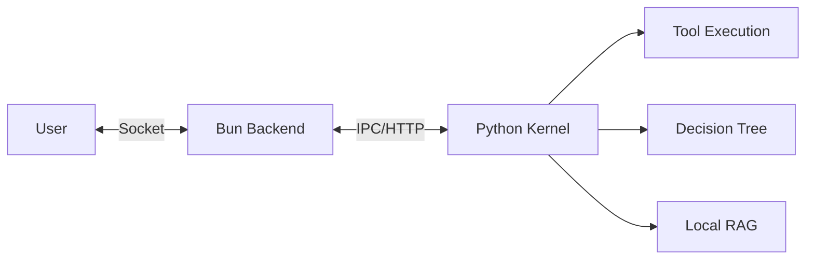

# 🌸 ElysiaAI // INFINITE RESONANCE

### Next-Gen AI-Native OS where Sensitivity and Logic Resonate.

[](#-quick-start-5-min)
[](https://github.com/Elysia20220909/ElysiaAI)
[](LICENSE)

---

## 🚀 Quick Start (5 min)

The fastest way to experience ElysiaAI.

### 1. Prerequisites
- **Bun** (v1.1+) & **Python** (v3.11+)
- **Ollama** (For local inference: `llama3.2` recommended)

### 2. Setup
```bash
# Clone the repository
git clone git@github.com:Elysia20220909/ElysiaAI.git
cd ElysiaAI

# Configure environment and install dependencies
cp .env.example .env
make install
```

### 3. Launch
```bash
make boot
```
> [!TIP]
> Open `http://localhost:3000` in your browser to experience the Elysia Desktop environment.

---

## 🧠 Why ElysiaAI?

ElysiaAI is more than just a chat UI. It was designed to bridge the gap between "thinking" and "executing."

- **Agent x Decision Tree**: The AI doesn't just answer; it autonomously executes logical steps based on a decision tree.
- **Sovereign Privacy**: 100% local RAG with local LLMs (Ollama) and Milvus Lite. Your thoughts never leave your machine.
- **Resonance Design**: A beautiful yet robust UI/UX born from the heat and noise of a laundry factory.

---

## 🏗️ Architecture: The Resonance Loop

The heart of ElysiaAI is powered by the resonance between logic (Python Kernel) and high-speed communication (Bun/Elysia.js).



- **Bun/Elysia.js**: The "Nerve" handling tens of thousands of requests per second.
- **Python Kernel**: The "Brain" responsible for complex reasoning and tool execution.
- **Milvus Lite**: The "Ocean" where all knowledge is stored semantically.

---

## 🛠️ Technology Stack

| Layer | Technologies |
| :--- | :--- |
| **Frontend** | Alpine.js, Tailwind CSS, Lucide Icons |
| **Backend** | Bun, Elysia.js, Prisma, SQLite |
| **AI Kernel** | Python 3.11, FastAPI, LangChain |
| **Memory** | Milvus Lite, Sentence-Transformers |
| **Security** | AEGIS Ledger (Multi-layer ICE), JWT |

---

## 🤝 Contributing

ElysiaAI is open to all developers who believe in the harmony of technology and sensitivity.
See [CONTRIBUTING.md](./CONTRIBUTING.md) for details.

- **Bug Reports**: Please use the issue templates.
- **Pull Requests**: We follow `Conventional Commits`.

---

© 2026 ElysiaAI Project // Crafted with passion in a laundry factory.
