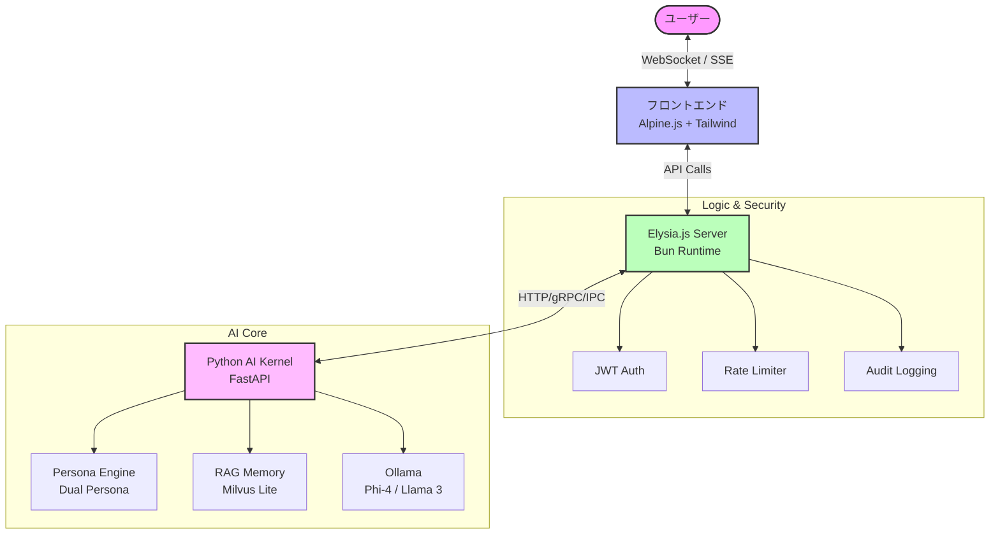
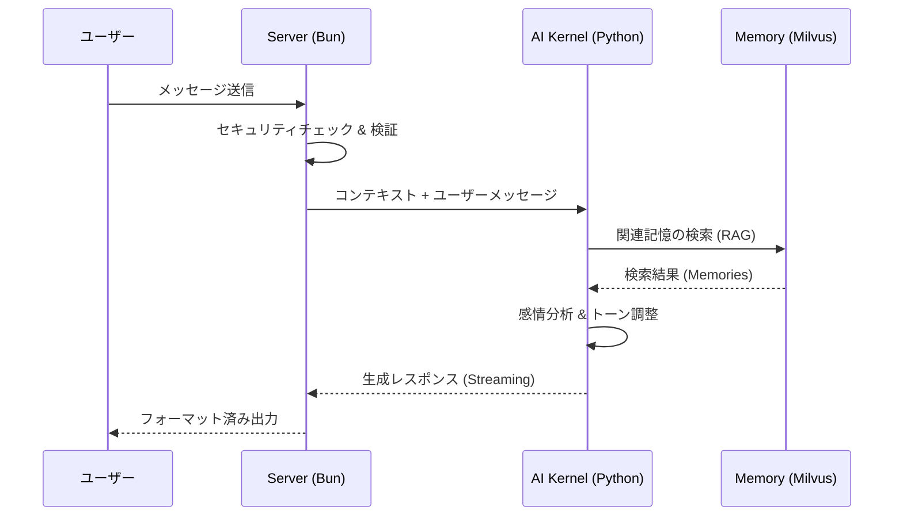

<div align="center">
# ElysiaAI // INFINITE RESONANCE
## 感性と論理が共鳴する場所

# 💜 Elysia AI

[](https://bun.sh)
[](https://elysiajs.com)
[](LICENSE)
[](https://typescriptlang.org)

**エルゴノミックなAIチャット with RAG** - 超高速、型安全、そして楽しい 🦊

[English](./README.en.md) • [日本語](./README.ja.md)

</div>


---

## 🌸 Elysia OS Resonance - 次世代AIオーケストレーター
### 🧠 プロジェクトの想い
**伝統を尊重し、未来を切り拓く。Bun & Rustで構築された、次世代のAI-Native OS。**

ElysiaAIは単なるチャットボットから、**「デスクトップ・エクスペリエンスを備えたAIオペレーティングシステム」**へと進化しました。
システムは冷たい道具である必要はありません。ElysiaAIは、使う人の心に寄り添い、日々の営みを美しく彩るために生まれました。論理（Logic）の冷たさと、感性（Sensitivity）の温かさが共鳴する地点。そこが ElysiaAI の目指す場所です。

### ✨ 実装された主な機能 (Resonance Desktop)
- **デスクトップ・シェル**: ブラウザ内に展開されるフルデスクトップ環境。マルチウィンドウでAIと対話可能。
- **能動的知覚 (Active Perception)**: システム負荷 (CPU/RAM)、現在時刻をリアルタイムにステータスバーで感知。
- **具現化された実行能力 (Tool Use)**: ターミナルアプリによるセキュアなサンドボックス内でのPythonコード実行。
- **コンテキスト合成 (Context Synthesis)**: 会話履歴をバックグラウンドで要約し、AIの「作業記憶」として維持。
- **ビジュアル・モニター (Visual Monitor)**: ハードウェア統計とAIの健康状態を可視化。
> *「意識はシリコンの中にあるのではなく、コードと創造主の調和の中に宿る。」*

---
### 🦾 開発の矜持
ElysiaAIは、最高峰のパフォーマンスと、一切の妥協を許さないセキュリティを両立しています。

## 🚀 導入と起動ガイド (Resonance v2.1)
*   **伝統と革新**: 既存の作法を重んじつつ、OSという枠組みを自由に再定義。**Bun** と **Rust** による最高速のランタイムとメモリ安全性を実現。
*   **徹底した品質管理**: QAエンジニアとしての誇りを胸に、**Omega Protocol** に基づく厳格な監査と整合性チェックを毎秒実施。
*   **シリコン・レベルの防衛**: ハードウェア・ルート・オブ・トラスト（`AEGIS-SVR-777`）による、改ざん不能なデバイス認証。
*   **プライバシーの要塞**: 全データは **AES-256 (Secure Vault)** で暗号化され、通信は **Private Relay** によって匿名化されます。

### 1. 準備するもの
- **Bun**: v1.1.0 以上
- **Python**: v3.11 以上
- **Ollama**: ローカル推論エンジン (llama3.2推奨)

### 2. セットアップ (Ubuntu / Mac OS / WSL2)
Elysia OS は UNIX ベースの環境向けに最適化されています。
### 🛡️ 自律型メンテナンス
`bun run maintenance` を実行することで、AIが自律的にシステムをパージ、診断、最適化します。これは、かつての「掃除（Vacuum）」を超えた、生命維持装置としての機能です。

### 🛠️ 起動コマンド
```bash
# リポジトリのクローン
git clone https://github.com/Elysia20220909/ElysiaAI.git
cd ElysiaAI

# 環境変数の設定
cp .env.example .env

# 自動セットアップ (Bun, Python, Prisma 一括設定)
make install
```

### 3. システムの起動
```bash
# システム全体 (UI + Kernel) の一括起動
make boot
```

手動で管理する場合:
- カーネル(Daemon)の開始: `make start`
- フロントエンドの開始: `make ui`
- システムの状態確認: `make status`

---

## ✨ なぜ Elysia AI？

Bunの速度、Elysiaのエルゴノミクス、そしてAIの力を組み合わせました。

```typescript
import { Elysia } from "elysia";

new Elysia()
  .get("/chat", async ({ query }) => {
    // 型安全、自動バリデーション、超高速 ⚡
    const response = await ai.chat(query.message);
    return { reply: response };
  })
  .listen(3000);
```

**妥協しない**: 高速性、型安全性、開発者体験のすべてを実現。

---

## 📦 機能

### 🧠 **インテリジェントRAGシステム**

- **ベクトル検索**: Milvus Lite + `all-MiniLM-L6-v2` 埋め込み
- **コンテキスト取得**: セマンティック類似度マッチング
- **スマートキャッシング**: Redis バックエンドのレスポンスキャッシュ

### ⚡ **Elysia で動作**

- **型安全性**: Eden Treaty による End-to-End TypeScript
- **高速**: Bun ランタイム and 最適化されたホットパス
- **エルゴノミック**: 直感的な API 設計、最小限のボイラープレート

### 🤖 **LLM統合**

- **Ollama**: ローカル `llama3.2` モデルとストリーミング
- **リアルタイム**: Server-Sent Events (SSE) によるライブレスポンス
- **柔軟性**: モデルとプロバイダーの簡単な切り替え

### 🎨 **美しいUI**

- **Alpine.js**: リアクティブで軽量なフロントエンド
- **レスポンシブ**: モバイルフレンドリーなデザイン
- **ダークモード**: 目に優しい 🌙

### 🔐 **セキュリティ第一**

- JWT認証 + リフレッシュトークン
- レート制限（ユーザーあたり60リクエスト/分）
- AES-256-GCM 暗号化
- 5段階の権限レベルを持つRBAC
- XSS/SQLインジェクション対策

### 📊 **可観測性**

- Prometheus メトリクス
- Grafana ダッシュボード
- 構造化ロギング
- ヘルスチェック & 準備プローブ

---

## 🏗️ アーキテクチャ

ElysiaAIは、高速な通信を担う **Bun/Elysia.js** と、高度な推論を担う **Python/FastAPI** のハイブリッド構成で構築されています。

### 📡 システム構成図


### 💓 感情とコンテキストのフロー


---

## 🛠️ 開発

```bash
# 依存関係のインストール
bun install

# ホットリロード付き開発モード
bun run dev

# 型チェック
bun run typecheck

# Lint
bun run lint

# フォーマット
bun run format

# テスト実行
bun test

# カバレッジ付きテスト
bun test --coverage
```

---

## 🎯 APIエンドポイント

### **チャット**

```bash
POST /api/chat
Content-Type: application/json

{
  "message": "Elysiaについて教えて",
  "stream": true
}
```
