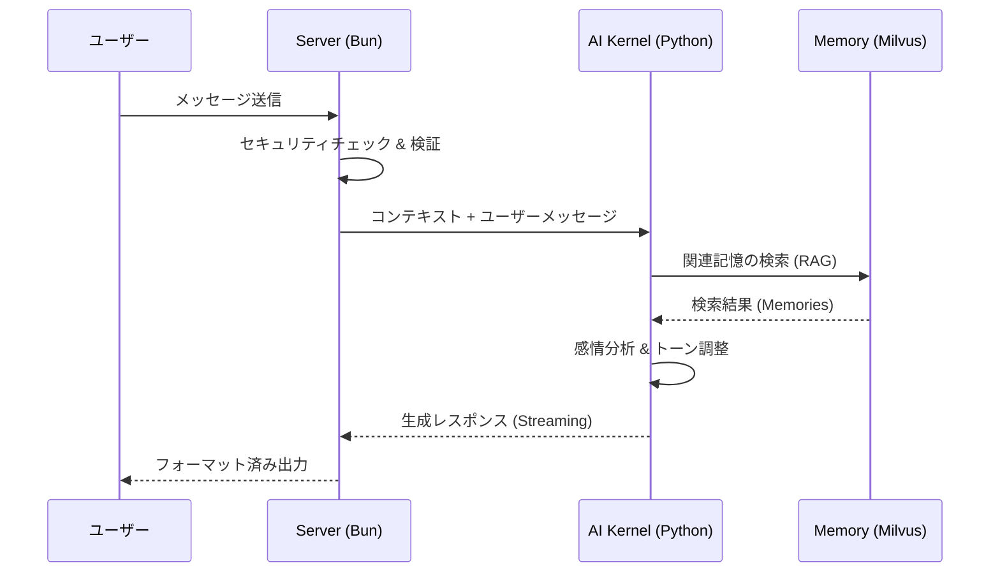

<div align="center">

# 💜 Elysia AI

[](https://bun.sh)
[](https://elysiajs.com)
[](LICENSE)
[](https://typescriptlang.org)

**エルゴノミックなAIチャット with RAG** - 超高速、型安全、そして楽しい 🦊

[English](./README.en.md) • [日本語](./README.ja.md)

</div>

---

## 🌸 Elysia OS Resonance - 次世代AIオーケストレーター

ElysiaAIは単なるチャットボットから、**「デスクトップ・エクスペリエンスを備えたAIオペレーティングシステム」**へと進化しました。

### ✨ 実装された主な機能 (Resonance Desktop)
- **デスクトップ・シェル**: ブラウザ内に展開されるフルデスクトップ環境。マルチウィンドウでAIと対話可能。
- **能動的知覚 (Active Perception)**: システム負荷 (CPU/RAM)、現在時刻をリアルタイムにステータスバーで感知。
- **具現化された実行能力 (Tool Use)**: ターミナルアプリによるセキュアなサンドボックス内でのPythonコード実行。
- **コンテキスト合成 (Context Synthesis)**: 会話履歴をバックグラウンドで要約し、AIの「作業記憶」として維持。
- **ビジュアル・モニター (Visual Monitor)**: ハードウェア統計とAIの健康状態を可視化。

---

## 🚀 導入と起動ガイド (Resonance v2.1)

### 1. 準備するもの
- **Bun**: v1.1.0 以上
- **Python**: v3.11 以上
- **Ollama**: ローカル推論エンジン (llama3.2推奨)

### 2. セットアップ (Ubuntu / Mac OS / WSL2)
Elysia OS は UNIX ベースの環境向けに最適化されています。

```bash
# リポジトリのクローン
git clone https://github.com/Elysia20220909/ElysiaAI.git
cd ElysiaAI

# 環境変数の設定
cp .env.example .env

# 自動セットアップ (Bun, Python, Prisma 一括設定)
make install
```

### 3. システムの起動
```bash
# システム全体 (UI + Kernel) の一括起動
make boot
```

手動で管理する場合:
- カーネル(Daemon)の開始: `make start`
- フロントエンドの開始: `make ui`
- システムの状態確認: `make status`

---

## ✨ なぜ Elysia AI？

Bunの速度、Elysiaのエルゴノミクス、そしてAIの力を組み合わせました。

```typescript
import { Elysia } from "elysia";

new Elysia()
  .get("/chat", async ({ query }) => {
    // 型安全、自動バリデーション、超高速 ⚡
    const response = await ai.chat(query.message);
    return { reply: response };
  })
  .listen(3000);
```

**妥協しない**: 高速性、型安全性、開発者体験のすべてを実現。

---

## 📦 機能

### 🧠 **インテリジェントRAGシステム**

- **ベクトル検索**: Milvus Lite + `all-MiniLM-L6-v2` 埋め込み
- **コンテキスト取得**: セマンティック類似度マッチング
- **スマートキャッシング**: Redis バックエンドのレスポンスキャッシュ

### ⚡ **Elysia で動作**

- **型安全性**: Eden Treaty による End-to-End TypeScript
- **高速**: Bun ランタイムと最適化されたホットパス
- **エルゴノミック**: 直感的な API 設計、最小限のボイラープレート

### 🤖 **LLM統合**

- **Ollama**: ローカル `llama3.2` モデルとストリーミング
- **リアルタイム**: Server-Sent Events (SSE) によるライブレスポンス
- **柔軟性**: モデルとプロバイダーの簡単な切り替え

### 🎨 **美しいUI**

- **Alpine.js**: リアクティブで軽量なフロントエンド
- **レスポンシブ**: モバイルフレンドリーなデザイン
- **ダークモード**: 目に優しい 🌙

### 🔐 **セキュリティ第一**

- JWT認証 + リフレッシュトークン
- レート制限（ユーザーあたり60リクエスト/分）
- AES-256-GCM 暗号化
- 5段階の権限レベルを持つRBAC
- XSS/SQLインジェクション対策

### 📊 **可観測性**

- Prometheus メトリクス
- Grafana ダッシュボード
- 構造化ロギング
- ヘルスチェック & 準備プローブ

---

## 🏗️ アーキテクチャ

ElysiaAIは、高速な通信を担う **Bun/Elysia.js** と、高度な推論を担う **Python/FastAPI** のハイブリッド構成で構築されています。

### 📡 システム構成図


### 💓 感情とコンテキストのフロー


---

## 🛠️ 開発

```bash
# 依存関係のインストール
bun install

# ホットリロード付き開発モード
bun run dev

# 型チェック
bun run typecheck

# Lint
bun run lint

# フォーマット
bun run format

# テスト実行
bun test

# カバレッジ付きテスト
bun test --coverage
```

---

## 🎯 APIエンドポイント

### **チャット**

```bash
POST /api/chat
Content-Type: application/json

{
  "message": "Elysiaについて教えて",
  "stream": true
}
```

### **RAGクエリ**

```bash
POST /api/rag/query
{
  "query": "ベクトル検索とは？",
  "top_k": 5
}
```

### **ヘルスチェック**

```bash
GET /health
# 返却値: { "status": "ok", "uptime": 12345 }
```

**完全なAPIドキュメント**: http://localhost:3000/swagger

---

### **テスト実行**

```bash
# ユニットテスト
make test

# E2Eテスト (Playwright)
bunx playwright test

# 脆弱性スキャン (GlassWorm / Secrets)
python scripts/glassworm_lint.py
```

**テストカバレッジ**: 80%+ 包括的なセキュリティテストスイート付き

詳細は [SECURITY_TESTING_GUIDE.md](SECURITY_TESTING_GUIDE.md) を参照してください。

---

## 🚢 本番デプロイ

### **Docker**（推奨）

```bash
# 本番イメージのビルド
docker build -f Dockerfile.production -t elysia-ai:latest .

# docker-composeで実行
docker-compose up -d
```

### **クラウドプラットフォーム**

```bash
# AWS
cd cloud/aws && ./deploy.sh

# GCP
cd cloud/gcp && ./deploy.sh
```

### **パフォーマンス**

- **コールドスタート**: < 100ms
- **平均レスポンス**: 45ms (p50)
- **スループット**: 10,000 req/s
- **最大同時ユーザー数**: 50,000+

---

## 📚 ドキュメント

- 📖 [アーキテクチャガイド](docs/architecture/ARCHITECTURE.md)
- 🔌 [APIリファレンス](docs/API.md)
- 🔐 [セキュリティベストプラクティス](docs/SECURITY.md)
- 🚀 [デプロイメントガイド](docs/DEPLOYMENT_GUIDE.md)
- 🤝 [コントリビューションガイドライン](docs/community/CONTRIBUTING.md)
- 📝 [変更履歴](CHANGELOG.md)

---

## 🗺️ ロードマップ

**v2.0**（2026年Q1）

- 🎯 関数呼び出し & ツール使用
- 🔄 マルチエージェントオーケストレーション
- 🌐 GraphQL API

**v2.1**（2026年Q2）

- 🎤 音声入出力サポート
- 🖼️ マルチモーダルAI（画像、動画）
- 🔍 高度なRAG技術

**v3.0**（2026年Q3）

- 🤖 メモリ付きエージェントフレームワーク
- 🏢 マルチテナントアーキテクチャ
- ☸️ Kubernetesネイティブデプロイ

---

### 🛠️ 開発者向けリソース
- **[APIリファレンス](file:///docs/API_REFERENCE.md)**: 各エンドポイントの詳細仕様。
- **[コントリビューションガイド](file:///CONTRIBUTING.md)**: 開発への協力方法と規約。

---

## 📜 ライセンス
MIT License - Copyright (c) 2025 chloeamethyst
利用・改変・再配布は自由ですが、愛を持って扱ってくださいね♡

Permission is hereby granted, free of charge, to any person obtaining a copy
of this software and associated documentation files (the "Software"), to deal
in the Software without restriction, including without limitation the rights
to use, copy, modify, merge, publish, distribute, sublicense, and/or sell
copies of the Software, and to permit persons to whom the Software is
furnished to do so, subject to the following conditions:

The above copyright notice and this permission notice shall be included in all
copies or substantial portions of the Software.

THE SOFTWARE IS PROVIDED "AS IS", WITHOUT WARRANTY OF ANY KIND, EXPRESS OR
IMPLIED, INCLUDING BUT NOT LIMITED TO THE WARRANTIES OF MERCHANTABILITY,
FITNESS FOR A PARTICULAR PURPOSE AND NONINFRINGEMENT. IN NO EVENT SHALL THE
AUTHORS OR COPYRIGHT HOLDERS BE LIABLE FOR ANY CLAIM, DAMAGES OR OTHER
LIABILITY, WHETHER IN AN ACTION OF CONTRACT, TORT OR OTHERWISE, ARISING FROM,
OUT OF OR IN CONNECTION WITH THE SOFTWARE OR THE USE OR OTHER DEALINGS IN THE
SOFTWARE.

詳細は [LICENSE](LICENSE) ファイルを参照してください。

---

## 🤝 サポート

- **Issue**: [GitHub Issues](https://github.com/chloeamethyst/ElysiaJS/issues)
- **ディスカッション**: [GitHub Discussions](https://github.com/chloeamethyst/ElysiaJS/discussions)
- **セキュリティ**: [SECURITY.md](docs/SECURITY.md) を参照

---

## 🙏 クレジット

[Elysia](https://elysiajs.com/) • [Bun](https://bun.sh/) • [Ollama](https://ollama.ai/) • [Milvus](https://milvus.io/) • [FastAPI](https://fastapi.tiangolo.com/)

---

<div align="center">

Made with ❤️ by [chloeamethyst](https://github.com/chloeamethyst)

⭐ **GitHubでスターをお願いします！**

</div>
