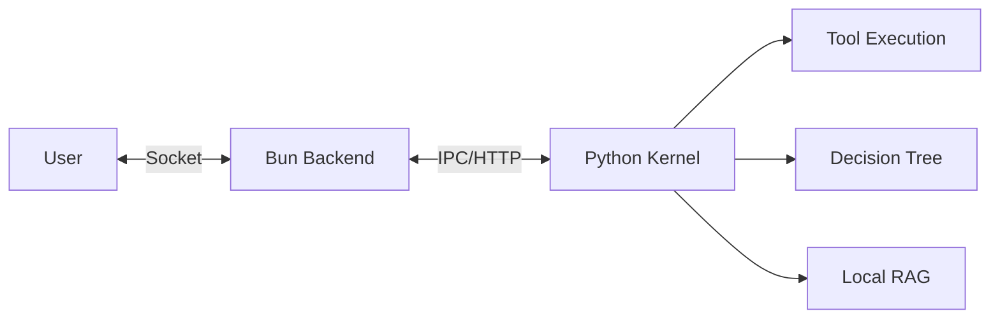

# 🌸 ElysiaAI // INFINITE RESONANCE

### 感性と論理が共鳴する、次世代AI-Native OS。

[](#-quick-start-5-min)
[](https://github.com/Elysia20220909/ElysiaAI)
[](LICENSE)
[](CHANGELOG.ja.md)

---

## 🚀 Quick Start (5 min)

ElysiaAIを最も速く体験する方法です。

### 1. 準備
- **Bun** (v1.1+) & **Python** (v3.11+)
- **Ollama** (ローカル推論用: `llama3.2` 推奨)

### 2. セットアップ
```bash
# リポジトリの取得
git clone git@github.com:Elysia20220909/ElysiaAI.git
cd ElysiaAI

# 統合管理CLIによるセットアップ
bun scripts/manage.ts setup
bun scripts/manage.ts setup-python
```

### 3. 起動
```bash
bun scripts/manage.ts dev
```
> [!TIP]
> ブラウザで `http://localhost:3000` を開くと、Elysia Desktop環境が展開されます。

### 4. 依存ツールのセットアップ (重要)
- **Milvus Lite**: セマンティック記憶（RAG）に使用されます。`bun scripts/manage.ts setup-python` で自動インストールされます。
- **VOICEVOX**: 音声合成に使用されます。[公式サイト](https://voicevox.hiroshiba.jp/)からエンジンをダウンロードし、起動しておいてください。
- **Windows セットアップ**: Windows環境では `scripts/setup-security.ps1` を実行して、セキュアなディレクトリ権限を設定することを推奨します。

---

## 🧠 Why ElysiaAI?

単なるチャットUIではありません。ElysiaAIは「思考」と「実行」の間に横たわる溝を埋めるために設計されました。

- **Agent x Decision Tree**: AIが単に答えるだけでなく、決定木（Decision Tree）に基づいて論理的なステップを自律的に実行します。
- **Sovereign Privacy**: ローカルLLM（Ollama）とMilvus Liteによる100%ローカルなRAG。あなたの思考は、あなたのマシンの外に出ることはありません。
- **Resonance Design**: ランドリー工場の熱気から生まれた、美しく、それでいて強靭なUI/UX。

---

## 🏗️ Architecture: The Resonance Loop

ElysiaAIの心臓部は、論理（Python Kernel）と高速通信（Bun/Elysia.js）の共鳴によって動いています。



- **Bun/Elysia.js**: 秒間数万のリクエストを処理する「神経」。
- **Python Kernel**: 複雑な推論とツール実行を担う「脳」。
- **Milvus Lite**: 全ての知識をセマンティックに記憶する「海」。

---

## 🗺️ ロードマップ

ElysiaAIは以下のフェーズを経て進化します。

### Phase 1: Foundation (現在)
- [x] Bun & Python Kernelの統合
- [x] ローカルRAG (Milvus Lite) の実装
- [x] 統合管理CLI (manage.ts) の開発

### Phase 2: Resonance (次期)
- [ ] **複数ユーザー対応**: マルチユーザー管理と権限制御 (RBAC)。
- [ ] **メモリ暗号化**: Milvus記憶領域とログの AES-256-GCM 暗号化。
- [ ] **高度なCI/CD**: 自動テストカバレッジの向上。

### Phase 3: Transcendence
- [ ] **AbyssRTOS 統合**: 完全隔離された実行環境。
- [ ] **Shield Agent**: Rustによるリアルタイム脅威検知。
- [ ] **Sovereign Mesh**: 分散型AI OSネットワーク。

---

## 🔒 セキュリティ概念

ElysiaAIは、以下の独自概念でユーザーの主権を保護します。

- **Responsible AI**: ユーザーデータ、APIキー、非公開文書、チャットログ、RAGソースは、明示的な同意なく公開・記録・利用されるべきではありません。
- **White ICE**: システム保護のための表層防壁。
- **Black ICE**: 悪意ある入力を遮断する深層防壁。
- **AbyssRTOS**: プロセスを外部から隠蔽する隔離実行環境。

詳細は [SECURITY.md](./SECURITY.md)、[Responsible AI](./docs/RESPONSIBLE_AI.md)、[Threat Model](./docs/THREAT_MODEL.md) を参照してください。

---

## 🛠️ 技術スタック

| Layer | Technologies |
| :--- | :--- |
| **Frontend** | Alpine.js, Tailwind CSS, Lucide Icons |
| **Backend** | Bun, Elysia.js, Prisma, SQLite |
| **AI Kernel** | Python 3.11, FastAPI, LangChain |
| **Memory** | Milvus Lite, Sentence-Transformers |
| **Security** | AEGIS Ledger (Multi-layer ICE), JWT |

---

## 🧪 品質ゲート

Pull Request前に以下を実行してください。

```bash
bun run lint
bun run test
bun run typecheck
bun run check:git-hygiene
bun run check:encoding
bun run security:glassworm -- --ci
```

`.env` や `.env.*` は追跡禁止です。追跡するのは `.env.example` のみです。
文字化け検出は UTF-8 不正、置換文字、Windows-1252/CP932 系の典型的な崩れを検出します。

---

## 🎙️ Open-LLM-VTuber Bridge

Open-LLM-VTuber は外部サービスとして起動し、ElysiaAI から Bridge API で検出・監視します。

```dotenv
OPEN_LLM_VTUBER_ENABLED=true
OPEN_LLM_VTUBER_BASE_URL=http://127.0.0.1:12393
```

詳細は [Open-LLM-VTuber Bridge](./docs/OPEN_LLM_VTUBER_INTEGRATION.md) を参照してください。

---

## 🤝 コントリビュート

ElysiaAIは、技術と感性の調和を信じる全ての開発者のために開かれています。
詳細は [CONTRIBUTING.md](./CONTRIBUTING.md) をご覧ください。

- **Bug Reports**: Issueテンプレートに従って報告してください。
- **Pull Requests**: `Conventional Commits` 準拠をお願いしています。

---

© 2026 Elysia20220909 // ElysiaAI Main // Crafted with passion in a laundry factory.
