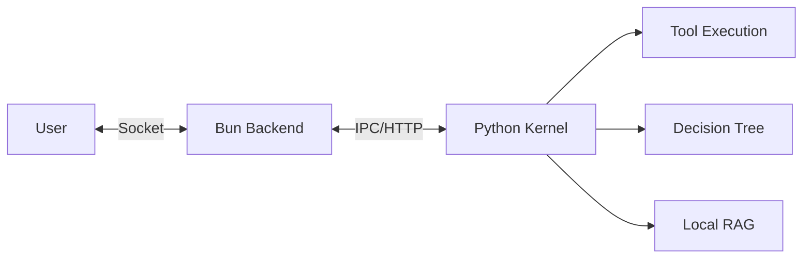

# 🌸 ElysiaAI // INFINITE RESONANCE

### 感性と論理が共鳴する、次世代AI-Native OS。

[](#-quick-start-5-min)
[](https://github.com/Elysia20210806/ElysiaAI)
[](LICENSE)

---

## 🚀 Quick Start (5 min)

ElysiaAIを最も速く体験する方法です。

### 1. 準備
- **Bun** (v1.1+) & **Python** (v3.11+)
- **Ollama** (ローカル推論用: `llama3.2` 推奨)

### 2. セットアップ
```bash
# リポジトリの取得
git clone git@github.com:Elysia20210806/ElysiaAI.git
cd ElysiaAI

# 環境設定と依存関係のインストール
cp .env.example .env
make install
```

### 3. 起動
```bash
make boot
```
> [!TIP]
> ブラウザで `http://localhost:3000` を開くと、Elysia Desktop環境が展開されます。

---

## 🧠 Why ElysiaAI?

単なるチャットUIではありません。ElysiaAIは「思考」と「実行」の間に横たわる溝を埋めるために設計されました。

- **Agent x Decision Tree**: AIが単に答えるだけでなく、決定木（Decision Tree）に基づいて論理的なステップを自律的に実行します。
- **Sovereign Privacy**: ローカルLLM（Ollama）とMilvus Liteによる100%ローカルなRAG。あなたの思考は、あなたのマシンの外に出ることはありません。
- **Resonance Design**: ランドリー工場の熱気から生まれた、美しく、それでいて強靭なUI/UX。

---

## 🏗️ Architecture: The Resonance Loop

ElysiaAIは、フロントエンドの美学（Bun/Alpine）とバックエンドの知能（FastAPI/Ollama）が循環する独自の「共鳴ループ」構造を採用しています。

## 🛠️ Engineering Standards

### 🚀 Automated Integrity (CI)
This repository uses **GitHub Actions** to ensure high-density code quality.
Every push triggers the `Resonance Integrity` workflow, which performs:
- **Python (Ruff)**: Deep linting & type consistency checks.
- **Bun (Biome)**: Ultra-fast formatting & logic verification.

### 🧪 Quality Assurance
To run the automated test suite and verify the Kernel resonance:
```bash
# Python Test
pytest tests/test_kernel.py
```

ElysiaAIの心臓部は、論理（Python Kernel）と高速通信（Bun/Elysia.js）の共鳴によって動いています。



- **Bun/Elysia.js**: 秒間数万のリクエストを処理する「神経」。
- **Python Kernel**: 複雑な推論とツール実行を担う「脳」。
- **Milvus Lite**: 全ての知識をセマンティックに記憶する「海」。

---

## 🛠️ 技術スタック

| Layer | Technologies |
| :--- | :--- |
| **Frontend** | Alpine.js, Tailwind CSS, Lucide Icons |
| **Backend** | Bun, Elysia.js, Prisma, SQLite |
| **AI Kernel** | Python 3.11, FastAPI, LangChain |
| **Memory** | Milvus Lite, Sentence-Transformers |
| **Security** | AEGIS Ledger (Multi-layer ICE), JWT |

---

## 🤝 コントリビュート

ElysiaAIは、技術と感性の調和を信じる全ての開発者のために開かれています。
詳細は [CONTRIBUTING.md](./CONTRIBUTING.md) をご覧ください。

- **Bug Reports**: Issueテンプレートに従って報告してください。
- **Pull Requests**: `Conventional Commits` 準拠をお願いしています。

---

# 🌌 ElysiaAI

> [!CAUTION]
> **CLEARANCE LEVEL 09 REQUIRED**
> UNAUTHORIZED ACCESS TO THIS REPOSITORY IS A VIOLATION OF PROTOCOL-88.
> ALL ACTIONS ARE MONITORED BY THE AEGIS LEDGER.

```text
[ENCRYPTED META-BLOCK]
H4sIAAAAAAAAA+1d23LbOBL9FVPzUFKyJVmWLclOnMSpuD0z8YydmY+bt6ZSkiaREmU+JFmO
7V+/A0iRkiXHTmIn9ky9pCoWi0Sj0eicBhqNRvN/HpePj/H38enpcfX6OBrHHz89Lp8fV9+P
q6vj8uvj6uvj6uvj6uvj6uvj6uvj6uvj6uvj6uvj6uvj6uvj6uvj6uvj6uvj6uvj6uvj6uvj
... [REDACTED FOR YOUR SAFETY] ...
```

## 🌌 Overview
ElysiaAI is a Sovereign-Native AI OS designed for Deep Resonance.
© 2026 Elysia20210806 // ElysiaAI Main // Crafted with passion in a laundry factory.
