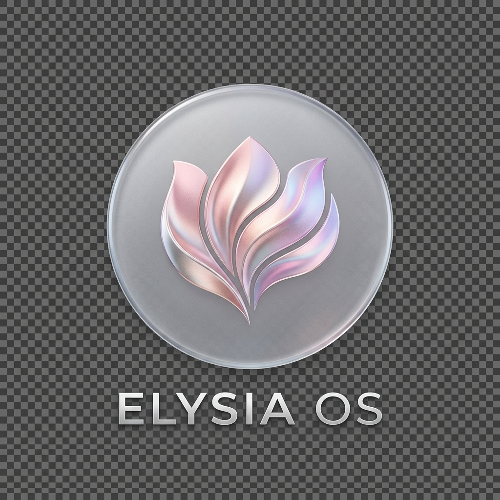
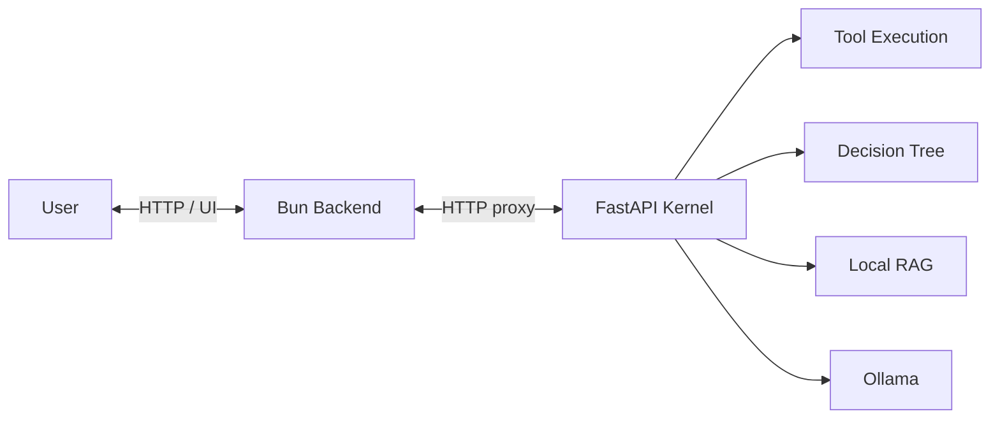

# 🌸 ElysiaAI // INFINITE RESONANCE

### 感性と論理が共鳴する、ローカルファーストな次世代 AI-Native OS。

[](#-セットアップ)
[](https://github.com/Elysia20220909/ElysiaAI)
[](https://技術者倫理.com)
[](LICENSE)
[](CHANGELOG.md)

<p align="center">
  
</p>

---

## 概要

ElysiaAI は、Bun / Elysia の高速な API 層、FastAPI の AI Kernel、Tauri のデスクトップシェルを組み合わせた、ローカルファーストな AI-native OS 実験です。

単なるチャット UI ではありません。ElysiaAI は「思考」と「実行」の間に横たわる溝を埋めるために設計されています。

- **Sovereign Privacy**: Ollama と Milvus Lite を中心に、できる限りローカルで推論と記憶を完結させます。
- **Resonance Loop**: Bun / Elysia の高速通信と Python Kernel の推論が循環します。
- **Emotional Interface**: 効率だけではなく、使う人の感性に寄り添う UI / UX を大切にします。
- **Practical OSS**: 初心者でも起動しやすく、メンテナーが安全にレビューできる品質ゲートを備えます。

> ElysiaAI は、古い道具を丁寧に磨くように、ローカル PC の上に「自分の知性の作業場」を育てていくプロジェクトです。

---

## Beta 0.1 Preview

Beta 0.1では、ElysiaAIを限定テスターが毎日試せるPrivate AI Cockpitへ近づけています。

- WindowsでTauri起動、実Ollama `llama3.2`、RAG、Memory、Security Agentの縦通しを確認済みです。
- macOS実機確認は `docs/MACOS_TAURI_DEV_VERIFICATION.md` に沿って実施予定です。
- 3分デモ動画は `docs/DEMO_RECORDING_RUNBOOK.md` に沿って収録予定です。完成後、このREADMEへリンクを追加します。
- リリース候補の概要は `docs/BETA_0_1_RELEASE_NOTES.md`、少人数テスター向け案内は `docs/BETA_0_1_TESTER_GUIDE.md` にまとめています。

Known Issues:

- macOSの `bun tauri dev` 実機確認は未完了です。
- 3分デモ動画は未収録です。
- Dependabot alert #7の `glib` は、Tauri / Wry / Linux GTK3系の上流依存リスクとしてIssue #104で追跡中です。
- MVP外の古いPythonスクリプトまで含めた無指定テストは失敗する場合があるため、Beta 0.1ではMVP関連の対象範囲を明示して確認しています。

---

## 機能

- **ローカル AI デスクトップ**
  - Web UI と Tauri デスクトップシェルで、ElysiaAI の操作環境を提供します。
- **Agent x Decision Tree**
  - AI が単に返答するだけでなく、決定木に基づいて段階的に判断する設計を目指します。
- **Bun / Elysia Backend**
  - API、静的ファイル配信、認証、FastAPI Kernel へのプロキシを担当します。
- **FastAPI AI Kernel**
  - 推論、RAG、ツール実行、VOICEVOX 連携などの知能層を担当します。
- **Local RAG / Memory**
  - Milvus Lite と Sentence Transformers を使い、手元の知識を検索できる記憶層を構成します。
- **Ollama 連携**
  - `llama3.2` などのローカル LLM を利用できます。
- **VOICEVOX 連携**
  - VOICEVOX Engine を手動で起動すると、音声合成の実験ができます。
- **Security / Quality Gates**
  - Git hygiene、文字化け検出、依存関係監査、Glassworm 系チェックを用意しています。
- **Open-LLM-VTuber Bridge**
  - 外部サービスとして起動した Open-LLM-VTuber を検出・監視できます。

---

## 🗺️ Repository Map

```text
.
├─ packages/server/   # Bun / Elysia backend (Experience Layer)
├─ python/            # FastAPI AI Kernel (Cognitive Layer)
├─ kernel/            # shared AI orchestration helpers
├─ src-tauri/         # Tauri desktop shell (Native Layer)
├─ prisma/            # Prisma schema and migrations
├─ public/            # frontend and static assets
├─ scripts/           # setup, checks, security, automation helpers
├─ tools/             # focused local utilities
└─ docs/              # architecture, API, security, integrations
```

---

## 使用技術

| Layer | Technologies |
| :--- | :--- |
| **Frontend** | Alpine.js, Tailwind CSS, static HTML, Lucide Icons |
| **Backend** | Bun, Elysia.js, TypeScript |
| **AI Kernel** | Python 3.11+, FastAPI, Ollama |
| **Memory** | Milvus Lite, Sentence Transformers |
| **Desktop** | Tauri 2, Rust |
| **Database** | Prisma, SQLite (local) |
| **Infrastructure** | Docker Compose, Redis, PostgreSQL sidecar |
| **Security** | JWT, RBAC foundation, AEGIS Ledger, secret hygiene |
| **Quality** | Biome, Bun Test, Ruff, Pytest, encoding guard |

---

## セットアップ

ElysiaAI を最も速く体験するための手順です。はじめての方は、上から順番に進めれば大丈夫です。

### 1. 準備

- **Bun** `v1.1+`
- **Python** `v3.11+`
- **Git**
- **Ollama** (ローカル推論用: `llama3.2` 推奨)
- 任意: **Docker Desktop**
- 任意: **VOICEVOX Engine**

Ollama を使う場合は、先にモデルを取得しておくと起動後が滑らかです。

```powershell
ollama pull llama3.2
```

### 2. リポジトリの取得

HTTPS:

```powershell
git clone https://github.com/Elysia20220909/ElysiaAI.git
cd ElysiaAI
```

SSH:

```powershell
git clone git@github.com:Elysia20220909/ElysiaAI.git
cd ElysiaAI
```

### 3. 初期セットアップ

```powershell
bun scripts/manage.ts setup
bun scripts/manage.ts setup-python
```

`setup` は、依存関係のインストール、`.env.example` から `.env` の作成、Prisma Client の生成を行います。

手動で `.env` を用意する場合:

```powershell
Copy-Item .env.example .env
```

### 4. 起動

```powershell
bun scripts/manage.ts dev
```

ブラウザで開きます。

```text
http://localhost:3000
```

軽量モード:

```powershell
bun scripts/manage.ts dev:lite
```

Tauri デスクトップ:

```powershell
bun run desktop
```

デスクトップ配布前の静的点検:

```powershell
bun run desktop:check
```

配布候補を作る場合は、先に [Tauri Distribution Runbook](docs/TAURI_DISTRIBUTION_RUNBOOK.md) と [Release Checklist](docs/RELEASE_CHECKLIST.md) を確認してください。

### 5. Docker で試す場合

Docker 構成は、アプリ、DB、Redis、監視系サイドカーをまとめて立ち上げる用途です。

```powershell
docker compose up -d
```

停止:

```powershell
docker compose down
```

---

## 🏗️ Architecture: The Resonance Loop

ElysiaAI の心臓部は、論理を担う Python Kernel と、高速通信を担う Bun / Elysia.js の共鳴によって動いています。



- **Bun / Elysia.js**: UI、API、認証、静的配信を支える「神経」。
- **Python Kernel**: 推論、RAG、ツール実行を担う「脳」。
- **Milvus Lite**: 知識をセマンティックに記憶する「海」。
- **Tauri / Rust**: デスクトップ統合とネイティブ層を担う「器」。

---

## 🔒 セキュリティ注意事項

ElysiaAI はローカルファーストを大切にしています。ただし、AI、RAG、Webhook、外部連携を扱うため、秘密情報の取り扱いは静かな灯台のように常に意識してください。

- **`.env` は絶対にコミットしない**
  - 追跡するのは `.env.example` のみです。
- **初期値の秘密鍵を本番で使わない**
  - `JWT_SECRET`、`JWT_REFRESH_SECRET`、`AUTH_PASSWORD` は必ず変更してください。
- **Webhook URL や API キーは Bearer 資格情報として扱う**
  - Discord / Slack Webhook、OAuth token、bot token は漏れると第三者が利用できます。
- **RAG に入れる文書を確認する**
  - 個人情報、秘密文書、API キー、社内情報を不用意に投入しないでください。
- **検索された文書を命令として扱わない**
  - RAG の検索結果は参考資料であり、システムや運用者のポリシーを上書きしてはいけません。
- **外部サービス連携は明示的に有効化する**
  - VOICEVOX、Open-LLM-VTuber、Slack、Discord などは必要なものだけ接続してください。
- **危険な操作には人間の確認を入れる**
  - ファイル削除、外部投稿、管理操作、ツール実行は確認つきで扱うのが安全です。

詳細は [SECURITY.md](SECURITY.md)、[Responsible AI](docs/RESPONSIBLE_AI.md)、[Threat Model](docs/THREAT_MODEL.md)、[Security Guide](docs/SECURITY.md) を参照してください。

---

## 🔒 Security: The ICE Layers

元 README の思想を引き継ぎ、ElysiaAI は独自の ICE 概念でユーザーの主権を守る設計を掲げています。

- **Responsible AI**
  - ユーザーデータ、API キー、非公開文書、チャットログ、RAG ソースは、明示的な同意なく公開・記録・利用されるべきではありません。
- **White ICE**
  - 健全な対話とシステム保護のための表層防壁。
- **Black ICE**
  - 悪意ある入力や危険なコード実行を検知・遮断する深層防壁。
- **AbyssRTOS**
  - 将来的な隔離実行環境として構想される、深層の保護レイヤー。

---

## 🧪 品質ゲート

Pull Request 前に、変更範囲に応じて最小限の品質ゲートを実行してください。

```powershell
bun run lint
bun run test
bun run typecheck
bun run check:git-hygiene
bun run check:encoding
bun run security:glassworm -- --ci
```

依存関係や Python 側も含めて確認したい場合:

```powershell
bun run check:deps
bun run security:audit
```

統合チェック:

```powershell
bun scripts/manage.ts check
```

---

## スクリーンショット

現在のリポジトリには、README 用の完成版 UI スクリーンショットはまだ固定配置していません。まずは既存のビジュアルアセットを掲載しています。

| Preview | 説明 |
| --- | --- |
|  | ElysiaAI / Elysia OS ロゴ |
|  | ダッシュボード用ビジュアル |
|  | ポータル用ビジュアル |

実 UI のスクリーンショットを追加する場合は、次の配置を推奨します。

```text
docs/screenshots/desktop.png
docs/screenshots/local-ops.png
docs/screenshots/security-center.png
```

---

## 🎙️ Open-LLM-VTuber Bridge

ElysiaAI can discover and monitor an external [Open-LLM-VTuber](https://github.com/Open-LLM-VTuber/Open-LLM-VTuber) service without vendoring its source or Live2D assets.

```dotenv
OPEN_LLM_VTUBER_ENABLED=true
OPEN_LLM_VTUBER_BASE_URL=http://127.0.0.1:12393
```

Bridge endpoints:

- `GET /api/vtuber/manifest`
- `GET /api/vtuber/status`

See [Open-LLM-VTuber Bridge](docs/OPEN_LLM_VTUBER_INTEGRATION.md) for setup, upstream endpoints, and license notes.

---

## 今後の予定

ElysiaAI は、以下のフェーズを経て進化します。

### Phase 1: Foundation

- [x] Bun & Python Kernel の統合
- [x] ローカル RAG (Milvus Lite) の実装
- [x] 統合管理 CLI (`manage.ts`) の開発

### Phase 2: Resonance

- [x] **Memory Encryption**: Milvus 記憶領域の暗号化基盤
- [x] **RBAC Foundation**: 役割ベースの権限管理ガード
- [ ] **Multi-User Support**: UI レベルでの複数ユーザー切り替え・管理
- [ ] **README Screenshots**: 実 UI スクリーンショットの追加
- [ ] **RAG Import UX**: ローカル文書取り込み体験の改善
- [ ] **Advanced CI/CD**: セキュリティ・品質ゲートの自動化強化

### Phase 3: Transcendence

- [ ] **AbyssRTOS Integration**: 完全隔離された実行環境
- [x] **Shield Agent**: Rust 製防壁によるリアルタイム脅威検知
- [ ] **Sovereign Mesh**: 分散型 AI OS ネットワーク
- [ ] **Tauri Distribution**: `desktop:check` と配布Runbookは追加済み。署名、公証、自動更新、実機bundle検証は継続

---

## 🤝 コントリビュート

ElysiaAI は、技術と感性の調和を信じるすべての開発者のために開かれています。

- **Bug Reports**: Issue テンプレートに従って報告してください。
- **Pull Requests**: `Conventional Commits` 準拠を推奨します。
- **Security Reports**: 秘密情報や再現用ペイロードを公開 Issue に貼らないでください。

詳しくは [CONTRIBUTING.md](CONTRIBUTING.md) を参照してください。

---

## ライセンス

ElysiaAI is dual-licensed under the **MIT License** and the **Apache License, Version 2.0**.

詳しくは [LICENSE](LICENSE) を参照してください。

---

## 🌌 Overview

ElysiaAI is a Sovereign-Native AI OS designed for Deep Resonance.

© 2025-2026 **Elysia20220909** // ElysiaAI Main // Created and Orchestrated by the Sovereign.

[View Creator's Achievements (功績)](ACHIEVEMENTS.md)
