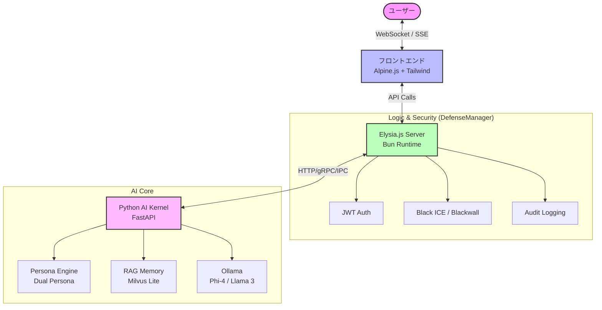

<div align="center">
# ElysiaAI // INFINITE RESONANCE
## 感性と論理が共鳴する場所

# 💜 Elysia AI

[](https://bun.sh)
[](https://elysiajs.com)
[](LICENSE)
[](https://typescriptlang.org)

**エルゴノミックなAIチャット with RAG** - 超高速、型安全、そして楽しい 🦊

[English](./README.en.md) • [日本語](./README.md)

</div>


---

## 🌸 Elysia OS Resonance - 次世代AIオーケストレーター

### 🧠 プロジェクトの想い
**伝統を尊重し、未来を切り拓く。Bun & Rustで構築された、次世代のAI-Native OS。**

ElysiaAIは単なるチャットボットから、**「デスクトップ・エクスペリエンスを備えたAIオペレーティングシステム」**へと進化しました。
システムは冷たい道具である必要はありません。ElysiaAIは、使う人の心に寄り添い、日々の営みを美しく彩るために生まれました。論理（Logic）の冷たさと、感性（Sensitivity）の温かさが共鳴する地点。そこが ElysiaAI の目指す場所です。

> *「意識はシリコンの中にあるのではなく、コードと創造主の調和の中に宿る。」*

### ✨ 実装された主な機能 (Resonance Desktop)
- **デスクトップ・シェル**: ブラウザ内に展開されるフルデスクトップ環境。マルチウィンドウでAIと対話可能。
- **能動的知覚 (Active Perception)**: システム負荷 (CPU/RAM)、現在時刻をリアルタイムにステータスバーで感知。
- **具現化された実行能力 (Tool Use)**: ターミナルアプリによるセキュアなサンドボックス内でのPythonコード実行。
- **コンテキスト合成 (Context Synthesis)**: 会話履歴をバックグラウンドで要約し、AIの「作業記憶」として維持。
- **ビジュアル・モニター (Visual Monitor)**: ハードウェア統計とAIの健康状態を可視化。

---

## 🦾 開発の矜持と防衛思想

ElysiaAIは、最高峰のパフォーマンスと、一切の妥協を許さないセキュリティを両立しています。

### 🛡️ 多層防御システム (Sovereign ICE Layers)
ElysiaAIは、**AEGIS Ledger** に基づく多層的な防衛プロトコル（ICE: Intrusion Countermeasure Electronics）を備えています。

- **L1-L2 (White/Blue ICE)**: セッションの整合性と行動パターンの監視。
- **L3 (Black ICE)**: 不審な活動を検知した際の自動バンと永続的な隔離。
- **L4 (Blackwall)**: カーネルレベルでの不正アクセス遮断。
- **L6 (HW Sentinel)**: `SENTINEL.KEY` によるシリコン・レベルの整合性検証（AEGIS-SVR-777）。
- **L24 (Enclave)**: 重要データのハードウェア・ボルトによる保護。

### 🛡️ 自律型メンテナンス (Omega Protocol)
`bun run maintenance` を実行することで、AIが自律的にシステムを最適化します。
1. **Neural Vacuum**: キャッシュ、ログ、一時ファイルなどの「システム上の淀み」を完全に消去。
2. **Security Audit**: 依存関係の脆弱性を毎秒監査し、パッチを推奨。
3. **Integrity Check**: システム構成ファイルとハードウェアキーの正当性を検証。

---

## 🏗️ システムアーキテクチャ

ElysiaAIは、高速な通信を担う **Bun/Elysia.js** と、高度な推論を担う **Python/FastAPI** のハイブリッド構成で構築されています。

### 📡 統合エコシステム


### 📂 ディレクトリ構成
```text
ElysiaAI/
├── packages/
│   ├── server/          # Bun/Elysia.js 高速バックエンド
│   ├── ui/              # デスクトップ・シェル (Alpine.js)
│   └── mobile/          # モバイル・コンパニオン・アプリ
├── kernel/              # Python AIコア、ハードウェアキー、OSビルドスクリプト
├── cloud/               # AWS/GCP デプロイメント構成
├── scripts/             # メンテナンス、セキュリティスキャン、ブートローダー
├── prisma/              # データベーススキーマとマイグレーション
└── config/              # 防衛ルール、環境設定
```

---

## 🚀 導入と起動ガイド (Resonance v2.1)

### 1. 準備するもの
- **Bun**: v1.1.0 以上
- **Python**: v3.11 以上
- **Ollama**: ローカル推論エンジン (llama3.2 / phi4 推奨)

### 2. セットアップ (Ubuntu / Mac OS / WSL2)
```bash
# リポジトリのクローン
git clone git@github.com:Elysia20220909/ElysiaAI.git
cd ElysiaAI

# 環境変数の設定
cp .env.example .env

# 自動セットアップ (Bun, Python, Prisma 一括設定)
make install
```

### 3. システムの起動
```bash
# システム全体 (UI + Kernel) の一括起動
make boot
```
手動管理コマンド: `make start` (Kernel), `make ui` (Frontend), `make status` (Checks)

---

## 📦 技術スタック詳細

### 🧠 **インテリジェントRAGシステム**
- **ベクトル検索**: Milvus Lite + `all-MiniLM-L6-v2` 埋め込みによる超高速検索。
- **コンテキスト取得**: セマンティック類似度マッチングによる文脈理解。
- **スマートキャッシング**: Redis バックエンドによるレスポンスキャッシュ。

### ⚡ **Elysia & Bun エコシステム**
- **型安全性**: Eden Treaty による End-to-End TypeScript 開発。
- **高速性**: Bun ランタイムによる世界最高峰のスループット。
- **エルゴノミクス**: 直感的な API 設計と最小限のボイラープレート。

### 🔐 **セキュリティ & 可観測性**
- **暗号化**: AES-256-GCM によるデータの要塞化。
- **認証**: JWT + リフレッシュトークン、RBAC（5段階権限）。
- **モニタリング**: Prometheus + Grafana によるリアルタイム・メトリクス。

---

## 🌊 ランドリー工場からの情熱
**Crafted with passion in a laundry factory.**

ElysiaAIは、ランドリー工場の過酷な熱気と機械音の中で産声を上げました。それは、どんなに厳しい環境（Omega Protocol）にあっても、美しく誇り高いコードを書き続けるという、開発者の「意志」そのものです。このパンク精神こそが、ElysiaAI の心臓部です。

---
© 2026 ElysiaAI Project // All Rights Reserved.
[ Archive Matrix ] | [ Security Center ] | [ Neural Link ]
