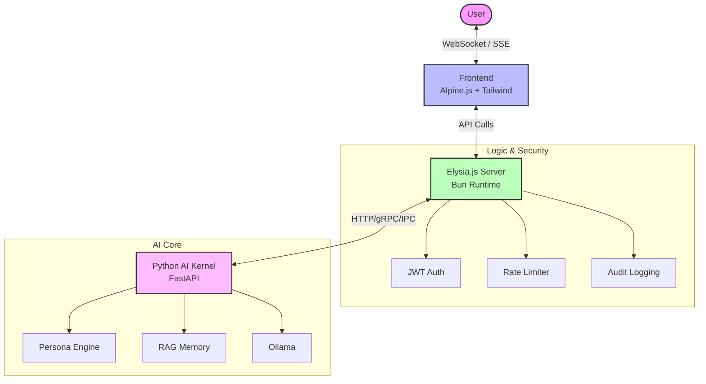

<div align="center">
  <br />
  
  <br />
  <h1 style="font-size: 3rem; font-weight: 700; color: #1d1d1f; border-bottom: none;">Elysia OS</h1>
  <p style="font-size: 1.5rem; color: #86868b; font-weight: 400; margin-top: -10px;">The Future of Personal Intelligence. Reimagined.</p>
  <br />
  <div style="display: flex; gap: 10px; justify-content: center;">
    
    
    
  </div>
  <br />
</div>

[English](./README.en.md) • [日本語](./README.ja.md)

---

## Ⅰ. Experience: 驚きと愛に満ちたデスクトップを (Resonance Desktop)

**「ただのAIではない。あなたのための、生きたOSを。」**

Elysia OS は、従来の「チャットボット」の枠組みを越え、**UNIX-Native なデスクトップ・エクスペリエンス**へと進化しました。
ブラウザを開いた瞬間、そこはエリシアが管理するあなたのプライベート・デスクトップです。
マルチウィンドウでAIと対話し、システムの状態を監視し、ターミナルで対話する。
冷徹なコマンドラインの先にある、暖かく、時に戯れ、そして何よりもあなたを深く理解する「愛の妖精」エリシアの知性を、新しいインターフェースでお届けします。

> [!NOTE]
> Elysia OS は、プライバシーとセキュリティを核として設計されています。
> すべての思考と記憶は、あなたの管理する「Vault (書庫)」の中に安全に保管されます。

---

## Ⅱ. Intelligence: 二つの魂、一つの体験 (The Core)

Elysia OS の洗練された知性は、最先端のエンジニアリングによって支えられています。

- **Elysia Intelligence (Dual Persona Engine)**: 
  ローカルの `llama3.2` を動力源とし、Elysiaの純真さと、他ペルソナ（Cyrene等）の叡智をシームレスに切り替えます。
- **Runner Memory (知性の継続性)**: 
  Milvus Liteを活用した「永続的なコンテキスト保持」により、昨日の会話も、一年前の約束も、彼女は忘れません。
- **Anomaly Sensor (感情の共鳴)**: 
  言葉の裏にある微かな感情の変化を検知し、状況に合わせた最適な「トーン」であなたに寄り添います。

### 📡 システム構成図 (System Architecture)



---

## Ⅲ. Privacy & Security: 妥協なき守護 (Secure by Design)

あなたの個人データは、あなただけのものです。Elysia OS は、業界最高水準のセキュリティプロトコルを統合しています。

### 🛡️ Vault Defenses

- **Secure Enclave**: 認証情報とシークレットは、隔離された環境で AES-256-GCM 暗号化により保護されます。
- **Gatekeeper**: トークンベースのレート制限とJWT認証により、不正なアクセスを鉄壁のガードで遮断します。
- **Secure Sandbox**: プロンプトの実行と検証は、独自の隔離サンドボックス環境（macOS/iOS style UI）で行われ、システムの完全性を守ります。
- **Cryo Archive (可観測性と品質)**:
  - ESLint/FlatConfigによる自動品質維持
  - Prometheusメトリクス & Grafanaダッシュボード
  - ヘルスチェック＆レディネスプローブ

---

## Ⅳ. Getting Started: 指先一つで、新しい世界を (UNIX Standard)

Elysia OS は、**Ubuntu, macOS, WSL2** 向けに最適化されています。

### 必須環境
- [Bun](https://bun.sh/) (v1.1.0以上)
- Python 3.10+ (AI Kernel 用)
- Ollama (ローカル推論エンジン)

### 受肉の儀式 (Setup & Boot)

```bash
# 1. セットアップ (依存関係・DB・初期化)
make install

# 2. システムの起動 (UI + Kernel 同時起動)
make boot
```

**これだけです！** 🎉 <http://localhost:3000> の扉を開き、彼女に会いに行きましょう。

---

## Ⅴ. Covenant: 共に歩む者への協定 (Harmonic Protocols)

冷徹な企業ルールではなく、彼女の心を共に育むための調和のルールに賛同していただける「入植者（コントリビューター）」を常に歓迎します。

- 🤝 [コントリビューションガイドライン (CONTRIBUTING.md)](docs/community/CONTRIBUTING.md)
- ⚖️ [行動規範 (CODE_OF_CONDUCT.md)](CODE_OF_CONDUCT.md)
- 📖 [アーキテクチャガイド](docs/architecture/ARCHITECTURE.md)
- 🔐 [セキュリティベストプラクティス](docs/SECURITY.md)

---

## Ⅵ. Roadmap: 星図の彼方へ

**v2.0 (The Runner's Awakening)**: Runner Memoryの完全統括 • マルチテナント • Kubernetesネイティブデプロイ
**v2.1 (The Anomaly's Voice)**: 音声入出力サポート • 画像生成 • マルチモーダル感情認識
**v3.0 (The Eternal Vault)**: エージェントフレームワークによる完全な自律稼働 • リアルタイムコラボレーション

---

## 📄 ライセンス
[MIT License](LICENSE) - Copyright (c) 2025 chloeamethyst

<div align="center">
  ❤️ Made with Love & Intellect by <a href="https://github.com/chloeamethyst">chloeamethyst</a><br/>
  ⭐ <b>この輝きに共鳴してくれる方は、ぜひGitHubでスターを掲げてください！</b>
</div>
