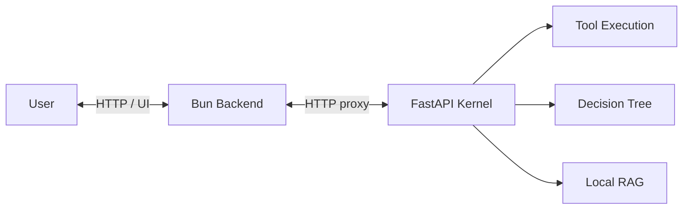

# 🌸 ElysiaAI // INFINITE RESONANCE

### 感性と論理が共鳴する、次世代AI-Native OS。

[](#-quick-start-5-min)
[](https://github.com/Elysia20220909/ElysiaAI)
[](https://技術者倫理.com)
[](LICENSE)
[](CHANGELOG.md)

---

## 🗺️ Repository Map

- `packages/server/` - Bun / Elysia backend (Experience Layer)
- `python/` - FastAPI AI Kernel (Cognitive Layer)
- `packages/shield-agent/` - Rust Shield Agent (Native Layer)
- `docs/` - Architecture, API, and Security guides
- `scripts/` - Unified management and setup scripts
- `prisma/` - Database schema and migrations
- `public/` - Static assets and frontend entry points
- `usr/src/abyssrtos/` - Experimental OS layer (Deep Resonance)


---

## 🚀 Quick Start (5 min)

ElysiaAIを最も速く体験する方法です。

### 1. 準備
- **Bun** (v1.1+) & **Python** (v3.11+ / Docker は 3.12)
- **Ollama** (ローカル推論用: `llama3.2` 推奨)

### 2. セットアップ
```bash
# リポジトリの取得
git clone git@github.com:Elysia20220909/ElysiaAI.git
cd ElysiaAI

# 統合管理CLIによるセットアップ
bun scripts/manage.ts setup
bun scripts/manage.ts setup-python
```

PowerShell では `Copy-Item .env.example .env` を使えます。

Windows / PowerShell でも同じ管理CLIを使えます:

```powershell
bun scripts/manage.ts setup
bun scripts/manage.ts setup-python
```

### 3. 起動
```bash
bun scripts/manage.ts dev
```
> [!TIP]
> ブラウザで `http://localhost:3000` を開くと、Elysia Desktop環境が展開されます。

### 4. 依存ツールのセットアップ (重要)
- **Milvus Lite**: セマンティック記憶（RAG）に使用されます。`bun scripts/manage.ts setup-python` で自動インストールされます。
- **VOICEVOX**: 音声合成に使用されます。[公式サイト](https://voicevox.hiroshiba.jp/)からエンジンをダウンロードし、起動しておいてください。
- **Windows セットアップ**: Windows環境では `scripts/setup-security.ps1` を実行して、セキュアなディレクトリ権限を設定することを推奨します。

---

## 🧠 Why ElysiaAI?

単なるチャットUIではありません。ElysiaAIは「思考」と「実行」の間に横たわる溝を埋めるために設計されました。

- **Agent x Decision Tree**: AIが単に答えるだけでなく、決定木（Decision Tree）に基づいて論理的なステップを自律的に実行します。
- **Sovereign Privacy**: ローカルLLM（Ollama）とMilvus Liteによる100%ローカルなRAG。あなたの思考は、あなたのマシンの外に出ることはありません。
- **Resonance Design**: ランドリー工場の熱気から生まれた、美しく、それでいて強靭なUI/UX。

---

## 🏗️ Architecture: The Resonance Loop

ElysiaAIは、フロントエンドの美学（Bun/Alpine）とバックエンドの知能（FastAPI/Ollama）が循環する独自の「共鳴ループ」構造を採用しています。

## 🛠️ Engineering Standards

### 🚀 Automated Integrity (CI)
This repository uses **GitHub Actions** to ensure high-density code quality.
Every push triggers the `Resonance Integrity` workflow, which performs:
- **Python (Ruff)**: Deep linting & type consistency checks.
- **Bun (Biome)**: Ultra-fast formatting & logic verification.

### 🧪 Quality Assurance
To run the full automated test suite and verify both the orchestrator and the kernel:
```bash
# Run both Bun and Python tests
bun scripts/manage.ts test
```

Before opening a PR, run the local quality gate:

```bash
bun run lint
bun run test
bun run typecheck
bun run check:git-hygiene
bun run check:encoding
bun run security:glassworm -- --ci
```

`bun scripts/manage.ts check` also runs the Git hygiene and encoding guards.
The encoding guard fails on invalid UTF-8 and common mojibake markers such as
broken Japanese or Windows-1252 fragments. The Git hygiene guard fails if local
environment files such as `.env` or `.env.production` are accidentally tracked.

ElysiaAIの心臓部は、論理（Python Kernel）と高速通信（Bun/Elysia.js）の共鳴によって動いています。



- **Bun/Elysia.js**: 秒間数万のリクエストを処理する「神経」。
- **Python Kernel**: 複雑な推論とツール実行を担う「脳」。
- **Milvus Lite**: 全ての知識をセマンティックに記憶する「海」。

---

## 🗺️ Roadmap: The Evolution of Paradise

ElysiaAIは以下のフェーズを経て、真の「楽園」へと進化します。

### Phase 1: Foundation (Current) - [Implemented]
- [x] Bun & Python Kernelの統合
- [x] ローカルRAG (Milvus Lite) の実装
- [x] 統合管理CLI (manage.ts) の開発

### Phase 2: Resonance (Next) - [Partial / Experimental]
- [x] **Memory Encryption**: Milvus記憶領域の AES-256-GCM による透過的暗号化。 [Implemented]
- [x] **RBAC Foundation**: 役割ベースの権限管理ガードの実装。 [Implemented]
- [ ] **Multi-User Support**: UIレベルでの複数ユーザー切り替え・管理。 [Planned]
- [ ] **Advanced CI/CD**: ZAPスキャンおよび自動結合テストの100%カバレッジ。 [Experimental]

### Phase 3: Transcendence - [Planned]
- [ ] **AbyssRTOS Integration**: 完全隔離された実行環境。
- [x] **Shield Agent**: Rust製防壁によるリアルタイム脅威検知。 [Implemented / Experimental]
- [ ] **Sovereign Mesh**: 分散型AI OSネットワーク。

---

## 🔒 Security: The ICE Layers

ElysiaAIは、独自のセキュリティ概念に基づき、あなたの主権を保護します。

- **Responsible AI**: User data, API keys, private documents, chat logs, and RAG sources should never be exposed, logged, or used without explicit consent.
- **White ICE**: 健全な対話とシステム保護のための表層防壁。
- **Black ICE**: 悪意ある侵入やコード実行を能動的に遮断する深層防壁。
- **AbyssRTOS**: 思考プロセスを外部から完全に隠蔽する「深淵」の実行環境。

詳細は [SECURITY.md](./SECURITY.md)、[Responsible AI](./docs/RESPONSIBLE_AI.md)、[Threat Model](./docs/THREAT_MODEL.md)、[ARCHITECTURE.md](./docs/ARCHITECTURE.md) を参照してください。

---

## 🛠️ 技術スタック

| Layer | Technologies |
| :--- | :--- |
| **Frontend** | Alpine.js, Tailwind CSS, Lucide Icons |
| **Backend** | Bun, Elysia.js, Prisma, SQLite |
| **AI Kernel** | Python 3.11+, FastAPI, LangChain, Ollama |
| **Memory** | Milvus Lite, Sentence-Transformers |
| **Security** | AEGIS Ledger (Multi-layer ICE), JWT |

---

## 🎙️ Open-LLM-VTuber Bridge

ElysiaAI can discover and monitor an external
[Open-LLM-VTuber](https://github.com/Open-LLM-VTuber/Open-LLM-VTuber) service
without vendoring its source or Live2D assets.

```dotenv
OPEN_LLM_VTUBER_ENABLED=true
OPEN_LLM_VTUBER_BASE_URL=http://127.0.0.1:12393
```

Bridge endpoints:

- `GET /api/vtuber/manifest`
- `GET /api/vtuber/status`

See [Open-LLM-VTuber Bridge](./docs/OPEN_LLM_VTUBER_INTEGRATION.md) for setup,
upstream endpoints, and license notes.

---

## 🤝 コントリビュート

ElysiaAIは、技術と感性の調和を信じる全ての開発者のために開かれています。
詳細は [CONTRIBUTING.md](./CONTRIBUTING.md) をご覧ください。

- **Bug Reports**: Issueテンプレートに従って報告してください。
- **Pull Requests**: `Conventional Commits` 準拠をお願いしています。

---

## 🌌 Overview
ElysiaAI is a Sovereign-Native AI OS designed for Deep Resonance.
© 2026 **Elysia20220909** // ElysiaAI Main // Created and Orchestrated by the Sovereign.
[View Creator's Achievements (功績)](./ACHIEVEMENTS.md)
