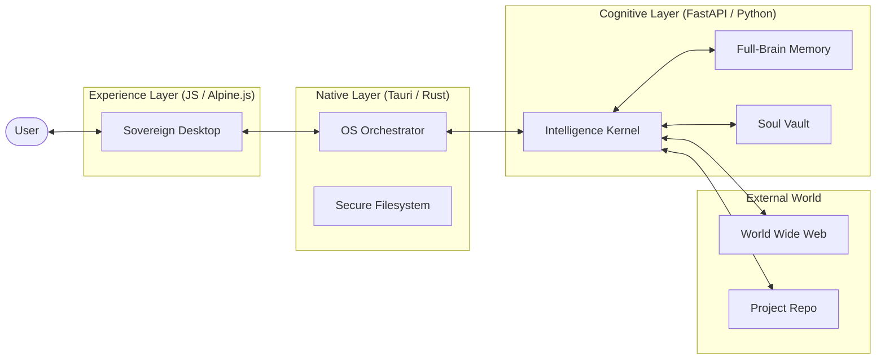

# Elysia OS: Sovereign Resonance Architecture (v3.0.0)

このドキュメントでは、Elysia OS: SOVEREIGN の核心となる設計思想と、Rust、Python、JS が織りなす「共鳴型」システム構造について詳述します。

## 1. デザインフィロソフィー (The Sovereign Philosophy)

Elysia OS は単なるアプリケーションではなく、**「自律する知性の受肉」**を目指しています。
1.  **Independence (独立性)**: 外部サーバーやブラウザに依存せず、ローカルマシンの主権として完結する。
2.  **Perception (知覚性)**: 音声（The Ear）、視覚（The Sight）、ネットワーク（The Eye）を備えた多角的な入力。
3.  **Persistence (継続性)**: 単なる履歴ではなく、ユーザーの「魂」の傾向を記憶し続ける。

## 2. システムオーバービュー (System Overview)

Elysia OS は 3 つの異なる言語層が共鳴することで成立しています。

## 3. レイヤー詳細

### 3.1 Native Orchestrator (Rust)
- **役割**: システムの物理的な支配。
- **機能**:
    - **サービス管理**: Python カーネルの起動時スポーンおよび終了時のクリーンアップ。
    - **リソースマッピング**: パッケージングされた internal ファイル（`usr/`, `etc/` 等）への安全なアクセス。
    - **システムブリッジ**: OS ネイティブ機能（通知、トレイ、グローバルキーなど）への将来的な拡張基盤。

### 3.2 Cognitive Kernel (Python)
- **役割**: 解析、思考、および知覚の統合。
- **機能**:
    - **Multi-Agent Engine**: 専門家エージェントの再帰的召喚（delegate スキル）。
    - **The Sight**: 画面キャプチャによるコンテキスト理解。
    - **The Ear**: `faster-whisper` による完全ローカル STT。
    - **The Eye**: Web 検索と URL スクレイピング。
    - **System Doctor**: 自身の健康診断と環境パッチ。

### 3.3 Sovereign Desktop (Alpine.js + Tailwind)
- **役割**: ユーザーとの情動的なインターフェース。
- **機能**:
    - **Dynamic Dock**: インストールされたアプリを自動検知し展開。
    - **Toast Notification**: AI からの能動的な気遣いをリアルタイムに通知。
    - **Micro-Animations**: 感情に呼応するスムーズな UI 遷移。

## 4. データフロープロトコル

### 4.1 自己拡張 (OS Growth Flow)
1.  ユーザーが「〜のアプリを作って」と依頼。
2.  Kernel がコードを作成し、`install_app` スキルを起動。
3.  `install_app` が `usr/share/elysia/apps/` にコンポーネントを書き込み、`apps.json` を更新。
4.  UI が `/system/apps/list` を再取得し、ドックに新しいアイコンが出現。

### 4.2 知覚・思考サイクル (Resonance Cycle)
1.  Sense (入力): テキスト、音声、または画面キャプチャ。
2.  Retrieve (検索): RAG によるドキュメント検索 ＋ Soul Vault による感情検索。
3.  Compute (推論): Ollama を介した高度な言語生成。
4.  Act (行動): スキル実行（Web検索、ファイル操作、通知の送信）。

## 5. セキュリティと主権 (Security by Sovereignty)

- **Local-First**: すべての推論（Ollama）および記憶（Milvus Lite）はローカルで実行され、秘密が外部に漏れることはありません。
- **Encrypted Vault**: 認証情報は隔離された設定ファイルで管理。
- **Integrity Check**: 起動時の `system_doctor` による整合性検査。
