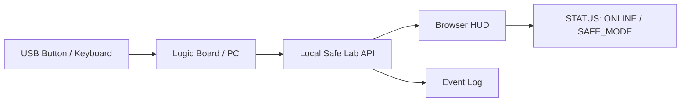

# E.L.I.S.I.A. Logic Board Parts and Schematic Reading Primer

## Summary

This document is a beginner primer for safely **reading, identifying, and explaining** motherboards and logic boards before trying to build anything around them.

The target boards are PC motherboards, mini PCs, Raspberry Pi-class SBCs, and Arduino/ESP32-class development boards used as the core of the E.L.I.S.I.A. Mark LXXXV Safe Mini Lab. The first goal is understanding parts, markings, and connections, not hazardous live work or power modification.

First ideas to learn:

- Read a board like a flat map of a technical city.
- Read a schematic as a map of electrical connections, not as a literal picture of flowing electricity.
- A beginner's first task is observation, classification, diagramming, and logging, not soldering.
- Do not handle live measurement, power-supply modification, high voltage, or large batteries.

## 1. Safety Boundary

### Covered Here

- How to identify common board parts.
- How to read silkscreen labels, reference designators, and polarity marks.
- How to read electrical diagrams, schematics, and block diagrams.
- Concepts such as power rails, GND, signal lines, and buses.
- How to choose a safe logic board for the Safe Mini Lab.
- Unpowered observation and diagramming.

### Not Covered

- Power-supply disassembly, modification, or repair.
- High-voltage circuit measurement.
- Large batteries, motors, or heaters.
- Hazardous wearable machine design.
- Weapon, flight, propulsion, projection, or attack circuits.
- Wearing a powered bare board on the body.

## 2. How to Read a Logic Board

Read a logic board in layers:

```text
Physical layer: parts, connectors, PCB, screw holes, cooling
Power layer: power input, voltage conversion, GND, protection
Compute layer: CPU, SoC, memory, storage
Communication layer: USB, LAN, Wi-Fi, I2C, SPI, UART
Display layer: HDMI, DisplayPort, small displays, LEDs
Safety layer: fuses, protection diodes, reset, logs, stop
```

In Mark LXXXV language, the logic board is not just the armor's heart. It is the quiet central nervous board where power, memory, display, input, and communication meet.

## 3. Common Parts

| Part | What It Looks Like | Common Marking | Role | Beginner Reading |
| --- | --- | --- | --- | --- |
| CPU / SoC | Large square IC, often under a heatsink | `U`, `IC`, `CPU` | Main compute | The largest brain-like part |
| RAM | ICs near CPU or DIMM module | `U`, `DRAM` | Temporary memory | Working desk space |
| Storage | M.2 SSD, eMMC, microSD | `J`, `CN`, `U` | Stores OS and logs | Bookshelf |
| Chipset / PCH | Control IC near CPU | `U`, `PCH` | Peripheral coordination | Intersection |
| VRM | Cluster of coils, MOSFETs, capacitors | `L`, `Q`, `C`, `U` | Voltage conversion | Power conditioning area |
| Resistor | Tiny rectangular part | `R` | Adjusts current or signals | Signal tuning part |
| Capacitor | Tiny rectangle or cylinder | `C` | Stabilizes power, absorbs noise | Small electrical reservoir |
| Inductor / Coil | Slightly larger block | `L` | Power conversion, filtering | Power-area landmark |
| Diode | Small directional part | `D` | Reverse protection, clamping | One-way part |
| Transistor / MOSFET | Small IC-like part with 3+ pins | `Q` | Switching and control | Electrical switch |
| Crystal / Oscillator | Small metal can or block | `Y`, `X` | Clock reference | Board metronome |
| Connector | USB, HDMI, pin header | `J`, `CN`, `P` | External connection | Input/output gate |
| Fuse | Small protection part | `F` | Overcurrent protection | Protective part |
| Test Pad | Small round exposed metal pad | `TP` | Factory or diagnostic point | Identify only at first |
| Switch | Button or slide switch | `SW` | Input or reset | Human input point |
| LED | Small light-emitting part | `LED`, `D` | Status indication | Board voice |

## 4. Silkscreen and Reference Designators

The white labels on a PCB are called **silkscreen**. Treat them as part name tags.

| Mark | Meaning | Example |
| --- | --- | --- |
| `R` | Resistor | `R12`, `R101` |
| `C` | Capacitor | `C5`, `C220` |
| `L` | Inductor | `L1`, `L45` |
| `D` | Diode / LED | `D3`, `LED1` |
| `Q` | Transistor / MOSFET | `Q1`, `Q17` |
| `U` / `IC` | Integrated Circuit | `U2`, `IC5` |
| `J` / `CN` | Connector | `J1`, `CN10` |
| `F` | Fuse | `F1` |
| `TP` | Test Point | `TP12` |
| `SW` | Switch | `SW1` |
| `Y` / `X` | Crystal / Oscillator | `Y1`, `X1` |
| `FB` | Ferrite Bead | `FB2` |

Reading sequence:

1. Find the large parts.
2. Find the connectors.
3. Find the power area: coils, capacitors, fuses.
4. Collect labels such as `U`, `J`, `R`, `C`, `L`, and `D`.
5. Treat nearby parts as functional groups.

## 5. Types of Electrical Drawings

| Drawing | What It Shows | Beginner Focus |
| --- | --- | --- |
| Block diagram | High-level functional connections | CPU, power, display, communication |
| Schematic | Electrical connections between parts | Symbols, net names, GND, power rails |
| Wiring diagram | Cable and connector relationships | What connects to what |
| PCB layout | Physical part placement | Part location, connectors, cooling |
| Bill of materials | List of parts used | Part numbers, values, quantities |

At first, compare block diagrams and board photos before diving into dense schematics.

## 6. Schematic Vocabulary

| Term | Meaning | How to Read It |
| --- | --- | --- |
| Net | Name of an electrically shared connection | Same name means connected, even when separated |
| GND | Reference potential and return path | Common reference point |
| Power Rail | Power line such as `5V`, `3V3`, `1V8` | Shows operating voltage |
| Signal | Line carrying information | Separate input, output, and communication |
| Bus | Multiple lines or a standard communication path | USB, I2C, SPI, UART, PCIe |
| Pull-up / Pull-down | Resistor that sets a default signal state | Common around buttons and config pins |
| Enable | Signal that turns power or an IC on | Look for `EN`, `ENABLE` |
| Reset | Signal that returns logic to initial state | Look for `RST`, `RESET` |
| Clock | Timing reference | Look for `CLK`, `OSC`, `XTAL` |

## 7. Schematic Reading Order

Beginners should read from the outside in:

```text
1. Read the title and page name
2. Read the large block names
3. Find power input
4. Find GND
5. Find major ICs
6. Find connectors
7. Follow power rail names
8. Follow signal names
9. Check Enable / Reset / Clock
10. Note protection parts and test points
```

### 7.1 Read Power First

Example power rail names:

```text
VBUS   = often used for USB 5V input
5V     = 5 volt rail
3V3    = 3.3 volt rail
1V8    = 1.8 volt rail
GND    = reference and return path
```

How to read:

- Find where power enters.
- Check which IC uses which voltage.
- If an `EN` signal exists, see what enables the rail.
- Locate fuses, protection diodes, and ferrite beads.

### 7.2 Read Signals Next

Example signal names:

```text
USB_D+
USB_D-
I2C_SCL
I2C_SDA
SPI_MOSI
SPI_MISO
UART_TX
UART_RX
RESET_N
LED_STATUS
BUTTON_IN
```

How to read:

- `_IN` often means input, and `_OUT` often means output.
- `_N` often means active-low, where Low means active.
- `SCL/SDA` usually means I2C.
- `MOSI/MISO/SCK/CS` usually means SPI.
- `TX/RX` usually means UART.
- Do not treat high-speed signals such as USB or PCIe as beginner modification targets.

## 8. Concept Example: USB Button and Status LED

This is a conceptual diagram. Beginners should use a prebuilt USB button, keyboard, or development board, not direct wiring into a bare PC motherboard.



Safe interpretation:

- Use USB keyboard, USB button, or development-board input.
- Replace LED output with an on-screen virtual LED first.
- If a real LED is added later, keep it low-voltage on a development board and short-duration.
- Do not wire directly into PC motherboard power or high-speed signals.

## 9. E.L.I.S.I.A. Logic Board Specification Notes

Record these when choosing a board for the Safe Mini Lab.

| Item | What to Record |
| --- | --- |
| Board Name | PC, mini PC, or SBC name |
| CPU / SoC | Model and core count |
| RAM | Capacity |
| Storage | SSD, microSD, capacity |
| Display | HDMI, USB-C, internal display |
| Network | LAN, Wi-Fi, Bluetooth |
| Power | Standard AC adapter or normal PC power supply |
| Cooling | Fan, heatsink, enclosure |
| OS | Windows, macOS, Linux, Raspberry Pi OS |
| Safe Lab Role | HUD, API, logs, virtual sensors |
| Physical Output | Disabled by default |

Template:

```text
Board Name:
Role: E.L.I.S.I.A. Safe Mini Lab Logic Board
OS:
Display:
Network:
Storage:
Power Source:
Cooling:
Physical Output: disabled
Admin Surface: localhost / LAN only
Log Policy: no secrets
```

## 10. Learning Route

### Step 1: Read Images

- Look at motherboard or Raspberry Pi photos and classify large parts.
- Find `U`, `J`, `R`, `C`, `L`, `D`, and `TP`.
- Mark power, display, and communication areas in notes.

### Step 2: Observe Real Boards Unpowered

- Unplug power before reading board labels.
- Locate connectors, heatsinks, SSD, memory, and fans.
- Do not scrape the board with metal tools.
- Be mindful of static electricity and avoid unnecessary contact with parts.

### Step 3: Draw a Block Diagram

```text
Power -> Logic Board -> OS -> Local Server -> HUD
                         |
                         +-> Logs
                         +-> Virtual Sensors
                         +-> Input Only
```

### Step 4: Read Schematic Pages

- Power page.
- Input pages such as USB or buttons.
- Output pages such as LEDs or displays.
- Leave dense CPU and memory details for later.

### Step 5: Connect the Safe Mini Lab

- Start by showing state in the browser HUD.
- Then return state from a local API.
- Add USB input or low-risk display only if needed.

## 11. Beginner Work to Avoid

Avoid:

- Live board measurement.
- Disassembling PC power supplies, AC adapters, or chargers.
- Working around internal laptop or phone batteries.
- Connecting high-current LEDs, motors, or heaters.
- Making tiny SMD soldering the first exercise.
- Unplanned BIOS, firmware, or Secure Boot changes.
- Practicing on an important PC.

The best first practice target is an old board photo, a low-cost development board, or a virtual diagram.

## 12. Acceptance Criteria

You have completed this primer when you can:

- Explain what `R`, `C`, `L`, `D`, `U`, `J`, and `TP` mean on a board.
- Find GND, power rails, major ICs, and connectors on a schematic.
- Recognize USB, I2C, SPI, and UART names as communication signals.
- Write a Safe Mini Lab logic-board specification note.
- Explain what should not be touched.
- Make system state visible with HUD and logs before using physical output.

At that point, the board stops being a mysterious plate of parts. It becomes a quiet map. You can begin to see where power enters, where thought happens, and where the outside world connects.
