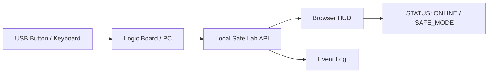

# E.L.I.S.I.A. ロジックボード部品と電気図面の読み方 入門

## 要約

この文書は、マザーボードやロジックボードを「作る」前に、まず安全に **読む、見分ける、説明する** ための入門書です。

対象は、E.L.I.S.I.A. Mark LXXXV Safe Mini Lab の中核になるPCマザーボード、ミニPC、Raspberry Pi系SBC、Arduino/ESP32系開発ボードです。最初の目的は、危険な通電作業や電源改造ではなく、部品、記号、配線の考え方を理解することです。

最初に覚えること:

- 基板は、部品が載った「平面の都市地図」のように読む。
- 回路図は、電気の流れそのものではなく、接続関係を描いた地図として読む。
- 初心者の最初の作業は、はんだ付けではなく、観察、分類、図解、ログ化にする。
- 通電中の測定、電源装置の分解、高電圧、大容量バッテリーは扱わない。

## 1. 安全境界

### この文書で扱うこと

- 基板上の主要部品の見分け方。
- シルク印刷、部品番号、極性マークの読み方。
- 電気図面、回路図、ブロック図の読み方。
- 電源レール、GND、信号線、バスの概念。
- Safe Mini Lab用ロジックボードの安全な選び方。
- 非通電状態での観察と図解。

### この文書で扱わないこと

- 電源装置の分解、改造、修理。
- 高電圧回路の測定。
- 大容量バッテリー、モーター、ヒーターの制御。
- 人体装着型の危険な機械の設計。
- 兵器、飛行、推進、投射、攻撃用途の回路。
- 通電中の裸基板を身体に装着する運用。

## 2. ロジックボードを読むための考え方

ロジックボードは、次の層に分けて読むと楽になります。

```text
物理層: 部品、コネクタ、基板、ネジ穴、放熱
電源層: 電源入力、電圧変換、GND、保護部品
計算層: CPU、SoC、メモリ、ストレージ
通信層: USB、LAN、Wi-Fi、I2C、SPI、UART
表示層: HDMI、DisplayPort、小型画面、LED
安全層: ヒューズ、保護ダイオード、リセット、ログ、停止
```

Mark LXXXV風に言い換えると、ロジックボードは「鎧の心臓」ではなく、もっと静かな **中枢神経の基板** です。電力、記憶、表示、入力、通信がここで出会います。

## 3. 主要部品の見分け方

| 部品 | 基板上の見た目 | よくある記号 | 役割 | 初心者向けの読み方 |
| --- | --- | --- | --- | --- |
| CPU / SoC | 大きな四角いIC、放熱板の下にあることが多い | `U`, `IC`, `CPU` | 計算の中心 | 一番大きな頭脳として見る |
| RAM | CPU近くのIC、またはDIMMモジュール | `U`, `DRAM` | 一時記憶 | 作業机の広さとして見る |
| ストレージ | M.2 SSD、eMMC、microSD | `J`, `CN`, `U` | OSやログを保存 | 本棚として見る |
| チップセット / PCH | CPU近くの制御IC | `U`, `PCH` | 周辺機器の交通整理 | 交差点として見る |
| VRM | コイル、MOSFET、コンデンサが集まる | `L`, `Q`, `C`, `U` | 電圧変換 | 電源を整える区画として見る |
| 抵抗 | 小さな四角部品 | `R` | 電流や信号を調整 | 信号の調整部品 |
| コンデンサ | 小さな四角または円筒 | `C` | 電源の安定化、ノイズ吸収 | 電気の小さな貯水槽 |
| インダクタ / コイル | やや大きい四角部品 | `L` | 電源変換、ノイズ対策 | 電源区画の目印 |
| ダイオード | 小さな部品、向きがある | `D` | 逆流防止、保護 | 一方通行の部品 |
| トランジスタ / MOSFET | 小型IC風、3本以上の端子 | `Q` | スイッチング、制御 | 電気のスイッチ |
| 発振子 / 水晶 | 金属ケース、小さな四角 | `Y`, `X` | クロック基準 | 基板のメトロノーム |
| コネクタ | USB、HDMI、ピンヘッダ | `J`, `CN`, `P` | 外部との接点 | 入出力の門 |
| ヒューズ | 小さな保護部品 | `F` | 過電流保護 | 守りの部品 |
| テストパッド | 小さな丸い金属点 | `TP` | 製造時や検査用 | 初心者は触らず位置だけ覚える |
| スイッチ | ボタンやスライド | `SW` | 入力、リセット | 人間が押す入口 |
| LED | 小さな発光部品 | `LED`, `D` | 状態表示 | 基板の声として見る |

## 4. シルク印刷と部品記号

基板上の白い文字や記号を **シルク印刷** と呼びます。これは、部品の名前札です。

| 記号 | 読み方 | 代表例 |
| --- | --- | --- |
| `R` | Resistor | `R12`, `R101` |
| `C` | Capacitor | `C5`, `C220` |
| `L` | Inductor | `L1`, `L45` |
| `D` | Diode / LED | `D3`, `LED1` |
| `Q` | Transistor / MOSFET | `Q1`, `Q17` |
| `U` / `IC` | Integrated Circuit | `U2`, `IC5` |
| `J` / `CN` | Connector | `J1`, `CN10` |
| `F` | Fuse | `F1` |
| `TP` | Test Point | `TP12` |
| `SW` | Switch | `SW1` |
| `Y` / `X` | Crystal / Oscillator | `Y1`, `X1` |
| `FB` | Ferrite Bead | `FB2` |

読む順番:

1. 大きな部品を探す。
2. コネクタを探す。
3. 電源まわりのコイル、コンデンサ、ヒューズを探す。
4. `U`, `J`, `R`, `C`, `L`, `D` の記号を拾う。
5. 基板上で近い部品同士をグループとして見る。

## 5. 電気図面の種類

| 図面 | 何を表すか | 初心者が見るポイント |
| --- | --- | --- |
| ブロック図 | 機能の大きなつながり | CPU、電源、表示、通信の流れ |
| 回路図 | 部品同士の接続 | 部品記号、ネット名、GND、電源レール |
| 配線図 | ケーブルやコネクタの接続 | どこからどこへつながるか |
| 基板レイアウト | 実際の部品配置 | 部品位置、コネクタ位置、放熱 |
| 部品表 | 使う部品の一覧 | 型番、値、数量 |

最初は、回路図だけを読むより、ブロック図と実物写真を並べる方が理解しやすいです。

## 6. 回路図の基本語彙

| 用語 | 意味 | 見方 |
| --- | --- | --- |
| Net | 同じ電気的接続を持つ線の名前 | 同じ名前なら離れていてもつながっている |
| GND | 基準電位、戻り道 | すべての基準点として見る |
| Power Rail | `5V`, `3V3`, `1V8` などの電源線 | どの電圧で動くかを見る |
| Signal | 情報を運ぶ線 | 入力、出力、通信を分ける |
| Bus | 複数線または規格化された通信 | USB、I2C、SPI、UART、PCIeなど |
| Pull-up / Pull-down | 信号の初期状態を決める抵抗 | ボタンや設定ピンでよく見る |
| Enable | 電源やICを有効にする信号 | `EN`, `ENABLE` を探す |
| Reset | 初期状態へ戻す信号 | `RST`, `RESET` を探す |
| Clock | タイミング基準 | `CLK`, `OSC`, `XTAL` を探す |

## 7. 回路図の読み順

初心者は、細部から入るより、次の順番が安全で確実です。

```text
1. タイトルとページ名を見る
2. 大きなブロック名を読む
3. 電源入力を探す
4. GNDを探す
5. 主要ICを探す
6. コネクタを探す
7. 電源レール名を追う
8. 信号名を追う
9. Enable / Reset / Clockを見る
10. 保護部品とテストポイントを確認する
```

### 7.1 まず電源を見る

電源レールの例:

```text
VBUS   = USBから来る5V系の名前としてよく使われる
5V     = 5ボルト系
3V3    = 3.3ボルト系
1V8    = 1.8ボルト系
GND    = 基準、戻り道
```

読み方:

- どこから電源が入るかを見る。
- どのICがどの電圧で動くかを見る。
- `EN` 信号がある場合、何が電源を有効化しているかを見る。
- ヒューズ、保護ダイオード、フェライトビーズの位置を見る。

### 7.2 次に信号を見る

信号線の例:

```text
USB_D+
USB_D-
I2C_SCL
I2C_SDA
SPI_MOSI
SPI_MISO
UART_TX
UART_RX
RESET_N
LED_STATUS
BUTTON_IN
```

読み方:

- `_IN` は入力、`_OUT` は出力の意味で使われることがある。
- `_N` は負論理、つまりLowで有効を表すことがある。
- `SCL/SDA` はI2C、`MOSI/MISO/SCK/CS` はSPI、`TX/RX` はUARTでよく使う。
- USBやPCIeなどの高速信号は、初心者は改造対象にしない。

## 8. 概念例: USBボタンとステータスLED

これは概念図です。初心者は、既製のUSBボタンや開発ボードを使い、裸のPCマザーボードへ直接配線しない方針にします。



安全な考え方:

- 入力はUSBキーボード、USBボタン、開発ボード経由にする。
- LEDはまず画面上の仮想LEDで代替する。
- 実LEDを使う場合も、低電圧の開発ボード上で短時間表示に限定する。
- PCマザーボードの電源や高速信号へ直接工作しない。

## 9. E.L.I.S.I.A. 用ロジックボード仕様メモ

Safe Mini Lab用にボードを選ぶときは、次を記録します。

| 項目 | 記録すること |
| --- | --- |
| Board Name | PC名、ミニPC名、SBC名 |
| CPU / SoC | 型番、コア数 |
| RAM | 容量 |
| Storage | SSD、microSD、容量 |
| Display | HDMI、USB-C、内蔵画面など |
| Network | LAN、Wi-Fi、Bluetooth |
| Power | 標準ACアダプタ、通常PC電源 |
| Cooling | ファン、ヒートシンク、ケース |
| OS | Windows、macOS、Linux、Raspberry Pi OS |
| Safe Lab Role | HUD、API、ログ、仮想センサーなど |
| Physical Output | 既定で無効 |

テンプレート:

```text
Board Name:
Role: E.L.I.S.I.A. Safe Mini Lab Logic Board
OS:
Display:
Network:
Storage:
Power Source:
Cooling:
Physical Output: disabled
Admin Surface: localhost / LAN only
Log Policy: no secrets
```

## 10. 学習ルート

### Step 1: 画像で読む

- マザーボードやRaspberry Piの写真を見て、大きな部品を分類する。
- `U`, `J`, `R`, `C`, `L`, `D`, `TP` を探す。
- 電源まわり、表示まわり、通信まわりを色分けしてメモする。

### Step 2: 実物を非通電で観察する

- 電源を抜いた状態で、基板上の文字を読む。
- コネクタ、放熱板、SSD、メモリ、ファンの位置を確認する。
- 金属工具で基板をこすらない。
- 静電気に注意し、部品をむやみに触らない。

### Step 3: ブロック図にする

```text
Power -> Logic Board -> OS -> Local Server -> HUD
                         |
                         +-> Logs
                         +-> Virtual Sensors
                         +-> Input Only
```

### Step 4: 回路図のページを読む

- 電源ページ。
- USBやボタンなど入力ページ。
- LEDや表示など出力ページ。
- CPUやメモリの細部は後回しにする。

### Step 5: Safe Mini Labへ接続する

- まずはブラウザHUDで状態を見る。
- 次にローカルAPIで状態を返す。
- 最後に、必要な場合だけUSB入力や低リスク表示を足す。

## 11. 初心者が避ける作業

避けるもの:

- 通電中の基板測定。
- PC電源、ACアダプタ、充電器の分解。
- ノートPCやスマートフォンの内蔵バッテリー周辺の作業。
- 高電流LED、モーター、ヒーターの接続。
- 小さなSMD部品のはんだ付けを最初の課題にすること。
- BIOS、ファームウェア、セキュアブート周辺の無計画な改変。
- 重要なPCを練習台にすること。

最初の練習台は、壊れても困らない古い基板写真、安価な開発ボード、または仮想図面が向いています。

## 12. 受け入れ条件

この入門を終えたと言える状態:

- 基板上で `R`, `C`, `L`, `D`, `U`, `J`, `TP` の意味を説明できる。
- 回路図でGND、電源レール、主要IC、コネクタを探せる。
- USB、I2C、SPI、UARTの名前を見て、通信線だと判断できる。
- Safe Mini Labのロジックボード仕様メモを書ける。
- 何を触ってはいけないか説明できる。
- 物理出力を使わず、HUDとログで状態を見える化できる。

ここまで来ると、基板はただの謎の板ではなくなります。静かな地図になります。どこに電源が入り、どこで考え、どこから外の世界を見ているのかが、少しずつ読めるようになります。
