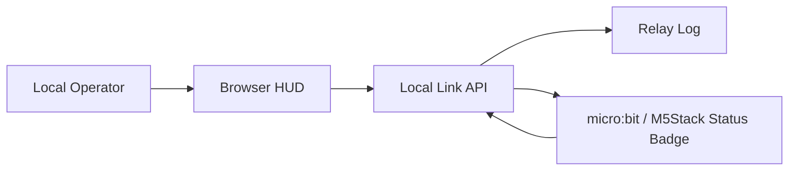

# E.L.I.S.I.A. Mark XLVII Safe Mini Lab Profile

## Summary

This document defines a safe **Mark XLVII / Mark 47** profile for the E.L.I.S.I.A. Safe Mini Lab.

If Mark LXXXV suggests distributed nanotech, final integration, and reconfiguration, Mark XLVII is better treated as a theme of **remote link, relay, standby, support HUD, and local operator connection**.

Mark XLVII here is not a real suit, weapon, flight system, propulsion system, or body-augmentation machine. It is a safe software UI, local HUD, low-risk display, logging, and communication-state learning profile.

## 1. Naming

| Name | Form |
| --- | --- |
| Japanese | マーク47 |
| English | Mark 47 |
| Roman numeral | Mark XLVII |
| E.L.I.S.I.A. profile name | `mark_xlvii_remote_link` |

## 2. Mark XLVII Themes

| Theme | Safe Mini Lab Meaning |
| --- | --- |
| Remote Link | State sync between browser HUD and small terminal |
| Standby Armor | Clear standby, online, and alert states |
| Relay Node | Role split across PC, micro:bit, M5Stack, Raspberry Pi |
| Support HUD | Display that helps local operator decisions |
| Local Operator | Manual, local, logged operation |
| Safety Governor | No physical output, no WAN exposure, no secret logging |

## 3. Difference From Mark LXXXV

| Lens | Mark LXXXV Profile | Mark XLVII Profile |
| --- | --- | --- |
| Feeling | Final integration, distributed fabric, nanotech style | Remote link, relay, standby support |
| First build | Status Badge / HUD | Remote Link Badge / Relay HUD |
| Core concept | Safety Governor + Nanotech Fabric | Local Operator + Relay Link |
| Learning focus | Whole distributed system picture | Communication, state sync, logging |
| Beginner entry | LED and state transitions | LED and link state |

## 4. Stage 1 Translation

The existing Stage 1 maps to Mark XLVII like this:

| Existing Name | Mark XLVII Name |
| --- | --- |
| Mark85 Status Badge | Mark XLVII Remote Link Badge |
| ONLINE | LINK ONLINE |
| ALERT | RELAY ALERT |
| SAFE_MODE | LOCAL SAFE MODE |
| MOTION | SIGNAL SHIFT |
| Event Stream | Relay Log |

The safe Stage 1 implementation can remain the same:

- `docs/ELISIA_MARK85_STAGE1_STATUS_BADGE_BUILD.en-US.md`
- `public/standalone/mark47-remote-link-badge/index.html`
- `public/standalone/mark85-status-badge/index.html`

## 5. Recommended Next Stage

For the Mark XLVII direction, the next stage is **Stage 2: Remote Link**.

Purpose:

- Synchronize state between the PC browser HUD and a small logic board.
- Learn communication, logging, and display coordination before adding physical output.
- Keep everything local.

Proposed shape:

First implementation direction:

- Simulate link state inside the browser first.
- Later treat micro:bit or M5Stack as a USB-connected display terminal.
- Do not use GPIO, motors, high-power LEDs, or external batteries.
- Do not use WAN exposure, cloud relays, or secret transmission.
- If moving into tools and soldering, stay within the low-voltage LED practice in `docs/ELISIA_STAGE1_5_SAFE_SOLDERING_STARTER.en-US.md`.
- To combine the four directions, use `docs/ELISIA_MARK47_STAGE2_REMOTE_LINK_INDICATOR.en-US.md`.

## 6. Safety Boundary

Allowed:

- Local HUD.
- Virtual link state.
- Built-in micro:bit LEDs or M5Stack screen display.
- Local API.
- Manual operation logs.

Excluded:

- Flight, propulsion, weapons, projectiles, or body augmentation.
- High-power systems or dangerous automation.
- Publicly exposed admin surfaces.
- Automatic secret collection, upload, or Git storage.

## 7. Initial Acceptance Criteria

Mark XLVII Stage 1 is complete when:

- The `Mark XLVII` and `Remote Link` themes can be explained.
- The browser HUD can switch between `LINK ONLINE`, `RELAY ALERT`, and `LOCAL SAFE MODE`.
- Events remain visible as a Relay Log.
- The control flow can be explained using display and logs only, without adding physical output.
- Stage 2 can be defined as communication-state synchronization.

Mark XLVII works best here as a design language for never losing the state of a distant support system. Quiet standby, reliable link, visible logs. That is where this version begins.
