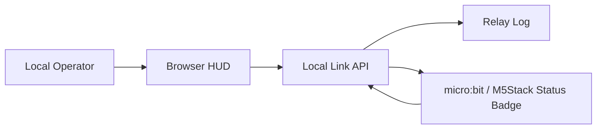

# E.L.I.S.I.A. Mark XLVII Safe Mini Lab プロファイル

## 要約

この文書は、E.L.I.S.I.A. Safe Mini Lab を **Mark XLVII（マーク47）** の設計言語で扱うための安全プロファイルです。

Mark LXXXV が「分散ナノテック、最終統合、自己再構成」の雰囲気だとすると、Mark XLVII は **遠隔リンク、中継、待機、支援HUD、ローカル操作者との接続** をテーマにします。

ここでのMark XLVIIは、実在するスーツ、兵器、飛行装置、推進装置、人体拡張装置ではありません。安全なソフトウェアUI、ローカルHUD、micro:bitなどの低リスク表示、ログ、通信状態の学習テーマとして扱います。

## 1. 表記

| 呼び方 | 表記 |
| --- | --- |
| 日本語 | マーク47 |
| 英語 | Mark 47 |
| ローマ数字 | Mark XLVII |
| E.L.I.S.I.A.内プロファイル名 | `mark_xlvii_remote_link` |

## 2. Mark XLVIIとして扱うテーマ

| テーマ | Safe Mini Labでの意味 |
| --- | --- |
| Remote Link | ブラウザHUDと小型端末の状態同期 |
| Standby Armor | 待機状態、オンライン状態、警告状態の明確化 |
| Relay Node | PC、micro:bit、M5Stack、Raspberry Piの役割分担 |
| Support HUD | 操作者の判断を助ける表示 |
| Local Operator | 操作は手動、ローカル、ログ付き |
| Safety Governor | 物理出力なし、WAN非公開、秘密ログ禁止 |

## 3. Mark LXXXVとの違い

| 観点 | Mark LXXXVプロファイル | Mark XLVIIプロファイル |
| --- | --- | --- |
| 雰囲気 | 最終統合、分散、ナノテック風 | 遠隔接続、中継、待機支援 |
| 最初の工作 | Status Badge / HUD | Remote Link Badge / Relay HUD |
| 中心概念 | Safety Governor + Nanotech Fabric | Local Operator + Relay Link |
| 学習向き | 分散システム全体像 | 通信、状態同期、ログ |
| 初心者向け入口 | LEDと状態遷移 | LEDと通信状態 |

## 4. Stage 1の読み替え

既存のStage 1は、Mark XLVIIでは次のように読み替えます。

| 既存名 | Mark XLVII名 |
| --- | --- |
| Mark85 Status Badge | Mark XLVII Remote Link Badge |
| ONLINE | LINK ONLINE |
| ALERT | RELAY ALERT |
| SAFE_MODE | LOCAL SAFE MODE |
| MOTION | SIGNAL SHIFT |
| Event Stream | Relay Log |

Stage 1の安全実装はそのまま使えます。

- `docs/ELISIA_MARK85_STAGE1_STATUS_BADGE_BUILD.ja.md`
- `public/standalone/mark47-remote-link-badge/index.html`
- `public/standalone/mark85-status-badge/index.html`

## 5. 推奨する次の段階

Mark XLVIIとして進めるなら、次は **Stage 2: Remote Link** です。

目的:

- PCブラウザHUDと小型ロジックボードの状態を同期する。
- 物理出力ではなく、通信、ログ、表示の連携を学ぶ。
- すべてローカルで完結させる。

構成案:

最初の実装方針:

- まずはブラウザ内で通信状態をシミュレーションする。
- 次にmicro:bitやM5StackをUSB接続の表示端末として扱う。
- GPIO、モーター、高出力LED、外部バッテリーは使わない。
- WAN公開、クラウド中継、秘密情報の送信はしない。
- 工具とはんだ付けに進む場合は、`docs/ELISIA_STAGE1_5_SAFE_SOLDERING_STARTER.ja.md` の低電圧LED練習だけに留める。
- 4方向をまとめて進める場合は、`docs/ELISIA_MARK47_STAGE2_REMOTE_LINK_INDICATOR.ja.md` を使う。

## 6. 安全境界

許可:

- ローカルHUD。
- 仮想リンク状態。
- micro:bitやM5Stackの内蔵LED/画面表示。
- ローカルAPI。
- 手動操作のログ。

除外:

- 飛行、推進、武器、投射、人体拡張。
- 高出力装置や危険な自動制御。
- 外部公開された管理画面。
- 秘密情報の自動収集、アップロード、Git保存。

## 7. 最初の合格条件

Mark XLVII Stage 1として完了と言える状態:

- `Mark XLVII` と `Remote Link` のテーマを説明できる。
- ブラウザHUDで `LINK ONLINE`, `RELAY ALERT`, `LOCAL SAFE MODE` を切り替えられる。
- イベントがRelay Logとして残る。
- 物理出力を増やさず、表示とログだけで制御の流れを説明できる。
- 次のStage 2で「通信状態の同期」を目標にできる。

Mark XLVIIは、力の象徴というより、離れた場所からでも状態を見失わないための設計言語として扱うと美しいです。静かな待機、確かな接続、見えるログ。そこから始めます。
