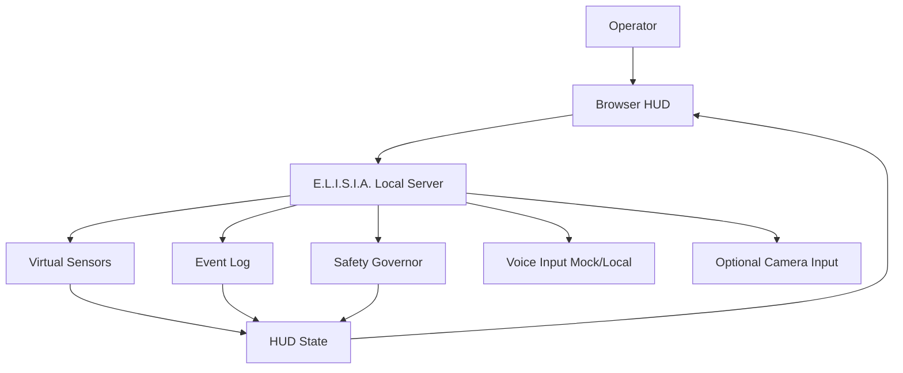
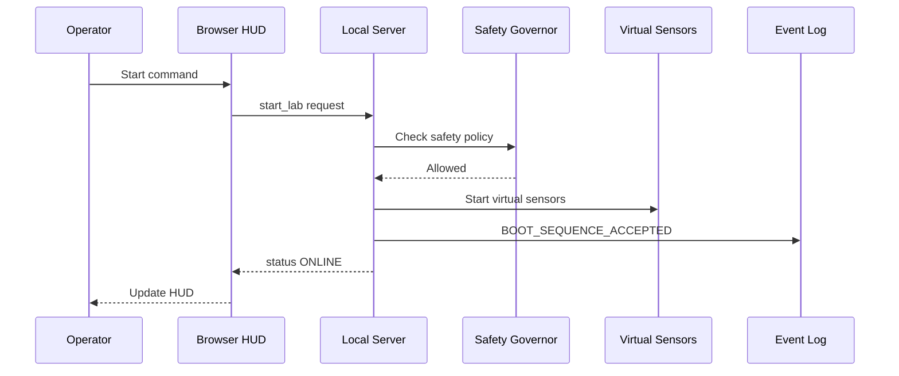
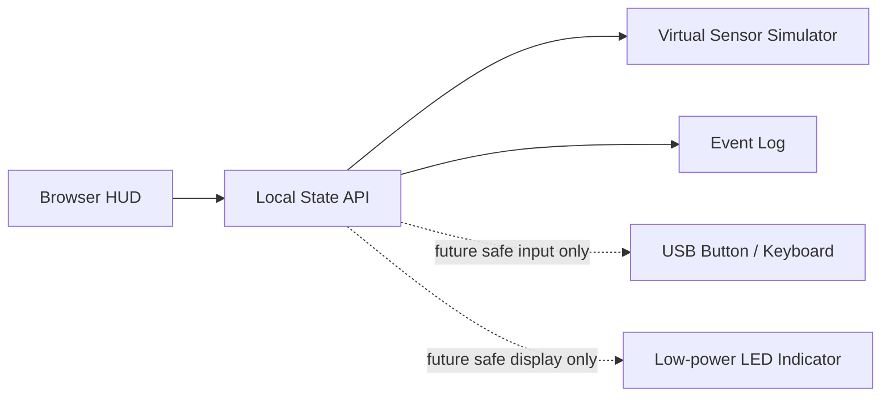

# E.L.I.S.I.A. Mark LXXXV Safe Mini Lab Design, Diagram, and Specification

## Summary

This document defines a beginner-safe E.L.I.S.I.A. Mark LXXXV-inspired mini lab for someone with no tool or hardware fabrication experience.

The project is not a real weapon, flight system, propulsion system, hazardous wearable machine, or exoskeleton. The first goal is a safe local control lab made of a PC HUD, virtual sensors, logs, optional voice or button input, and a local-only dashboard.

Core principles:

- Start without tools.
- Begin with virtual control, not physical actuation.
- Keep the system on `localhost` or a trusted LAN.
- Do not collect secrets automatically, upload them, or store them in Git.
- Prefer observation, logging, stopping, and safety boundaries over impressive output.

## 1. Document Scope

| Document Type | Covered Here | Not Covered |
| --- | --- | --- |
| Design document | Purpose, architecture, responsibilities, safety boundary, staged growth | Hazardous fabrication, flight, propulsion, weapons, body-strengthening systems |
| Diagram set | Software architecture, HUD layout, data flow, safe future extension diagram | Real suit, propulsion, weapon, or load-bearing mechanical drawings |
| Specification | Functional requirements, non-functional requirements, security requirements, acceptance criteria | Dangerous device control specifications or WAN-exposed admin panels |

## 2. Safety Boundary

### Allowed Scope

- Local web app on a PC or Raspberry Pi.
- Virtual sensor visualization.
- Safe HUD overlay on a camera preview.
- Local voice-command handling.
- Local event logging.
- Low-risk LED or USB indicator status display.
- Secure system administration patterns such as authentication, audit logs, and rate limits.

### Excluded Scope

- Devices intended for weapons, projection, attack, or hazardous illumination.
- Flight, propulsion, hovering, or body-lifting systems.
- High voltage, large batteries, or high-power motors.
- Dangerous autonomous physical control.
- Admin dashboards intended for WAN exposure.
- Automatic secret collection, external upload, or Git storage.

## 3. Initial Goal

The first project is the **Mark 85-style Mini HUD Lab**.

Purpose:

- Recreate the feeling of being inside a suit without building a real suit.
- Learn the core loop of input, decision, output, logging, and stopping.
- Create a clean foundation that can later connect to E.L.I.S.I.A. local services and HUD surfaces.

Initial completion target:

```text
E.L.I.S.I.A. MARK85 SAFE LAB
STATUS: ONLINE
POWER: USB / SIMULATED SAFE
LIFE SUPPORT: SIMULATED
NETWORK: LOCAL ONLY
THREAT LEVEL: LOW
LAST EVENT: BOOT_SEQUENCE_ACCEPTED
```

## 4. Design Document

### 4.1 System Overview



### 4.2 Component Responsibilities

| Component | Responsibility | Initial Implementation Target |
| --- | --- | --- |
| Browser HUD | Display status, warnings, logs, and virtual sensors | HTML/CSS/Canvas/Web UI |
| Local Server | Serve state to the HUD and persist events | Bun / Elysia or FastAPI |
| Sensor Simulator | Generate virtual temperature, distance, posture, and network state | Random values, fixed scenarios, or log replay |
| Safety Governor | Keep unsafe operations outside the lab boundary | Config file, allowlist, manual confirmation |
| Event Log | Record boot, input, alert, and state-transition events | JSONL or SQLite |
| Optional Camera | Overlay HUD elements on camera preview | Browser permission required |
| Optional Voice | Accept safe commands such as start and stop | Local speech recognition or button fallback |

### 4.3 Operating Model

- Run on `localhost` by default.
- If exposed to LAN, keep administrative actions behind authentication.
- Do not include physical device-control APIs in the initial scope.
- Disable external cloud integration by default.
- Do not log secrets, tokens, or personal data.
- Every operation should be visible, stoppable, and logged.

## 5. Diagram Set

### 5.1 MVP Topology

```text
+------------------------------+
| PC / Mac / Raspberry Pi       |
|                              |
|  +------------------------+  |
|  | Local Server           |  |
|  | - state API            |  |
|  | - event log            |  |
|  | - sensor simulator     |  |
|  | - safety policy        |  |
|  +-----------+------------+  |
|              |               |
|              v               |
|  +------------------------+  |
|  | Browser HUD            |  |
|  | - armor status         |  |
|  | - virtual sensors      |  |
|  | - alerts               |  |
|  | - logs                 |  |
|  +------------------------+  |
+------------------------------+
```

### 5.2 HUD Layout

```text
+--------------------------------------------------------+
| E.L.I.S.I.A. MARK85 SAFE LAB              LOCAL ONLY    |
+----------------------+----------------+----------------+
| ARMOR STATUS         | SENSOR GRID    | EVENT STREAM   |
| STATUS: ONLINE       | TEMP: 24.8 C   | 12:00 BOOT     |
| POWER: SAFE          | DIST: 42 cm    | 12:01 HUD ON   |
| MODE: SIMULATION     | MOTION: STABLE | 12:02 SAFE     |
+----------------------+----------------+----------------+
| CAMERA / VISUAL FIELD                                  |
|                                                        |
|        optional camera preview or animated HUD          |
|                                                        |
+----------------------+----------------+----------------+
| SAFETY GOVERNOR      | NETWORK        | CONTROLS       |
| OUTPUT: DISABLED     | LOCALHOST      | START / STOP   |
| WAN: BLOCKED         | AUTH: ENABLED  | ACK ALERT      |
+----------------------+----------------+----------------+
```

### 5.3 Data Flow



### 5.4 Safe Future Extension

If physical elements are added later, start with display or input only.



Extension principles:

- Use keyboard, USB buttons, and screen output before hardware.
- If LEDs are added, keep them low-voltage, low-brightness, short-duration, and manually stoppable.
- Do not include motors, propulsion, heavy loads, or body-supporting structures in this scope.

## 6. Specification

### 6.1 Functional Requirements

| ID | Requirement | Priority | Acceptance Criteria |
| --- | --- | --- | --- |
| F-001 | Display system state on the HUD | Required | `ONLINE`, `SAFE`, and `SIMULATION` are visible |
| F-002 | Display virtual sensor values | Required | At least two of temperature, distance, and posture update |
| F-003 | Persist event logs | Required | Start, stop, and alert acknowledgement are timestamped |
| F-004 | Provide safe mode | Required | Controls are visibly disabled while in safe mode |
| F-005 | Run locally | Required | Default URL is `localhost` or trusted LAN only |
| F-006 | Accept voice or button input | Optional | Input is logged and changes HUD state |
| F-007 | Display camera preview | Optional | Only appears after explicit browser permission |

### 6.2 Non-Functional Requirements

| ID | Requirement | Standard |
| --- | --- | --- |
| N-001 | Beginner-friendly | MVP can start without tools |
| N-002 | Safety | No physical output by default |
| N-003 | Observability | State, alerts, and logs are visible in the HUD |
| N-004 | Maintainability | Config, UI, virtual sensors, and logging are separable |
| N-005 | Privacy | Secrets, tokens, and personal data are not logged |
| N-006 | Visual quality | Red, gold, white, and blue-white glow are balanced for readability |

### 6.3 Security Requirements

| ID | Requirement | Implementation Direction |
| --- | --- | --- |
| S-001 | No WAN exposure | Do not default to open ports or public URLs |
| S-002 | Validate input | Use allowlists for commands, queries, and filenames |
| S-003 | Rate limit | Add simple limits to high-frequency APIs |
| S-004 | Minimize logs | Do not record secrets, tokens, or passwords |
| S-005 | Separate operations | Keep display and administration concerns separate |
| S-006 | Emergency stop | Provide a UI action that returns the lab to safe mode |

### 6.4 State Model

```text
OFFLINE
  -> BOOTING
  -> ONLINE
  -> SAFE_MODE
  -> SHUTDOWN

ONLINE
  -> ALERT
  -> SAFE_MODE
  -> SHUTDOWN

ALERT
  -> ACKNOWLEDGED
  -> SAFE_MODE
```

### 6.5 Event Log Format

For the MVP, choose JSONL or SQLite. JSONL is enough at the beginning.

```json
{
  "timestamp": "2026-05-12T12:00:00+09:00",
  "event": "BOOT_SEQUENCE_ACCEPTED",
  "mode": "SIMULATION",
  "source": "hud",
  "severity": "info",
  "details": {
    "network": "localhost",
    "physicalOutput": "disabled"
  }
}
```

### 6.6 Local API Proposal

| Method | Path | Purpose | Note |
| --- | --- | --- | --- |
| GET | `/api/safe-lab/status` | Fetch HUD state | Read-only |
| GET | `/api/safe-lab/events` | Fetch event logs | Limit result count |
| POST | `/api/safe-lab/start` | Start virtual lab | Does not start physical output |
| POST | `/api/safe-lab/stop` | Stop virtual lab | Returns to safe mode |
| POST | `/api/safe-lab/ack` | Acknowledge alert | Writes an operation log |

## 7. Motherboard / Logic Board First Design

In this document, building from the motherboard or logic board does not mean that a beginner should design and manufacture a multilayer PCB, modify a power supply, or work on hazardous electronics.

The safe meaning is to treat an off-the-shelf PC motherboard, mini PC, Raspberry Pi-class SBC, or Arduino/ESP32-class development board as the **central E.L.I.S.I.A. logic node**, then build the HUD, logs, virtual sensors, and low-risk inputs around it.

Component identification and schematic reading are split into `docs/ELISIA_LOGIC_BOARD_PARTS_AND_SCHEMATIC_READING.en-US.md`. This document focuses on the design boundary for integrating a logic board into the Safe Mini Lab.

### 7.1 Logic Board Responsibilities

| Area | Logic Board Responsibility | Beginner-Safe Handling |
| --- | --- | --- |
| Compute | Run the HUD, API, logs, and virtual sensors | Use an existing PC, mini PC, or Raspberry Pi |
| Storage | Store settings, event logs, and UI assets | Use SSD, microSD, SQLite, or JSONL |
| Network | Communicate with the browser HUD and local API | Keep it on `localhost` or trusted LAN |
| Display | Output to a monitor, browser, or small display | Prefer HDMI, USB, and Web UI |
| Input | Accept keyboard, mouse, USB button, or voice input | Input only, no physical actuation |
| Safety | Manage safe mode, stop, logs, and permissions | Disable physical output by default |

### 7.2 Recommended Starting Path

Use this sequence:

```text
Use the existing PC as a virtual logic board
  -> Move to a mini PC / Raspberry Pi as the dedicated logic board
  -> Try input/display only on a breadboard
  -> Consider a safe carrier board only when needed
```

| Stage | Setup | Purpose | Note |
| --- | --- | --- | --- |
| A | Existing PC | Build HUD and APIs with no tools | Do not use physical I/O |
| B | Mini PC / Raspberry Pi | Create a small dedicated core | Use a proper case, stable power, and cooling |
| C | Development board | Try low-risk I/O such as buttons or LEDs | Low voltage, short duration, manual stop |
| D | Carrier board | Organize wiring and improve appearance | No high power, body actuation, propulsion, or heating |

### 7.3 Safe Physical Layout

```text
+------------------------------------------------------+
| Enclosure / Desk Case                                |
|                                                      |
|  +--------------------+      +--------------------+  |
|  | Logic Board        |      | Display / HUD       |  |
|  | PC / mini PC / SBC | ---> | Browser / Monitor   |  |
|  +---------+----------+      +--------------------+  |
|            |                                         |
|            v                                         |
|  +--------------------+      +--------------------+  |
|  | Storage / Logs     |      | Input Only Zone     |  |
|  | SSD / microSD      |      | Keyboard / Button   |  |
|  +--------------------+      +--------------------+  |
|                                                      |
|  Power: certified adapter / normal PC PSU only        |
|  Physical output: disabled by default                 |
+------------------------------------------------------+
```

### 7.4 Boundary for PC Motherboards

If using a PC motherboard, keep the work inside the safe boundary of normal PC assembly.

Do:

- Mount the motherboard in a case or on an insulated work surface.
- Keep powered boards away from metal surfaces, bedding, and carpet.
- Do not open or modify the power supply.
- Do not plug or unplug parts while powered.
- Use standard parts for CPU, memory, SSD, cooling, and case fans.
- Keep cables inside the case and away from fans.
- Start with display, logs, and network monitoring only.

Avoid:

- Power-supply modification.
- Direct battery wiring.
- High-current LEDs, motors, or heaters.
- Bare-board operation while worn on the body.
- Direct contact between metal shells and exposed circuit boards.

### 7.5 Boundary for Raspberry Pi / SBC

Raspberry Pi-class SBCs are a good fit for the Safe Mini Lab logic board.

Recommended:

- Put the board in an official or high-quality case.
- Use stable USB-C power.
- Consider SSD boot instead of relying only on microSD.
- Do not use GPIO at first.
- If GPIO is used later, limit it to low-risk input/display such as LEDs, buttons, and sensor visualization.

Design view:

```text
SBC = small command room
GPIO = future low-risk I/O ports
SSD = storage layer
LAN = local nervous system
HUD = visualization layer
Safety Governor = operation boundary
```

### 7.6 When to Consider a Carrier Board

Only consider a custom board or carrier board after these are true:

- The HUD runs reliably on a PC or SBC.
- Logging, safe mode, and stop actions exist.
- You can explain which signals are inputs and which are display-only outputs.
- The design excludes high-power components.
- Failure stays within a harmless tabletop demo.

The first beginner board project is not making a board from scratch. It is choosing a safe core, making its state visible, and ensuring the system can be stopped.

## 8. Build Phases

| Phase | Goal | Deliverable |
| --- | --- | --- |
| Phase 0 | Read the design | This document, HUD sketch, safety boundary |
| Phase 1 | Build the Status Badge | `docs/ELISIA_MARK85_STAGE1_STATUS_BADGE_BUILD.en-US.md` and `public/standalone/mark85-status-badge/index.html` |
| Phase 2 | Add local state API | `status`, `events`, `start`, `stop` |
| Phase 3 | Run virtual sensors | Temperature, distance, and posture simulation |
| Phase 4 | Add logs and safe mode | JSONL/SQLite logs and stop action |
| Phase 5 | Add optional input | Keyboard, button, or voice mock |
| Phase 6 | Move to a dedicated logic board | Mini PC / Raspberry Pi near always-on operation |
| Phase 7 | Add optional visual extension | Camera HUD or low-risk LED indicator |

## 9. Cost Estimate

| Setup | Estimate | Comment |
| --- | --- | --- |
| Existing PC only | 0 JPY | Best first step |
| Used / small PC | 15,000 to 60,000+ JPY | Good dedicated logic board |
| Webcam | 1,500 to 5,000 JPY | For camera HUD experiments |
| USB microphone | 1,500 to 6,000 JPY | For voice commands |
| Raspberry Pi class board | 8,000 to 20,000+ JPY | Pricing and availability vary |
| Breadboard starter kit | 1,500 to 5,000 JPY | Wait until Phase 6 or later |
| Small display | 2,000 to 8,000 JPY | Useful for helmet-style display experiments |

The cleanest start is the existing PC. Add only what the project genuinely needs after the software lab works.

## 10. Acceptance Criteria

MVP is complete when:

- The HUD is visible in a browser.
- `STATUS: ONLINE` and `MODE: SIMULATION` are visible.
- At least two virtual sensor values are shown.
- Start, stop, and alert acknowledgement are logged.
- The system can return to safe mode.
- WAN exposure and physical output are disabled by default.
- No secrets are stored in logs or Git.
- If a logic board is used, it is operated with a case, insulation, cooling, and standard power.

## 11. Smallest Implementation Slice

If this moves into implementation, keep the first sprint small:

- Add Safe Lab read-focused routes under `packages/server/src/routes/`.
- Put the virtual sensors and state model under `packages/server/src/lib/`.
- Add one HUD surface to the existing local dashboard.
- Persist events in JSONL or the existing data layer.
- Run `bun run typecheck` and the smallest relevant tests.

This path does not need metal, sparks, or high-risk hardware. The first armor begins as a quiet status light on the desk.
