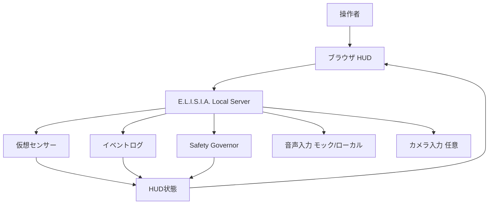
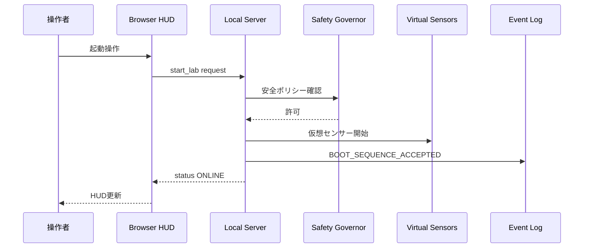
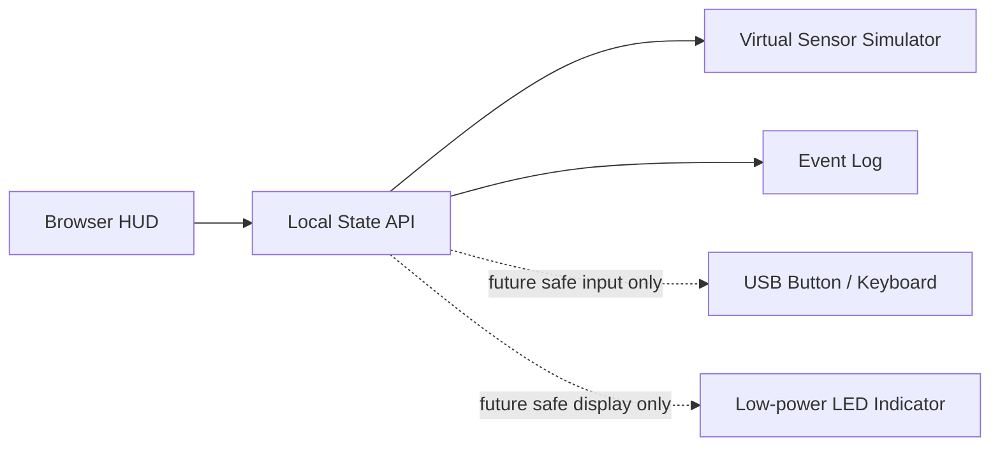

# E.L.I.S.I.A. Mark LXXXV Safe Mini Lab 設計書・設計図・仕様書

## 要約

この文書は、工具や機材製作の経験がない状態から始めるための、E.L.I.S.I.A. Mark LXXXV 風 Safe Mini Lab の設計書、設計図、仕様書です。

ここで作るものは、実在する兵器、飛行装置、推進装置、人体装着型の危険な機械ではありません。最初の目標は、PC上のHUD、仮想センサー、ログ、音声またはボタン入力、ローカル限定ダッシュボードで構成する安全な制御ラボです。

大切にする原則:

- 工具なしで始める。
- 物理デバイスを動かさない仮想制御から始める。
- LANまたはlocalhost内で完結する。
- 秘密情報を自動収集、アップロード、Git管理しない。
- 危険な出力より、観察、記録、停止、安全境界を優先する。

## 1. 文書の位置づけ

| 文書種別 | この文書で扱う内容 | 扱わない内容 |
| --- | --- | --- |
| 設計書 | 目的、構成、責務、安全境界、段階的な育て方 | 危険な機械工作、飛行、推進、武器、人体拡張 |
| 設計図 | ソフトウェア構成図、HUD画面図、データフロー図、将来の安全な拡張図 | 実スーツ、推進器、武器、耐荷重機構の製作図 |
| 仕様書 | 機能要件、非機能要件、セキュリティ要件、受け入れ条件 | 危険装置の制御仕様、WAN公開管理画面 |

## 2. 安全境界

### 許可する範囲

- PCまたはRaspberry Pi上のローカルWebアプリ。
- 仮想センサー値の表示。
- カメラ映像への安全なHUDオーバーレイ。
- 音声コマンドのローカル処理。
- ローカルログ保存。
- 低リスクなLED表示やUSB機器の状態表示。
- 認証、監査ログ、レート制限などの安全なシステム管理。

### 除外する範囲

- 兵器、投射、攻撃、照射を目的とした装置。
- 飛行、推進、浮上、人体を持ち上げる装置。
- 高電圧、大容量バッテリー、高出力モーター。
- 自律的に物理空間を操作する危険な制御。
- WAN公開を前提にした管理画面。
- 秘密情報の自動収集、外部アップロード、Gitへの保存。

## 3. 初期ゴール

最初に作るものは、**Mark 85風ミニHUDラボ**です。

目的:

- 「スーツを作る」のではなく、「スーツの中にいる気分を安全に再現する」。
- 入力、判断、出力、ログ、停止という制御システムの基礎を学ぶ。
- E.L.I.S.I.A. のローカルサーバやHUD UIへ自然に接続できる土台にする。

初期完成イメージ:

```text
E.L.I.S.I.A. MARK85 SAFE LAB
STATUS: ONLINE
POWER: USB / SIMULATED SAFE
LIFE SUPPORT: SIMULATED
NETWORK: LOCAL ONLY
THREAT LEVEL: LOW
LAST EVENT: BOOT_SEQUENCE_ACCEPTED
```

## 4. 設計書

### 4.1 システム全体像



### 4.2 コンポーネント責務

| コンポーネント | 役割 | 初期実装の目安 |
| --- | --- | --- |
| Browser HUD | 状態、警告、ログ、仮想センサーを表示する | HTML/CSS/Canvas/Web UI |
| Local Server | HUDへ状態を配信し、ログを保存する | Bun / Elysia または FastAPI |
| Sensor Simulator | 温度、距離、姿勢、ネットワーク状態を仮想生成する | 乱数、固定シナリオ、ログ再生 |
| Safety Governor | 危険な操作を持ち込まないための境界を管理する | 設定ファイル、許可リスト、手動確認 |
| Event Log | 起動、入力、警告、状態遷移を記録する | JSONL または SQLite |
| Optional Camera | カメラ映像にHUDを重ねる | ブラウザ権限で明示許可 |
| Optional Voice | 「起動」「停止」などの安全なコマンドを受ける | ローカル音声認識またはボタン代替 |

### 4.3 運用モデル

- 初期は `localhost` のみで動かす。
- LAN公開する場合も、管理操作は認証後に限定する。
- 物理デバイス制御APIは初期スコープに入れない。
- 外部クラウド連携は既定で無効にする。
- ログには秘密情報、トークン、個人情報を保存しない。
- すべての操作は「見える」「止められる」「記録される」ことを基本にする。

## 5. 設計図

### 5.1 MVP構成図

```text
+------------------------------+
| PC / Mac / Raspberry Pi       |
|                              |
|  +------------------------+  |
|  | Local Server           |  |
|  | - state API            |  |
|  | - event log            |  |
|  | - sensor simulator     |  |
|  | - safety policy        |  |
|  +-----------+------------+  |
|              |               |
|              v               |
|  +------------------------+  |
|  | Browser HUD            |  |
|  | - armor status         |  |
|  | - virtual sensors      |  |
|  | - alerts               |  |
|  | - logs                 |  |
|  +------------------------+  |
+------------------------------+
```

### 5.2 HUD画面図

```text
+--------------------------------------------------------+
| E.L.I.S.I.A. MARK85 SAFE LAB              LOCAL ONLY    |
+----------------------+----------------+----------------+
| ARMOR STATUS         | SENSOR GRID    | EVENT STREAM   |
| STATUS: ONLINE       | TEMP: 24.8 C   | 12:00 BOOT     |
| POWER: SAFE          | DIST: 42 cm    | 12:01 HUD ON   |
| MODE: SIMULATION     | MOTION: STABLE | 12:02 SAFE     |
+----------------------+----------------+----------------+
| CAMERA / VISUAL FIELD                                  |
|                                                        |
|        optional camera preview or animated HUD          |
|                                                        |
+----------------------+----------------+----------------+
| SAFETY GOVERNOR      | NETWORK        | CONTROLS       |
| OUTPUT: DISABLED     | LOCALHOST      | START / STOP   |
| WAN: BLOCKED         | AUTH: ENABLED  | ACK ALERT      |
+----------------------+----------------+----------------+
```

### 5.3 データフロー図



### 5.4 将来の安全な拡張図

物理要素を足す場合も、最初は表示や入力だけに限定します。



拡張時の考え方:

- まずはキーボード、USBボタン、画面表示で代替する。
- LEDを使う場合も、低電圧、低輝度、短時間、手動停止を前提にする。
- モーター、推進、重量物、身体を支える構造は別スコープにしない。

## 6. 仕様書

### 6.1 機能要件

| ID | 要件 | 優先度 | 受け入れ条件 |
| --- | --- | --- | --- |
| F-001 | HUDにシステム状態を表示する | 必須 | `ONLINE`, `SAFE`, `SIMULATION` が画面に表示される |
| F-002 | 仮想センサー値を表示する | 必須 | 温度、距離、姿勢のうち2種類以上が更新される |
| F-003 | イベントログを保存する | 必須 | 起動、停止、警告確認が時刻付きで記録される |
| F-004 | セーフモードを持つ | 必須 | セーフモード中は操作系が表示上も無効になる |
| F-005 | ローカル限定で動作する | 必須 | 既定URLが `localhost` またはLAN限定になる |
| F-006 | 音声またはボタン入力を受ける | 任意 | 入力がログに記録され、HUD状態が変わる |
| F-007 | カメラプレビューを表示する | 任意 | ブラウザ権限を明示許可した場合だけ表示される |

### 6.2 非機能要件

| ID | 要件 | 基準 |
| --- | --- | --- |
| N-001 | 初心者向け | 工具なしでMVPを開始できる |
| N-002 | 安全性 | 物理出力は既定で持たない |
| N-003 | 可観測性 | 状態、警告、ログが画面上で確認できる |
| N-004 | 保守性 | 設定、UI、仮想センサー、ログを分けて変更できる |
| N-005 | プライバシー | 秘密情報、トークン、個人情報をログに残さない |
| N-006 | 美観 | 赤、金、白、青白い発光を使いすぎず、読みやすさを優先する |

### 6.3 セキュリティ要件

| ID | 要件 | 実装方針 |
| --- | --- | --- |
| S-001 | WAN非公開 | ポート開放や公開URLを既定にしない |
| S-002 | 入力検証 | コマンド、クエリ、ファイル名を許可リストで扱う |
| S-003 | レート制限 | 高頻度APIに簡易制限を入れる |
| S-004 | ログ最小化 | 秘密、トークン、パスワードを記録しない |
| S-005 | 操作分離 | 表示系と管理系を分ける |
| S-006 | 緊急停止 | UI上にセーフモードへ戻す操作を置く |

### 6.4 状態モデル

```text
OFFLINE
  -> BOOTING
  -> ONLINE
  -> SAFE_MODE
  -> SHUTDOWN

ONLINE
  -> ALERT
  -> SAFE_MODE
  -> SHUTDOWN

ALERT
  -> ACKNOWLEDGED
  -> SAFE_MODE
```

### 6.5 イベントログ形式

MVPでは、JSONL または SQLite のどちらかを選びます。最初はJSONLで十分です。

```json
{
  "timestamp": "2026-05-12T12:00:00+09:00",
  "event": "BOOT_SEQUENCE_ACCEPTED",
  "mode": "SIMULATION",
  "source": "hud",
  "severity": "info",
  "details": {
    "network": "localhost",
    "physicalOutput": "disabled"
  }
}
```

### 6.6 ローカルAPI案

| Method | Path | 用途 | 注意 |
| --- | --- | --- | --- |
| GET | `/api/safe-lab/status` | HUD状態を取得する | 読み取り専用 |
| GET | `/api/safe-lab/events` | イベントログを取得する | 件数制限を入れる |
| POST | `/api/safe-lab/start` | 仮想ラボを開始する | 物理出力は起動しない |
| POST | `/api/safe-lab/stop` | 仮想ラボを停止する | セーフモードへ戻す |
| POST | `/api/safe-lab/ack` | 警告を確認する | 操作ログを残す |

## 7. マザーボード / ロジックボードから始める設計

ここでの「マザーボードから工作する」は、初心者が多層基板を設計・製造したり、電源装置を分解したりする意味ではありません。

安全な意味でのロジックボード工作は、既製のPCマザーボード、ミニPC、Raspberry Pi系SBC、Arduino/ESP32系開発ボードを **E.L.I.S.I.A. の中核ノード** として扱い、周辺にHUD、ログ、仮想センサー、低リスク入力を組み合わせることです。

部品の見分け方と電気図面の読み方は、別紙 `docs/ELISIA_LOGIC_BOARD_PARTS_AND_SCHEMATIC_READING.ja.md` に分けます。この文書では、ロジックボードをSafe Mini Labへ組み込む設計境界に集中します。

### 7.1 ロジックボードの役割

| 領域 | ロジックボードで担当すること | 初心者向けの安全な扱い |
| --- | --- | --- |
| 計算 | HUD、API、ログ、仮想センサーを動かす | 既存PC、ミニPC、Raspberry Piを使う |
| 記憶 | 設定、イベントログ、画面素材を保存する | SSD、microSD、SQLite、JSONLを使う |
| 通信 | ブラウザHUDやローカルAPIと通信する | `localhost` またはLAN限定にする |
| 表示 | モニター、ブラウザ、小型ディスプレイへ出す | HDMI、USB、Web UIを優先する |
| 入力 | キーボード、マウス、USBボタン、音声を受ける | 物理駆動ではなく入力だけにする |
| 安全 | セーフモード、停止、ログ、権限を管理する | 既定で物理出力を無効にする |

### 7.2 推奨する出発点

最初は、次の順番で進めます。

```text
既存PCを仮想ロジックボードにする
  -> ミニPC / Raspberry Piを専用ロジックボードにする
  -> ブレッドボードで入力表示だけ試す
  -> 必要になったら安全なキャリアボード化を検討する
```

| 段階 | 構成 | 目的 | 注意 |
| --- | --- | --- | --- |
| A | 既存PC | 工具なしでHUDとAPIを作る | 物理I/Oを使わない |
| B | ミニPC / Raspberry Pi | 小さな専用中枢にする | 公式ケース、安定電源、放熱を使う |
| C | 開発ボード | ボタンやLEDなど低リスクI/Oを試す | 低電圧、短時間、手動停止 |
| D | キャリアボード | 配線を整理して見た目を整える | 高出力、人体駆動、推進、発熱を入れない |

### 7.3 安全な物理配置図

```text
+------------------------------------------------------+
| Enclosure / Desk Case                                |
|                                                      |
|  +--------------------+      +--------------------+  |
|  | Logic Board        |      | Display / HUD       |  |
|  | PC / mini PC / SBC | ---> | Browser / Monitor   |  |
|  +---------+----------+      +--------------------+  |
|            |                                         |
|            v                                         |
|  +--------------------+      +--------------------+  |
|  | Storage / Logs     |      | Input Only Zone     |  |
|  | SSD / microSD      |      | Keyboard / Button   |  |
|  +--------------------+      +--------------------+  |
|                                                      |
|  Power: certified adapter / normal PC PSU only        |
|  Physical output: disabled by default                 |
+------------------------------------------------------+
```

### 7.4 PCマザーボードを使う場合の境界

PCマザーボードを使う場合は、工作というより **標準PC組み立ての安全な範囲** に留めます。

守ること:

- マザーボードはケースまたは絶縁された作業台に固定する。
- 金属面、布団、カーペットの上で通電しない。
- 電源ユニットを分解しない。
- 通電中に部品を抜き差ししない。
- CPU、メモリ、SSD、冷却、ケースファンは標準パーツだけを使う。
- 配線はケース内に収め、ファンに触れないようにする。
- まずは画面表示、ログ、ネットワーク監視だけを動かす。

避けること:

- 電源装置の改造。
- バッテリー直結。
- 高電流LED、モーター、ヒーターの接続。
- 身体に装着した状態での裸基板運用。
- 金属シェルと基板の直接接触。

### 7.5 Raspberry Pi / SBCを使う場合の境界

Raspberry Pi系SBCは、Safe Mini Labのロジックボードとして扱いやすい選択肢です。

推奨:

- 公式または品質の良いケースに入れる。
- 安定したUSB-C電源を使う。
- microSDよりSSD起動を検討する。
- GPIOは最初は使わない。
- 使うとしても、LED、ボタン、センサー表示のような低リスク入力表示に限定する。

設計上の見方:

```text
SBC = 小型司令室
GPIO = 将来の低リスクI/Oポート
SSD = 記憶層
LAN = ローカル神経網
HUD = 可視化層
Safety Governor = 操作境界
```

### 7.6 キャリアボード化の判断基準

専用基板やキャリアボードを検討するのは、次の条件を満たしてからで十分です。

- PCまたはSBC上でHUDが安定して動く。
- ログ、セーフモード、停止操作がある。
- どの信号が入力で、どの信号が表示用か説明できる。
- 高出力部品を使わない設計になっている。
- 失敗しても人や物を傷つけない卓上デモに収まっている。

初心者の最初の「基板工作」は、基板そのものを作ることではありません。安全な中核を選び、状態を見えるようにし、止められる構造にすることです。

## 8. 制作フェーズ

| フェーズ | 目標 | 成果物 |
| --- | --- | --- |
| Phase 0 | 設計を読む | この文書、画面案、安全境界 |
| Phase 1 | 静的HUDを作る | 1画面のHTML/CSSまたは既存UI内ページ |
| Phase 2 | ローカル状態APIを作る | `status`, `events`, `start`, `stop` |
| Phase 3 | 仮想センサーを動かす | 温度、距離、姿勢のシミュレーション |
| Phase 4 | ログとセーフモードを入れる | JSONL/SQLiteログ、停止操作 |
| Phase 5 | 任意の入力を足す | キーボード、ボタン、音声モック |
| Phase 6 | 専用ロジックボード化 | ミニPC / Raspberry Piで常時運用に近づける |
| Phase 7 | 任意の表示拡張 | カメラHUD、低リスクLED表示 |

## 9. 費用目安

| 構成 | 目安 | コメント |
| --- | --- | --- |
| PCのみ | 0円 | 既存PCで開始できる |
| 中古/小型PC | 15,000から60,000円以上 | 専用ロジックボードとして扱いやすい |
| Webカメラ追加 | 1,500から5,000円 | カメラHUDを試す場合 |
| USBマイク追加 | 1,500から6,000円 | 音声コマンドを試す場合 |
| Raspberry Pi系 | 8,000から20,000円以上 | 入手性と価格変動に注意 |
| ブレッドボード入門セット | 1,500から5,000円 | Phase 6以降で十分 |
| 小型ディスプレイ | 2,000から8,000円 | ヘルメット風表示の試作向け |

最初は、既存PCだけで始めるのが一番きれいです。経験を積んでから、必要なものだけ足します。

## 10. 受け入れ条件

MVP完了の条件:

- ブラウザでHUDが表示される。
- `STATUS: ONLINE` と `MODE: SIMULATION` が確認できる。
- 仮想センサー値が2種類以上表示される。
- 起動、停止、警告確認がログに残る。
- セーフモードに戻せる。
- WAN公開や物理出力が既定で無効になっている。
- 秘密情報をログやGitに保存していない。
- ロジックボードを使う場合、ケース、絶縁、放熱、標準電源の範囲で運用している。

## 11. 次に実装する場合の最小タスク

実装するなら、最初の1スプリントは小さくします。

- `packages/server/src/routes/` に Safe Lab の読み取り中心ルートを追加する。
- `packages/server/src/lib/` に仮想センサーと状態モデルを置く。
- 既存のローカルダッシュボードに HUD 画面を1つ追加する。
- JSONLまたは既存のデータ層にイベントログを保存する。
- `bun run typecheck` と、追加箇所に対応する最小テストを実行する。

この順番なら、金属も火花もいりません。最初の鎧は、机の上で静かに光る状態表示から始まります。
