# Architecture: RAG (Long-Term Memory)

ElysiaAI縺ｯ縲梧ｰｸ驕縺ｫ豸医∴縺ｪ縺・ｨ俶・縲阪ｒ謖√▽OS縺ｧ縺吶€・遏ｭ譛溯ｨ俶・・育峩霑代・莨夊ｩｱ螻･豁ｴ・峨・SQLite繝吶・繧ｹ縺ｮ `MemoryVault` 縺ｧ蜃ｦ逅・＆繧後∪縺吶′縲∵焚荳・ｻｶ縺ｫ蜿翫・驕主悉縺ｮ蟇ｾ隧ｱ繧・衍隴倥ｒ蜻ｼ縺ｳ隕壹∪縺吶◆繧√€・*Retrieval-Augmented Generation (RAG)** 繧｢繝ｼ繧ｭ繝・け繝√Ε繧貞ｰ主・縺励∪縺吶€ゅ・繝ｩ繧､繝舌す繝ｼ縺ｨ繝ｭ繝ｼ繧ｫ繝ｫ螳溯｡後・逅・ｿｵ縺ｫ蠕薙＞縲，hromaDB 縺ｾ縺溘・ Qdrant 縺ｮ繧医≧縺ｪ繝ｭ繝ｼ繧ｫ繝ｫ繝吶け繝医ΝDB繧呈治逕ｨ縺励∪縺吶€・
## System Workflow

```mermaid
sequenceDiagram
    participant User as 髢区挙閠・(User)
    participant Boot as 検boot.py (CLI)
    participant Persona as 減persona.py (Engine)
    participant Memory as 沈MemoryVault (SQLite)
    participant VectorDB as ｧVectorDB (Chroma)
    participant LLM as Gemini API

    User->>Boot: 蜈･蜉・(萓・ "縺ゅ・譎ゅ・邏・據縲∬ｦ壹∴縺ｦ繧具ｼ・)
    Boot->>Memory: 菫晏ｭ・(User Input)
    
    rect rgb(30, 30, 60)
    Note over Boot,VectorDB: Semantic Search (RAG)
    Boot->>LLM: 蜈･蜉帙ｒ繝吶け繝医Ν蛹・(Embedding)
    LLM-->>Boot: Vector [0.1, 0.4, ...]
    Boot->>VectorDB: 鬘樔ｼｼ險俶・縺ｮ讀懃ｴ｢ (Top-K)
    VectorDB-->>Boot: 髢｢騾｣縺吶ｋ驕主悉縺ｮ莨夊ｩｱ繝√Ε繝ｳ繧ｯ
    end
    
    Boot->>Persona: 蜿門ｾ励＠縺溯ｨ俶・+逶ｴ霑大ｱ･豁ｴ繧単rompt縺ｫ邨ｱ蜷・    Persona-->>Boot: RAG Prompt逕滓・
    
    Boot->>LLM: Prompt騾∽ｿ｡ (Gemini 1.5)
    LLM-->>Boot: 逕滓・繝・く繧ｹ繝・    
    Boot->>Memory: 菫晏ｭ・(ElysiaAI Response)
    Boot->>VectorDB: 莨夊ｩｱ繧偵・繧ｯ繝医Ν蛹悶＠縺ｦ髱槫酔譛滉ｿ晏ｭ・    Boot-->>User: 蠢懃ｭ斐ｒ陦ｨ遉ｺ
```

## Data Persistence

- 遏ｭ譛溽噪縺ｪ莨夊ｩｱ縺ｯ `data/memory/historical.db` (SQLite) 縺ｫ蜊ｳ蠎ｧ縺ｫ菫晏ｭ倥＆繧後∪縺吶€・- 繝舌ャ繧ｯ繧ｰ繝ｩ繧ｦ繝ｳ繝峨Ρ繝ｼ繧ｫ繝ｼ・医∪縺溘・髱槫酔譛溘ち繧ｹ繧ｯ・峨′繝舌ャ繝√→縺励※SQLite縺ｮ繝・く繧ｹ繝医ｒEmbedding縺ｫ螟画鋤縺励€√Ο繝ｼ繧ｫ繝ｫ縺ｮ `data/vector/` 鬆伜沺縺ｸ菫晄戟縺励∪縺吶€・
## Security & Privacy

縺吶∋縺ｦ縺ｮ逕滉ｽ薙ョ繝ｼ繧ｿ縺翫ｈ縺ｳ莨夊ｩｱ繝ｭ繧ｰ縺ｯ繝ｭ繝ｼ繧ｫ繝ｫ迺ｰ蠅・ｼ・ocker繧ｳ繝ｳ繝・リ蜀・Κ・峨°繧牙､夜Κ繝阪ャ繝医Ρ繝ｼ繧ｯ・・PI騾∽ｿ｡譎ゅｒ髯､縺擾ｼ峨∈豬∝・縺励↑縺・ｨｭ險医〒縺吶€・
