# Architecture: RAG (Long-Term Memory)

ElysiaAIは「永遠に消えなぁE���E」を持つOSです、E短期記�E�E�直近�E会話履歴�E��ESQLiteベ�Eスの `MemoryVault` で処琁E��れますが、数丁E��に及�E過去の対話めE��識を呼び覚ますため、E*Retrieval-Augmented Generation (RAG)** アーキチE��チャを導�Eします。�Eライバシーとローカル実行�E琁E��に従い、ChromaDB また�E Qdrant のようなローカルベクトルDBを採用します、E
## System Workflow

```mermaid
sequenceDiagram
    participant User as 開拓老E(User)
    participant Boot as 🌟boot.py (CLI)
    participant Persona as 🌸persona.py (Engine)
    participant Memory as 💾MemoryVault (SQLite)
    participant VectorDB as 🧠VectorDB (Chroma)
    participant LLM as Gemini API

    User->>Boot: 入劁E(侁E "あ�E時�E紁E��、覚えてる！E)
    Boot->>Memory: 保孁E(User Input)
    
    rect rgb(30, 30, 60)
    Note over Boot,VectorDB: Semantic Search (RAG)
    Boot->>LLM: 入力をベクトル匁E(Embedding)
    LLM-->>Boot: Vector [0.1, 0.4, ...]
    Boot->>VectorDB: 類似記�Eの検索 (Top-K)
    VectorDB-->>Boot: 関連する過去の会話チャンク
    end
    
    Boot->>Persona: 取得した記�E+直近履歴をPromptに統吁E    Persona-->>Boot: RAG Prompt生�E
    
    Boot->>LLM: Prompt送信 (Gemini 1.5)
    LLM-->>Boot: 生�EチE��スチE    
    Boot->>Memory: 保孁E(ElysiaAI Response)
    Boot->>VectorDB: 会話を�Eクトル化して非同期保孁E    Boot-->>User: 応答を表示
```

## Data Persistence

- 短期的な会話は `data/memory/historical.db` (SQLite) に即座に保存されます、E- バックグラウンドワーカー�E�また�E非同期タスク�E�がバッチとしてSQLiteのチE��ストをEmbeddingに変換し、ローカルの `data/vector/` 領域へ保持します、E
## Security & Privacy

すべての生体データおよび会話ログはローカル環墁E��EockerコンチE��冁E���E�から外部ネットワーク�E�EPI送信時を除く）へ流�EしなぁE��計です、E
