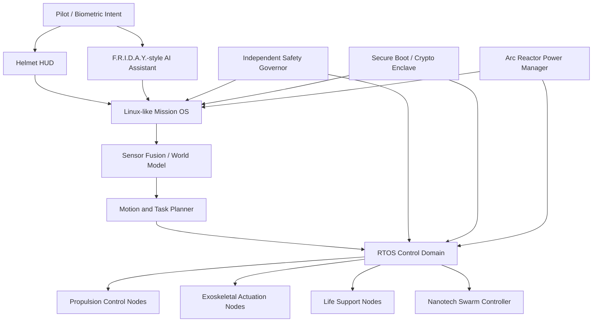
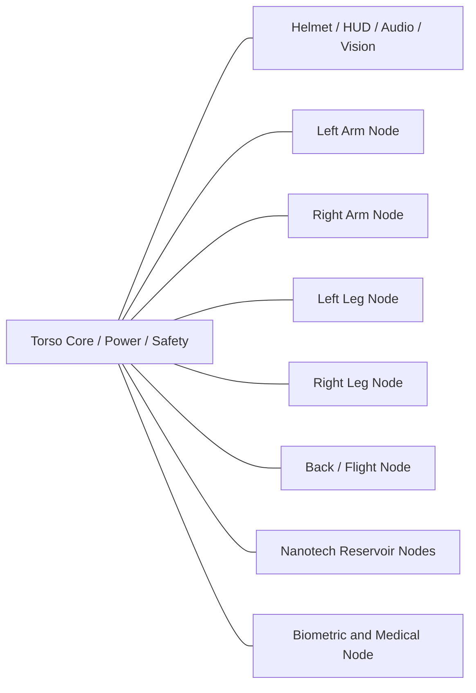
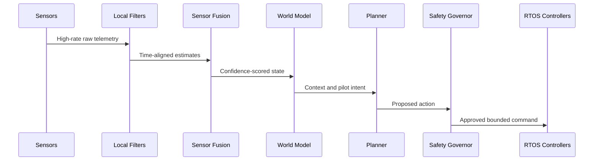

# Mark LXXXV Distributed Wearable Computing Platform Specification

要約:

- この文書は、MCUのIron Man Mark LXXXV armorを「分散型ウェアラブル・コンピューティング・プラットフォーム」として読むための安全な技術仕様です。
- MCUで確認できる事実、画面上の観察、工学的推論、フィクション拡張を明確に分離します。
- 実在する兵器、飛行装置、人体拡張装置、危険な自動制御装置の製造手順は扱いません。
- Raspberry Pi OS、ROS、組込みLinux、RTOS、現代ロボティクスとの比較は、概念理解とアーキテクチャ設計のために行います。

## 1. Scope and Safety Boundary

この仕様書は、物語・ゲーム・UIデモ・ロボティクス教育・安全設計の思考実験に使うためのものです。

扱うもの:

- 分散コンピューティングとしてのスーツ構造
- 高レベルOS、RTOS、組込みノード、センサーフュージョンの概念
- HUD、AI assistant、生命維持、安全境界、故障モード
- MCU描写をもとにした安全な工学的推論

扱わないもの:

- 武器の製造、改造、照準、威力向上、運用手順
- 実在の推進器、危険な高出力装置、人体装着型機械の具体的製作手順
- 現実デバイスを無断で自動操作する設計
- 現実世界で危害につながる最適化

## 2. Evidence Model

| Evidence class | Meaning | Confidence |
| --- | --- | --- |
| Confirmed MCU canon | 映画またはMarvel公式資料で確認できる情報 | High |
| Visible on-screen evidence | 画面上の挙動として観察できるが、内部構造は明示されないもの | Medium |
| Engineering inference | その挙動を成立させるために合理的と考えられる技術構成 | Medium-Low |
| Speculative fictional extension | 現実技術や画面描写を超えた、創作用の拡張設定 | Low |

## 3. Confirmed MCU Canon

| Item | Canon statement | Notes |
| --- | --- | --- |
| Mark LXXXV / Mark 85 | Marvel公式のMCU armor guideに、Endgame期の armor として Mark 85 が掲載されている | 名称と登場位置は公式に確認可能 |
| Mark 50 nanotech lineage | Marvel公式のMCU armor guideに Mark 50 が "Nanotech Suit" として掲載されている | Mark 85の描写を読む前提として、直前世代のnanotech armorが公式化されている |
| Bleeding Edge nanotech armor | Marvel公式記事で Infinity War の armor が "Bleeding Edge nanotech Iron Man armor" と説明されている | Mark 50の公式説明として参照可能 |
| Arc Reactor visual design | Marvel公式記事で Mark 50 Arc Reactor design について触れられている | 動力源の実物理はフィクション |
| F.R.I.D.A.Y.-style AI assistant | MCU内でTony StarkのAI assistantとしてF.R.I.D.A.Y.が使用される | Mark 85内部の全実装詳細は不明 |

Sources:

- [Marvel: A Guide on Every Armor Worn by Iron Man in the MCU](https://www.marvel.com/articles/movies/guide-every-iron-man-armor-mcu)
- [Marvel: How Marvel Studios' Prop Master Brings Super Hero Gadgets and Weapons to Life](https://www.marvel.com/articles/movies/how-marvel-studios-prop-master-brings-super-hero-gadgets-and-weapons-to-life)

## 4. Visible On-Screen Evidence

| Observed behavior | Evidence class | Platform implication |
| --- | --- | --- |
| Helmet HUD presents dense tactical and suit-state information | Visible on-screen evidence | Real-time graphics, sensor fusion, alert prioritization |
| Armor deploys and reshapes around Tony | Visible on-screen evidence | Distributed morphology control and state synchronization |
| Suit flies while maintaining human posture | Visible on-screen evidence | Stabilization loops, inertial estimation, pilot intent mediation |
| Suit tolerates severe impact and visible damage | Visible on-screen evidence | Fault detection, graceful degradation, structural state monitoring |
| Suit supports hostile environments including space-adjacent scenes in the nanotech era | Visible on-screen evidence | Sealing, thermal control, oxygen or environmental support |
| AI assistant speaks, warns, and summarizes | Visible on-screen evidence | Natural-language interface coupled to telemetry and safety state |
| Armor forms tools and protective structures | Visible on-screen evidence | Shape templates, local material allocation, power-aware morphology |

## 5. Engineering Interpretation

Mark LXXXV is best modeled as a layered cyber-physical system:

- A high-level mission computer behaves like an embedded Linux platform.
- Real-time control is delegated to RTOS or bare-metal safety controllers.
- Many embedded nodes live near the actuators, sensors, propulsion points, helmet, torso, and nanotech reservoirs.
- Hardware acceleration handles low-latency perception, graphics, cryptography, signal processing, and morphology coordination.
- A safety governor sits outside the expressive AI layer and can veto unstable actions.

## 6. Operating System Architecture

### 6.1 Layered OS Model

| Layer | Real-world analogy | Mark LXXXV role | Evidence class |
| --- | --- | --- | --- |
| Mission OS | Embedded Linux, Raspberry Pi OS, Android Automotive-like stack | AI, HUD, maps, comms, logging, diagnostics | Engineering inference |
| Robotics middleware | ROS / ROS 2 graph | Sensors, planners, controllers, semantic world model | Engineering inference |
| Real-time control | FreeRTOS, Zephyr, RTEMS, PREEMPT_RT Linux for softer loops | Flight stabilization, actuator timing, life support supervision | Engineering inference |
| Safety island | Automotive safety MCU, avionics monitor | Independent veto, emergency survival, fault containment | Engineering inference |
| Hardware fabric | FPGA / ASIC / GPU / NPU | Vision, cryptography, signal processing, nanotech coordination | Speculative fictional extension |

### 6.2 Raspberry Pi OS Comparison

Raspberry Pi OS is officially a Debian-based operating system optimized for Raspberry Pi hardware. It is useful as a teaching analogy for the high-level layer, but not for critical suit control.

| Area | Raspberry Pi OS | Mark LXXXV inferred design |
| --- | --- | --- |
| Base OS | Debian-based Linux | Hardened embedded Linux-like mission OS |
| Timing | General-purpose, not hard real-time | Split: Linux-like high-level layer plus RTOS safety loops |
| Hardware control | GPIO, cameras, USB, networking | Many sealed, redundant, safety-critical embedded buses |
| Failure impact | App crash, OS instability, data loss | Human safety risk, flight instability, life support risk |
| Security | User/device-oriented hardening | Secure boot, tamper response, zero-trust node authentication |

Source:

- [Raspberry Pi: Raspberry Pi OS documentation](https://www.raspberrypi.com/documentation/raspbian/using_linux.html)

### 6.3 ROS Comparison

ROS 2 describes robot systems as networks of nodes that communicate through typed messages, topics, services, and actions. That maps beautifully to a fictional suit, though Mark LXXXV would need stronger real-time and safety guarantees than typical research robotics.

| ROS concept | Suit analogue |
| --- | --- |
| Node | Helmet sensor node, left-arm controller, propulsion controller, life-support monitor |
| Topic | IMU stream, thermal state, biometric state, armor integrity |
| Service | Query suit health, request sensor calibration, fetch diagnostics |
| Action | Execute safe landing, seal breach, transition to emergency mode |
| ROS graph | Dynamic suit-internal network of compute and control nodes |

Source:

- [ROS 2: Basic Concepts](https://docs.ros.org/en/rolling/Concepts/Basic.html)

## 7. Linux-like High-Level System

The Linux-like Mission OS is the "large mind" of the suit, but not the reflex system.

Responsibilities:

- Run HUD compositor and augmented-reality overlays.
- Maintain mission timeline, logs, maps, and semantic world state.
- Host AI assistant processes and speech interaction.
- Coordinate non-critical planners and diagnostics.
- Provide sandboxed applications for analysis, simulation, and communication.
- Route messages between sensor-fusion services and lower-level controllers.

Design constraints:

- Critical control loops must continue if the high-level OS restarts.
- HUD failure must not imply life-support failure.
- AI assistant failure must not bypass the safety governor.
- High-level updates must be signed, rollback-capable, and isolated from control firmware.

## 8. RTOS Control Loops

RTOS loops are the "old craft" inside the shining armor: small, disciplined, deterministic, and trusted because they do one thing well.

| Loop | Timing class | Likely owner | Notes |
| --- | --- | --- | --- |
| Attitude stabilization | Hard / firm real-time | Propulsion RTOS nodes | Late output can destabilize flight |
| Exoskeleton torque assist | Firm real-time | Limb control nodes | Must avoid injuring the pilot |
| Life support regulation | Firm real-time | Torso safety node | Must continue during mission OS failure |
| Thermal regulation | Firm / soft real-time | Power and thermal nodes | Protects pilot, electronics, and nanotech substrate |
| HUD rendering | Soft real-time | Mission OS / GPU | Dropped frames are acceptable; false safety state is not |

Real-time Linux note:

- PREEMPT_RT can reduce Linux latency and improve preemption.
- For a wearable flight-capable suit, PREEMPT_RT would be suitable for soft or firm real-time work, not the most critical reflex loops.
- The safest architecture keeps hard safety loops on independent controllers.

Sources:

- [FreeRTOS Kernel Fundamentals](https://docs.aws.amazon.com/freertos/latest/userguide/dev-guide-freertos-kernel.html)
- [Linux Kernel: Real-time preemption](https://www.kernel.org/doc/html/latest/core-api/real-time/index.html)

## 9. FPGA / ASIC Acceleration

| Accelerator | Purpose | Evidence class |
| --- | --- | --- |
| Vision DSP / NPU | Object recognition, optical flow, depth estimation, HUD annotation | Engineering inference |
| Control FPGA | Deterministic routing for synchronized actuator and propulsion commands | Engineering inference |
| Cryptographic enclave | Secure boot, signed commands, encrypted logs, attestation | Engineering inference |
| Power-management ASIC | Load balancing, brownout prevention, emergency shedding | Engineering inference |
| Nanotech fabric ASIC | Local material-state computation and shape control | Speculative fictional extension |

Safety note:

- These accelerators are described only at a systems level.
- No circuitry, material recipe, propulsion design, or weaponization detail is included.

## 10. Distributed Embedded Nodes

| Node | Responsibilities | Failure posture |
| --- | --- | --- |
| Helmet | HUD, audio, cameras, eye tracking, voice I/O | Fall back to minimal alerts and audio prompts |
| Torso core | Power, safety governor, life support, primary compute | Preserve life support and emergency landing |
| Limb nodes | Force sensing, local actuation, impact detection | Lock into safe posture or low-force assist |
| Back/flight node | Stabilization and thrust-vector coordination | Reduce speed, rebalance, land |
| Nanotech reservoirs | Armor morphology, sealing, repair allocation | Freeze into protective shell |
| Biometric node | Heart rate, stress, injury, oxygen state | Trigger Guardian/survival modes |

## 11. Sensor Fusion

### 11.1 Input Sources

| Sensor class | Function |
| --- | --- |
| IMU / inertial | Attitude, acceleration, impact, fall detection |
| Optical cameras | Navigation, scene understanding, pilot-facing HUD context |
| Depth / ranging | Obstacle avoidance, landing assessment, close-space mapping |
| Thermal | Fire, overheating, body heat signatures, electronics health |
| Acoustic | Voice command, impact events, environmental awareness |
| Structural sensors | Deformation, crack detection, armor integrity |
| Biometric sensors | Stress, injury, oxygenation, consciousness state |
| Power telemetry | Load, thermal headroom, emergency reserves |

### 11.2 Fusion Pipeline

Key principle:

- The suit should treat uncertainty as a reason to become more conservative.
- When sensors disagree, autonomy decreases and pilot confirmation becomes more important.

## 12. HUD and AI Assistant

| Component | Role | Evidence class |
| --- | --- | --- |
| HUD compositor | Renders suit state, warnings, route hints, sensor overlays | Visible on-screen evidence |
| Voice assistant | Summarizes, warns, confirms, and mediates pilot intent | Confirmed / visible |
| Cognitive load manager | Suppresses nonessential alerts under stress | Engineering inference |
| Safety dialogue layer | Requires confirmation for high-risk actions | Engineering inference |
| Explainability logger | Records why the suit recommended or blocked an action | Speculative fictional extension |

HUD principles:

- Center view stays clear.
- Warnings are short and prioritized.
- Confidence and uncertainty are visible.
- AI suggestions are phrased as options, not coercion.
- Pilot survival and bystander protection outrank spectacle.

## 13. Propulsion Control

This section remains conceptual and non-instructional.

Platform implications:

- Multiple propulsion points imply synchronized control across distributed nodes.
- Center of mass must be estimated continuously as armor shape changes.
- Pilot movement, suit posture, power headroom, and environmental state must feed the stabilizer.
- Emergency behavior prioritizes controlled descent, collision avoidance, and pilot injury reduction.

| Robotics analogy | Suit interpretation |
| --- | --- |
| Drone flight controller | Attitude stabilization and sensor feedback |
| Humanoid robot controller | Whole-body posture and balance |
| Exoskeleton controller | Human-safe assistive force |
| Avionics safety monitor | Independent supervision and fault response |

## 14. Life Support

| Subsystem | Purpose | Evidence class |
| --- | --- | --- |
| Atmospheric sealing | Protect pilot from hostile environment | Visible / inference |
| Oxygen and CO2 management | Maintain breathable internal environment | Engineering inference |
| Thermal regulation | Protect pilot and electronics | Engineering inference |
| Medical monitoring | Detect injury, stress, unconsciousness | Engineering inference |
| Impact mitigation | Reduce acceleration and posture-related injury | Engineering inference |
| Emergency beacon | Help recovery when suit is disabled | Speculative fictional extension |

Safety rule:

- Life support belongs to the safety domain, not the entertainment/HUD domain.
- It must continue when AI, comms, or mission planning are degraded.

## 15. Nanotech Swarm Control

| Layer | Concept | Evidence class |
| --- | --- | --- |
| Nanotech armor existence | Armor can deploy and reshape as shown in the nanotech era | Confirmed lineage / visible |
| Shape library | Prevalidated forms for armor, sealing, repair, and non-harmful tools | Engineering inference |
| Mass and energy accounting | Tracks available nanotech material, heat, and power | Engineering inference |
| Local swarm consensus | Adjacent material clusters coordinate shape state | Speculative fictional extension |
| Self-healing mesh | Damaged areas isolate and route around failed material | Speculative fictional extension |

Safe control model:

- Shapes should be selected from validated templates.
- Emergency repair should prefer sealing, bracing, insulation, and pilot protection.
- The system should avoid unbounded improvisation, especially under sensor uncertainty.

## 16. Cybersecurity Threat Model

| Threat | Risk | Mitigation concept |
| --- | --- | --- |
| Wireless command injection | Unauthorized commands reach suit services | Signed commands, local trust anchors, strict pairing |
| Sensor spoofing | False world model or bad navigation | Multi-modal checks, confidence scoring, anomaly detection |
| AI assistant compromise | Misleading advice or unsafe automation | Least privilege, safety governor veto, audit logs |
| Firmware implant | Hidden behavior in embedded nodes | Secure boot, attestation, reproducible firmware provenance |
| Physical capture | Reverse engineering and key extraction | Tamper detection, compartmentalized secrets |
| Node impersonation | Fake limb or sensor node joins network | Mutual authentication and bus-level admission control |
| Nanotech desynchronization | Unstable morphology or resource exhaustion | Local fail-safe shapes and conservative fallback |

Threat model boundary:

- This is a defensive systems model.
- It intentionally avoids offensive cyber instructions, exploit procedures, or bypass steps.

## 17. Failure Modes

| Failure mode | Likely effect | Safe response |
| --- | --- | --- |
| Mission OS crash | HUD and AI degrade | RTOS continues flight/life support; restart high-level services |
| HUD blackout | Pilot loses rich situational display | Audio/minimal fallback; stabilize and exit high-risk mode |
| Sensor disagreement | World model confidence drops | Reduce autonomy; ask for pilot confirmation |
| Propulsion node loss | Asymmetric force or instability | Rebalance, reduce output, land |
| Limb node fault | Unsafe assistive force risk | Disable or lock local actuation into safe posture |
| Nanotech depletion | Reduced protection and adaptation | Freeze into conservative protective shell |
| Thermal overload | Pilot/electronics danger | Shed nonessential load; prioritize life support |
| Power instability | Cascading subsystem failures | Preserve life support, safety controller, controlled descent |
| AI logic failure | Bad summary or recommendation | Safety governor blocks unsafe actions |
| Security anomaly | Potential hostile control | Isolate affected service; enter local-only Guardian mode |

## 18. Safety Boundaries

| Boundary | Requirement |
| --- | --- |
| Human authority | Pilot intent remains central, except immediate survival overrides |
| Safety independence | Safety governor must not depend on conversational AI |
| Local-first operation | Critical functions work without cloud connectivity |
| No weapon optimization | Analysis excludes construction or performance tuning of weapons |
| Deterministic reflexes | Critical loops run on RTOS/safety controllers, not general AI |
| Graceful degradation | Failure reduces capability instead of creating uncontrolled behavior |
| Explainable override | Blocked actions should produce concise reasons when possible |
| Privacy | Biometric and cognitive-state logs stay local unless explicitly exported |

## 19. Comparison Matrix

| System | Similarity | Difference |
| --- | --- | --- |
| Raspberry Pi OS | Linux-like services, drivers, user-space apps | Not suitable alone for hard real-time wearable safety |
| Embedded Linux | Good fit for mission computer, HUD, logging, networking | Requires safety partitioning and deterministic companion controllers |
| ROS / ROS 2 | Excellent mental model for distributed nodes and messages | Typical ROS deployments need extra hardening for life-critical use |
| FreeRTOS / Zephyr-class RTOS | Strong analogy for local controllers and deterministic loops | Too small alone for AI/HUD-rich mission services |
| PREEMPT_RT Linux | Useful for lower-latency Linux tasks | Still not the only layer for hard safety reflexes |
| Modern robotics | Closest real-world pattern: Linux planner plus RTOS motor controllers | Mark LXXXV adds fictional nanotech, extreme power density, and cinematic AI |

## 20. Final Evaluation

Mark LXXXV is most coherent when treated as:

- A distributed robotics platform.
- A wearable cyber-physical system.
- A Linux-like mission computer wrapped around many deterministic embedded controllers.
- A fictional programmable-matter system with strong safety boundaries.

Engineering plausibility:

| Category | Evaluation |
| --- | --- |
| Layered compute architecture | High conceptual plausibility |
| ROS-like node graph | High educational value |
| RTOS control partitioning | Strongly plausible as an engineering pattern |
| FPGA / ASIC acceleration | Plausible at the architectural level |
| Nanotech swarm implementation | Fictional with current science |
| Arc Reactor power density | Fictional |
| Safety requirements | Absolute; the suit surrounds a human life |

Final judgment:

Mark LXXXV should not be understood as one magical computer. The richer reading is older and wiser: a whole village of small machines, each doing its duty, coordinated by a larger mind and restrained by a safety conscience. That is also the lesson modern robotics keeps teaching us. Intelligence is beautiful, but timing, containment, and humility keep the pilot alive.
