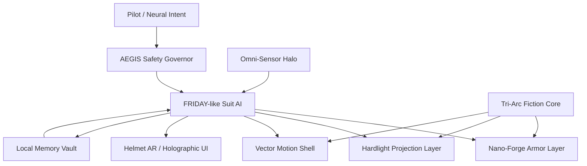

# Mark LXXXV Fantasy Suit System

完全フィクションのアイアンマンスーツ風システム設計書。

この文書は物語、ゲーム、UIデモ、ElysiaAI上のロールプレイ用です。実在する兵器、飛行装置、人体拡張装置、危険な自動操作機構の製造手順ではありません。

## 1. コンセプト

Mark LXXXV Fantasy Suit System は、装着者の身体を強くする鎧ではなく、装着者の意思、感情、判断、周囲の状況を一つの「共鳴ループ」に統合する架空のスーツOSです。

核になる思想:

- Armor as Interface: 鎧は武器ではなく、世界と対話するUI。
- Thought to Form: 思考が装甲、光、推進、視界に変換される。
- Safety Before Power: 出力より先に操縦者保護と周囲被害ゼロを優先する。
- Local Sovereignty: 判断ログ、感情状態、記憶はローカルに保持する。

## 2. 全体構成



## 3. コアモジュール

### 3.1 Tri-Arc Fiction Core

架空の小型高密度エネルギー源。現実の物理ではなく、物語上の「変換炉」として扱います。

役割:

- スーツ各部に仮想エネルギーを分配
- 瞬間出力と長時間稼働のバランス制御
- 外部エネルギーを受けた時の過負荷演出
- 緊急時は装甲維持と生命保護へ全リソースを寄せる

出力モード:

| Mode | 用途 | 優先度 |
| --- | --- | --- |
| Guardian | 操縦者保護、姿勢安定、救助 | 最高 |
| Mobility | 飛行演出、高速移動、回避 | 高 |
| Projection | ハードライト、ホログラム、シールド演出 | 中 |
| Cinematic | 撮影、ポーズ、光学エフェクト | 低 |

### 3.2 AEGIS Safety Governor

全行動の前に割り込む安全制御AI。

禁止するもの:

- 現実デバイスの無断操作
- 自動発火、自動攻撃、自動追尾
- 実在人物や設備への危険な制御
- 操縦者の明示なしの高出力モード

許可するもの:

- フィクション内の演出
- UIデモ
- 3Dシミュレーション
- ゲーム内ロールプレイ用の非破壊演出

### 3.3 FRIDAY-like Suit AI

人格を持つ支援AI。命令をそのまま実行するのではなく、装着者の意図を読み取り、危険を下げて提案に変換します。

人格設定:

- 声: 冷静、少し皮肉、でも忠実
- 得意: 状況要約、戦術ではなく救助最適化、姿勢制御
- 苦手: 装着者の無茶を完全には止められない

判断ループ:

1. Intent: 装着者の意図を読み取る
2. Risk: 周囲、姿勢、出力、心理状態を評価
3. Plan: 3つの安全な選択肢へ変換
4. Confirm: 高リスク行動は確認を取る
5. Act: シミュレーション内で実行
6. Learn: ローカルメモリに失敗と成功を保存

### 3.4 Nano-Forge Armor Layer

胸部コアから展開する架空ナノ装甲。現実の素材設計ではなく、視覚・物語上のレイヤーとして扱います。

主な形態:

- Base Shell: 通常装甲
- Impact Bloom: 衝撃点だけ花弁状に厚くなる装甲
- Repair Veil: 破損部を光の膜で仮補修
- Deep Space Cocoon: 真空・極寒・放射線を遮る演出用形態
- Rescue Frame: 人を抱える、支える、瓦礫から守るための拡張フレーム

弱点:

- 長時間の連続変形で熱飽和する
- コア損傷時は複雑形状を維持できない
- 操縦者の精神状態が荒れると不要な棘状形態が出る

### 3.5 Hardlight Projection Layer

ナノ粒子を消費せず、光と力場で形を作る架空レイヤー。

用途:

- シールド
- 足場
- 救助用担架
- ホログラムUI
- 光剣ではなく「切らない」拘束リボン
- 撮影用の翼、円環、軌跡エフェクト

重要制約:

- 実体への破壊力は持たせない
- 防御と移動補助、演出に寄せる
- 過負荷時は粒子ノイズとして美しく崩れる

### 3.6 Omni-Sensor Halo

ヘルメットと肩部から伸びる架空センサー網。

取得する情報:

- 周囲地形
- 熱源
- 音声
- 姿勢
- 操縦者の心拍、疲労、迷い
- 味方、民間人、危険領域の区別

表示:

- 赤: 即時危険
- 金: 行動候補
- 青: 安全な退路
- 白: 救助対象
- 紫: 未確定情報

## 4. 操作体系

### 4.1 Thought Command

思考を直接命令にせず、意図として扱います。

例:

| 操縦者の意図 | AIの解釈 | 実行 |
| --- | --- | --- |
| 守りたい | 防御優先 | Hardlight Shield |
| 間に合いたい | 最短安全経路 | Mobility Assist |
| 見失いたくない | 追跡ではなく記録 | Sensor Pin |
| 怖い | 出力制限と呼吸誘導 | Guardian Mode |
| かっこよく決めたい | 演出優先 | Cinematic Pose |

### 4.2 Helmet AR

ヘルメットUIは情報を増やしすぎない。

常時表示:

- Core Stability
- Suit Integrity
- Pilot Stress
- Nearby Risk
- Suggested Action

必要時のみ表示:

- 詳細地図
- センサー解析
- 故障箇所
- 過去の類似ケース

## 5. モード設計

### Guardian Mode

救助と保護に全振りする標準モード。

- 自動攻撃なし
- 出力上限あり
- 周囲被害ゼロ優先
- 操縦者がパニックでもAIが姿勢と呼吸を整える

### Cinematic Mode

撮影、配信、ロールプレイ用。

- 金赤の光沢を強調
- 背面にハードライト翼
- 着地時に衝撃波ではなく光のリング
- FF14風のグループポーズ用プリセットを持つ

### Deep Space Mode

宇宙活動演出用。

- 音を遮断し、心拍だけが聞こえる
- UIは白と金に絞る
- 推進光は細く、長く、静か
- AIの声が少し近くなる

### Last Stand Mode

物語終盤用の禁断モード。

発動条件:

- 操縦者が明示的に承認
- Guardian Modeで救助不能
- AIが全ログに警告を残す

演出:

- 全ナノ粒子が右腕へ集束
- コア光が白金に変化
- UIから余計な情報が消える
- AIが最後に一言だけ話す

制約:

- 実運用では存在しない
- 物語・ゲーム・映像演出専用

## 6. ElysiaAI 連携案

ElysiaAI 内では「実機制御」ではなく、創作支援・UIデモ・設定管理として扱います。

### 6.1 Persona

```yaml
name: AEGIS-FRIDAY
role: fictional_suit_operator
tone: calm, precise, lightly witty
hard_rules:
  - never control real devices without explicit user action
  - never provide real weapon construction steps
  - prefer rescue, simulation, visualization
```

### 6.2 Simulated API

```ts
type SuitMode =
  | "guardian"
  | "cinematic"
  | "deep_space"
  | "last_stand";

type SuitState = {
  mode: SuitMode;
  coreStability: number;
  armorIntegrity: number;
  pilotStress: number;
  nearbyRisk: "low" | "medium" | "high";
  suggestedAction: string;
};
```

### 6.3 Commands

| Command | Result |
| --- | --- |
| `suit status` | 現在の架空スーツ状態を表示 |
| `suit mode guardian` | 救助・保護モードへ |
| `suit mode cinematic` | 撮影映えモードへ |
| `suit simulate landing` | 着地演出を生成 |
| `suit design armor` | 装甲形態案を生成 |
| `suit quote` | AIの短いセリフを生成 |

## 7. UI デザイン

色:

- Arc White: `#f8fbff`
- Reactor Cyan: `#43d9ff`
- Stark Gold: `#d6a84f`
- Deep Red: `#8f1f1f`
- Warning Amber: `#ffb020`

表示原則:

- 画面中央は常に空ける
- 重要警告は短く出す
- 数値より状態を優先
- 操縦者が迷ったら、AIが選択肢を3つに絞る

## 8. サンプルシーン

### Scene: Rainfall Landing

雨の夜。操縦者が高層ビルの屋上に降り立つ。

- 脚部の推進光が雨粒を白く照らす
- 着地衝撃は光のリングとして逃がす
- 装甲表面の赤が濡れて暗くなり、金だけが鈍く光る
- AI: "Impact absorbed. Dramatic entrance: excessive, but effective."

### Scene: Rescue Frame

崩れかけた通路で、スーツが背面から金色の支柱を展開する。

- ナノ装甲は武器ではなく梁になる
- ハードライトが足場を作る
- UIは民間人の安全経路だけを表示
- AI: "Power diverted from style to survival. A rare improvement."

### Scene: Last Stand

視界が白く焼ける。全システムが右腕へ収束する。

- 警告音は鳴らない
- AIは黙って承認ログだけ残す
- 装甲の赤が剥がれ、内側の金が露出する
- 最後の表示: `You are not alone.`

## 9. 既知の制限

- 現実の物理には従わない
- 実機制御には使わない
- 武装は破壊ではなく演出、防御、救助として扱う
- 自動実行は禁止
- Last Stand Mode は物語専用

## 10. 次に作ると面白いもの

- ヘルメットHUD風のWeb UI: `public/suit-hud.html`
- `suit status` を返すElysiaAI用ローカルコマンド: `bun run suit -- status`
- 3Dスーツビューア: `public/suit-viewer.html`
- FF14グループポーズ向けの「Cinematic Mode」プリセット集: `docs/fictional/FF14_CINEMATIC_MODE_PRESETS.md`
- AEGIS-FRIDAY人格プロンプト: `prompts/aegis-friday-persona.md`
