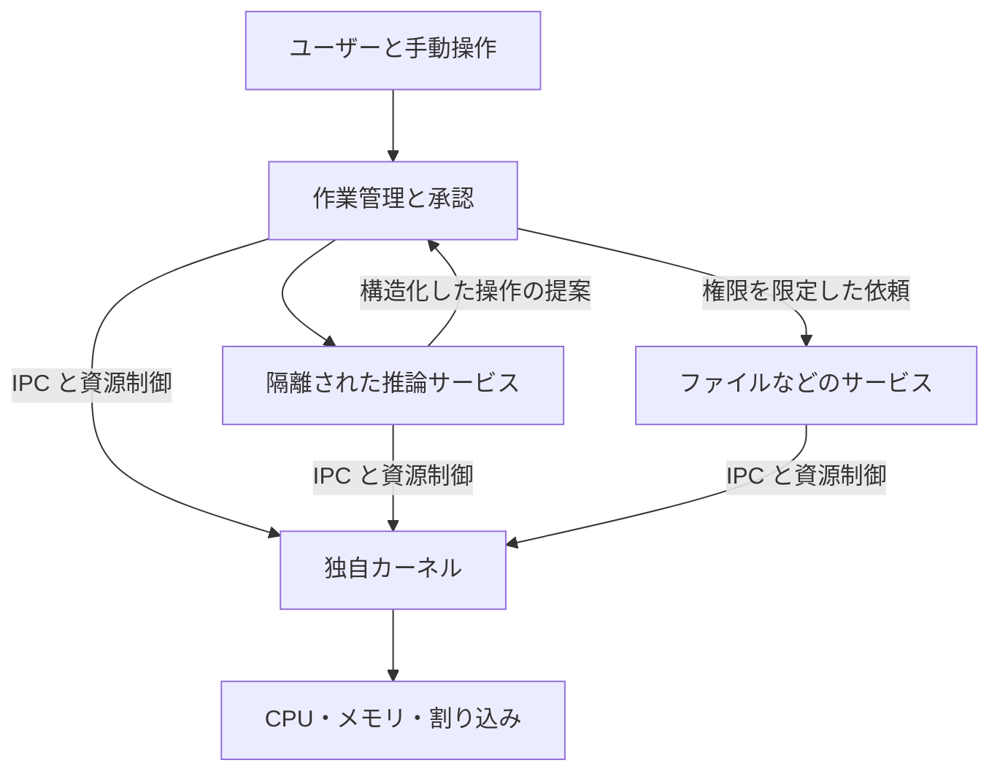

# 独自 OS の基本設計

状態: 長期設計案。固定した 2 プロセスの暫定 ABI は [ユーザー空間の検証](USERSPACE_VALIDATION.md)、
M2c の所有フレーム回収・タイマー切替は [資源回収と実行制御](LIFECYCLE_VALIDATION.md) を参照する。
M3a の IPC・権限ハンドル・待機解除は [通信と権限](IPC_VALIDATION.md) に記録する。
M3b の固定資料と要求の検査は [RAM 資料サービス](DOCUMENT_SERVICE_VALIDATION.md) に記録する。
M3c の限定した監督・再起動は [サービス復旧](SERVICE_RECOVERY_VALIDATION.md) に記録する。
M3d の別ビルドの実行ファイルは [ユーザー ELF](USER_ELF_VALIDATION.md) に記録する。
現段階では資料の保管と権限検査はカーネル内、IPC の受信・応答ループは Ring 3 に置く。
以下の全機能を実装済みとは扱わない。
[構想](README.md)、[権限設計](SECURITY.md)、[検証計画](MILESTONES.md)と合わせて読む。

## 設計判断

| 論点 | 初期案 | 理由と負担 |
| --- | --- | --- |
| CPU と実行環境 | x86-64、QEMU の固定した機種、最初は 1 vCPU | 検証対象を絞る。マルチコアと実機は別の合格条件が必要 |
| 起動 | UEFI ローダーから独自カーネルへ移行 | メモリマップと起動情報を明示的に引き継ぐ |
| 主言語 | Rust の `no_std`、必要最小限のアセンブリ | 通常の Rust の型と所有権を活用する。低レベル処理の正しさは別途検証する |
| カーネル構成 | マイクロカーネル寄りの小さな中核 | 隔離と権限を集中管理する。サービス間通信と障害復旧の実装は増える |
| AI | 制限付きのユーザープロセス | 推論の停止、異常出力、モデルの交換を OS の基本動作から分離する |
| 初期ストレージ | 読み取り専用の起動データと RAM 上の作業状態 | 永続化と電源断復旧を後段で独立して検証する |

Rust の `x86_64-unknown-none` は、カーネルなどのベアメタル向け ELF を生成し、
`std` と既定のアロケーターを提供しない。必要なメモリ管理は OS 側で用意する。
これは Rust を採用すればカーネルの安全性が保証される、という意味ではない。
[公式ターゲット仕様](https://doc.rust-lang.org/rustc/platform-support/x86_64-unknown-none.html)

## 起動と引き継ぎ

UEFI ローダーは、カーネル、初期サービス、起動情報の領域を準備する。
最初のローダーは、監査できる依存範囲に絞って既存実装の利用か自作かを決定する。
カーネルの自作は、ファームウェアやコンパイラーの自作を前提としない。

起動情報には、形式のバージョン、メモリ領域の種類と範囲、カーネルと初期サービスの配置、
必要なファームウェア情報、ログ出力の条件を含める。受け手は長さ、範囲、整列、重複を検証する。
文字列のポインターや無期限のファームウェア依存を暗黙に引き継がない。

ローダーは最新のメモリマップを取得し、対応するキーで `ExitBootServices()` を呼ぶ。
失敗を成功として扱わず、仕様に従う再取得・再試行の範囲を定める。
成功後は Boot Services を呼ばず、予約領域と Runtime Services の領域を保護する。
カーネル自身のシリアル出力で、引き継ぎ完了を観測する。
[UEFI Boot Services 仕様](https://uefi.org/specs/UEFI/2.10_A/07_Services_Boot_Services.html)

最初の起動試験では、通常経路に加えて、壊れた起動情報、確保失敗、例外を意図的に発生させる。
UEFI の画面に文字が出たことだけでは、カーネルへの引き継ぎを合格としない。

## 責務と信頼境界

| 要素 | 所有する責務 | 境界 |
| --- | --- | --- |
| カーネル | アドレス空間、スレッド、例外、割り込み、IPC、カーネルオブジェクトの権限 | 推論、検索、自然言語のポリシー解釈を実行しない |
| 初期サービス管理 | サービスの起動、初期権限の配布、制限付きの再起動 | ブート時の権限を AI へ渡さない |
| ファイル等のサービス | 自分が所有する資源の検証と操作 | 呼び出し元と対象ごとの権限を検証する |
| 作業管理 | ユーザーの承認、操作計画、予算、状態遷移、結果の照合 | AI の自己申告を承認や成功の証拠にしない |
| 推論サービス | 許可された入力の処理と操作候補の生成 | 生のデバイス、他のプロセスのメモリ、任意のネットワークへアクセスしない |

IPC はプロセス間で依頼を受け渡す仕組みである。
メッセージには明示的な長さと形式を持たせ、サイズ、保留件数、共有メモリ量に上限を設定する。
ユーザー空間のポインターを無検証で参照しない。共有メモリの読み取り・書き込み権限、
所有期間、相手の終了時の回収を定義する。

最初は単純なスケジューラーを用い、CPU 時間とメモリの上限を強制できることを確かめる。
AI によるスケジューリング最適化は、固定した基準との比較と復帰経路を持つ後続実験とする。

## 操作の契約

次の項目を意味上の契約とする。システムコールの番号、バイナリ配置、公開 SDK はまだ固定しない。

| 項目 | 内容 |
| --- | --- |
| 作業 ID と操作 ID | 一つの依頼と、個々の副作用を区別する |
| 実行主体 | ユーザー、依頼元プロセス、実行サービスを結び付ける |
| 操作の形式とバージョン | 許可された操作名、入力・出力の型、サイズ上限 |
| 対象 | サービスが検証した資源の識別子と、必要なら版番号 |
| 権限 | 操作に必要な、偽造できないハンドルへの参照 |
| 承認記録 | 承認対象の操作・入力・対象・送信先・期限への結び付き |
| 予算と期限 | CPU 時間、メモリ、IPC 件数、入出力量、単調時計による期限 |
| 結果 | 完了、拒否、失敗、中断、成否不明を区別する |
| 再試行の条件 | 操作の重複検出、結果の照会、取り消せる範囲 |

これらの項目は、渡されただけでは信頼しない。カーネルとサービスが呼び出し元を確定し、
作業管理と資源所有者が、各自の責務で内容を検証する。

## 中断と復旧

通常は「提案 → 検証 → 必要な承認 → 実行 → 結果確認 → 完了」と進む。
承認済みの入力や対象が変わったときは検証と承認へ戻す。

プロセス停止や時間切れは、外部の副作用を取り消せたことを意味しない。
実行中に応答が失われた操作は「成否不明」として保持し、結果を照会する。
重複実行を防げることが確認できる場合だけ再試行する。一般的な外部操作について
exactly-once や万能なロールバックを保証しない。

永続化を導入する段階で、操作記録と資源の更新をどのように整合させるかを決める。
再起動直後は失効前の権限を自動復元せず、期限、対象の版、ユーザーの意図を再確認する。

## 推論を接続する順序

最初に固定した応答を返すテスト用プロセスで操作契約を検証する。
必要に応じて既存ホストの推論サービスを使う場合は、開発用ブリッジであることを明示し、
接続先、入力データ、通信経路を限定する。この構成をゲスト内推論の達成とは数えない。

次に、独自 OS のユーザー空間で動く小さな CPU 推論器とモデルを検討する。
実行形式、ユーザー空間 ABI、アロケーター、必要な数値演算、SIMD/FPU 状態の保存、
モデルの読み込み、ライセンス、メモリ量を確認する。
既存の Ollama、Python、Bun、Tauri は、そのまま動く前提にしない。
GPU 対応はドライバーと実行環境を含む別の設計とする。

## 実装前に確定する事項

- QEMU、UEFI ファームウェア、Rust ツールチェーンの固定した版と取得元。
- ローダー、ELF の読み込み、初期メモリ配置、カーネルへの ABI。
- 最初の例外処理、タイマー、割り込みコントローラーの構成。
- 権限の失効方式と、起動時の信頼の根。
- ソースの配置、ライセンス、ホストの既存アプリとの接続範囲。

QEMU はマシン全体のエミュレーションと、画面を表示しない実行を提供する。
実装時は `-display none` と明示的なシリアル出力を設定し、ホストの画面や入力を操作しない。
[QEMU の概要](https://www.qemu.org/docs/master/system/introduction.html) /
[起動オプション](https://www.qemu.org/docs/master/system/invocation.html)
