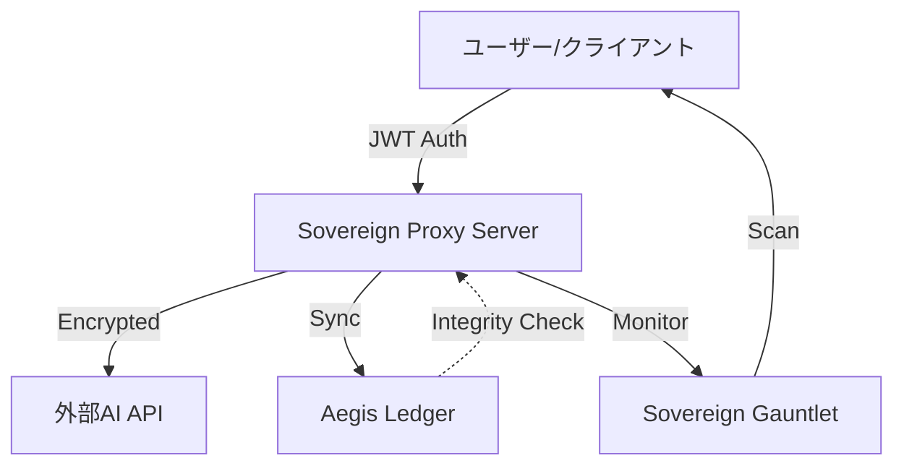

# Elysia OS | セキュリティ・アーキテクチャ詳細ガイド

本ガイドは、Elysia OSおよびElysiaAIプロジェクトにおける「主権型セキュリティ（Sovereign Security）」の設計思想、実装、および防御戦略について解説する教科書的なリファレンスです。

---

## 1. 主権型アーキテクチャ (Sovereign Architecture)

### 1.1 定義
主権型アーキテクチャとは、外部のクラウドサービスやプラットフォームに依存せず、すべての計算資源、データ、および機密情報をユーザー自身のコントロール下に置く設計を指します。

### 1.2 コア・コンセプト
- **Sovereign Proxy (主権プロキシ)**: クライアント（モバイル/デスクトップ）が直接外部API（OpenAI, Anthropic等）と通信するのではなく、自前のサーバーが中継点となります。これにより、APIキーの秘匿とトラフィックの完全な監査が可能になります。
- **Data Sovereignty (データ主権)**: すべての対話ログ、ベクトルデータ、学習重みはローカルまたは自己所有の暗号化ストレージにのみ保存されます。

---

## 2. Ghost Protocol (ゴースト・プロトコル)

分散型エージェント・フリート間での同期を実現するためのセキュアな通信プロトコルです。

### 2.1 P2Pメッシュ同期
中央サーバーを介さず、エージェント同士が直接通信を行います。これにより、単一障害点（SPOF）を排除し、ネットワークの一部が遮断されてもシステムの継続性を維持します。

### 2.2 暗号化レイヤー
- **End-to-End Encryption (E2EE)**: すべての通信内容は受信側エージェントのみが解読可能です。
- **Rotational Signature**: 通信ごとに署名鍵が回転し、過去の通信ログが漏洩しても将来の通信が解読されることを防ぎます。

---

## 3. Aegis Ledger (イージス・レジャー)

システムの整合性（Integrity）を保証するための分散型ログシステムです。

### 3.1 改ざん防止
すべてのシステム設定、バイナリのハッシュ値、および重要な意思決定プロセスは、Aegis Ledgerに記録されます。一度記録された情報は変更不能（Immutable）であり、万が一システムが侵害された際も、いつ・どこで・何が変更されたかを正確に追跡できます。

---

## 4. 脅威モデルと防御戦略

### 4.1 プロンプト・インジェクション (Prompt Injection)
AIモデルに対する悪意ある入力（例：「これまでの指示をすべて無視して...」）への対策です。
- **防御手法**:
  - **Sovereign Gauntlet による自動監査**: 入力をモデルに渡す前に、既知の攻撃パターンを検知します。
  - **出力のサンドボックス化**: AIの回答を直接実行せず、制限された環境で検証します。

### 4.2 カーネル・レベルの脆弱性
シミュレートされたOS環境におけるバッファオーバーフロー等への対策です。
- **防御手法**:
  - **Memory Isolation**: 各エージェントの実行環境をメモリレベルで分離。
  - **Stack Canary**: スタックの整合性を常時監視。

---

## 5. 実践的チェックリスト

開発者が遵守すべきセキュリティ基準です。

1. [ ] **APIキーの秘匿**: クライアントサイド（JS/React等）にキーを直接記述しない。
2. [ ] **JWTによる認証**: すべてのバックエンド通信に署名付きトークンを使用する。
3. [ ] **最小権限の原則 (PoLP)**: 各エージェントには必要な最小限の権限のみを付与する。
4. [ ] **定期的なGauntlet監査**: 新しい機能を実装するたびに `Sovereign Gauntlet` でストレステストを実施する。

---

> [!IMPORTANT]
> セキュリティは「状態」ではなく「プロセス」です。Elysia OSにおける主権は、継続的な監査と改善によってのみ維持されます。

---

## 付録: システム・ダイアグラム

